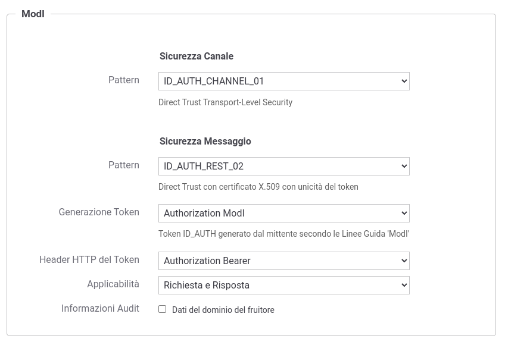

.. _modipa_idar02:

[ID_AUTH_SOAP_02 / ID_AUTH_REST_02] Direct Trust con certificato X.509 con unicità del messaggio/token
~~~~~~~~~~~~~~~~~~~~~~~~~~~~~~~~~~~~~~~~~~~~~~~~~~~~~~~~~~~~~~~~~~~~~~~~~~~~~~~~~~~~~~~~~~~~~~~~~~~~~~

.. note::
    La sigla che identifica il pattern di sicurezza messaggio varia a seconda se l'API sia di tipo REST, per cui la sigla corrisponde a *ID_AUTH_REST_02*, o SOAP dove viene utilizzata la sigla *ID_AUTH_SOAP_02*.

Questo pattern di sicurezza presenta le medesime caratteristiche di :ref:`modipa_idar01`, con l'unica differenza di prevedere un meccanismo di filtro che impedisce la ricezione di messaggi duplicati da parte di ciascun ricevente.

La registrazione della API deve essere effettuata agendo nella sezione "ModI - Sicurezza Messaggio" come indicato rispettavamente per una API REST in :numref:`api_messaggio2_fig` e per una API SOAP in :numref:`api_messaggio2_soap_fig`

- selezionare il 'Pattern' "ID_AUTH_REST_02" su API REST o 'ID_AUTH_SOAP_02' su API SOAP;
- selezionare una 'Generazione Token' di tipo 'Authorization ModI' per far si che il Token 'ID_AUTH' sia generato dalla parte mittente.

  Pattern di sicurezza messaggio "ID_AUTH_REST_02" per l'API

.. figure:: ../../../../_figure_console/modipa_api_messaggio2_soap.png
  :scale: 50%
  :align: center
  :name: api_messaggio2_soap_fig

  Pattern di sicurezza messaggio "ID_AUTH_SOAP_02" per l'API

Le configurazioni successive alla registrazione della API sono le medesime già descritte in precedenza per il pattern :ref:`modipa_idar01`.
