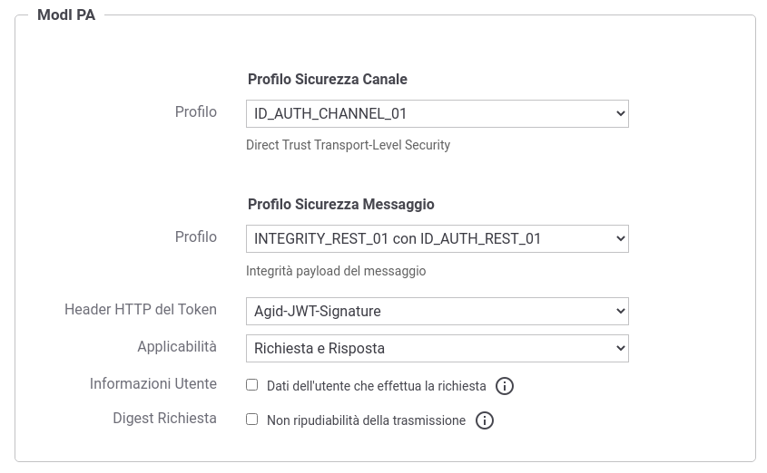
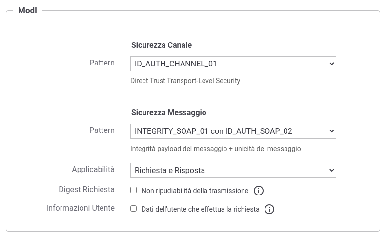
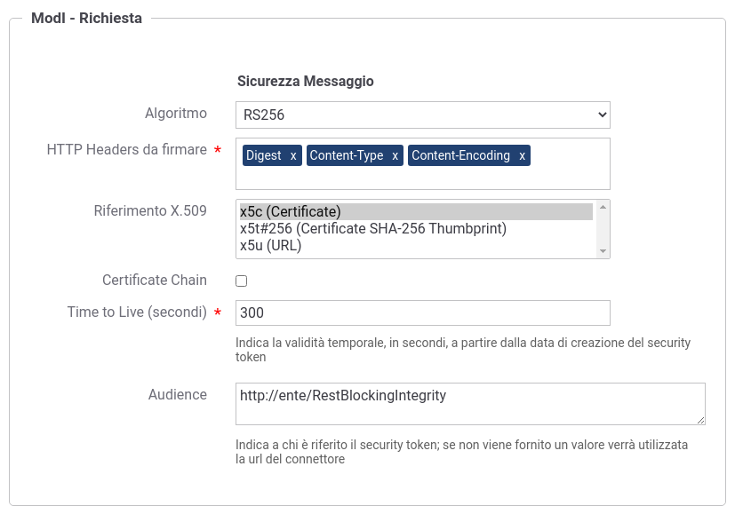
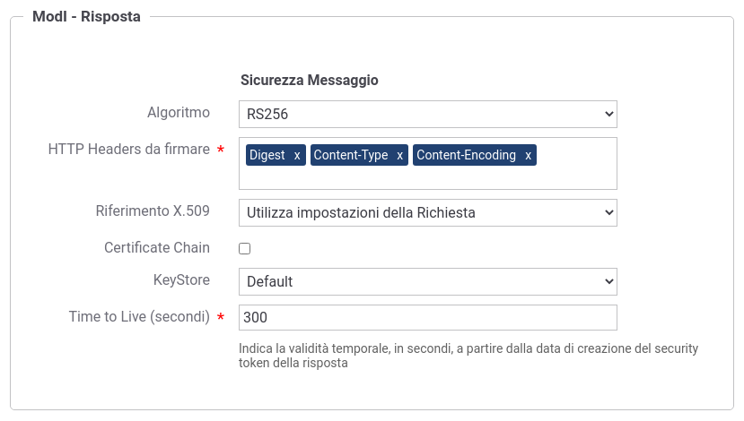

.. _modipa_idar03:

[INTEGRITY_SOAP_01 / INTEGRITY_REST_01] Integrità payload del messaggio
~~~~~~~~~~~~~~~~~~~~~~~~~~~~~~~~~~~~~~~~~~~~~~~~~~~~~~~~~~~~~~~~~~~~~~~~

.. note::
    La sigla che identifica il pattern di sicurezza messaggio varia a seconda se l'API sia di tipo REST, per cui la sigla corrisponde a *INTEGRITY_REST_01*, o SOAP dove viene utilizzata la sigla *INTEGRITY_SOAP_01*.

Questo pattern di sicurezza consente di estendere "ID_AUTH_REST_01" o "ID_AUTH_REST_02" aggiungendo un meccanismo che garantisce l'integrità del messaggio scambiato grazie all'invio, nel token di sicurezza, della firma digitale del payload.

L'attivazione di questo pattern avviene a livello della relativa API, nella sezione "ModI", elemento "Sicurezza Messaggio", selezionando il pattern "INTEGRITY_REST_01 con ID_AUTH_REST_01" nel caso si voglia estendere "ID_AUTH_REST_01", oppure il pattern "INTEGRITY_REST_01 con ID_AUTH_REST_02" nel caso si voglia estendere "ID_AUTH_REST_02" con il meccanismo di garanzia dell'integrità del payload (:numref:`api_messaggio3_fig`).

  Pattern di sicurezza messaggio "INTEGRITY_REST_01" per l'API

  Pattern di sicurezza messaggio "INTEGRITY_SOAP_01" per l'API

Le voci 'Header HTTP del Token' (presente solamente su API di tipo REST) e 'Applicabilità' consentono di personalizzare gli header HTTP utilizzati (nomi e contemporaneità) e di indicare se il pattern di sicurezza verrà attuato sia sulla richiesta che sulla risposta. Su API di tipo SOAP è possibile selezionare una 'Applicatibilità' che firmi oltre al body anche gli attachments, se presenti. Maggiori informazioni vengono fornite nella sezione ':ref:`modipa_sicurezza_avanzate`'.

La voce 'Informazioni Utente' consente di abilitare la funzionalità, descritta nella sezione ':ref:`modipa_infoUtente`', che consente di aggiungere all'interno del token di sicurezza le informazioni sull'utente che ha effettuato la richiesta.

La voce 'Digest Richiesta' consente di abilitare la funzionalità, descritta nella sezione ':ref:`modipa_requestDigest`', che consente di implementare la soluzione per la non ripudiabilità della trasmissione.

Per le configurazioni successive procedere come già descritto in precedenza per il pattern :ref:`modipa_idar01`.

Occorre solo tenere presente che per questo pattern di sicurezza sono presenti le seguenti differenze sulle maschere di configurazione delle API di tipo REST:

- Nel contesto della configurazione di una fruizione, relativamente alla sezione "ModI - Richiesta", oltre ai dati da fornire per la produzione della firma digitale deve essere aggiunta anche l'indicazione degli eventuali Header HTTP da firmare. Tale indicazione viene fornita con il campo "HTTP Headers da firmare" (:numref:`fruizione_richiesta_headers_fig`).

 Fruizione "INTEGRITY_REST_01" - Configurazione richiesta con indicazione HTTP Headers da firmare

- Nel contesto della configurazione di una erogazione, relativamente alla sezione "ModI - Risposta", oltre ai dati da fornire per la produzione della firma digitale deve essere aggiunta anche l'indicazione degli eventuali Header HTTP da firmare. Tale indicazione viene fornita con il campo "HTTP Headers da firmare" (:numref:`erogazione_risposta_headers_fig`).

 Erogazione "INTEGRITY_REST_01" - Configurazione risposta con indicazione HTTP Headers da firmare
