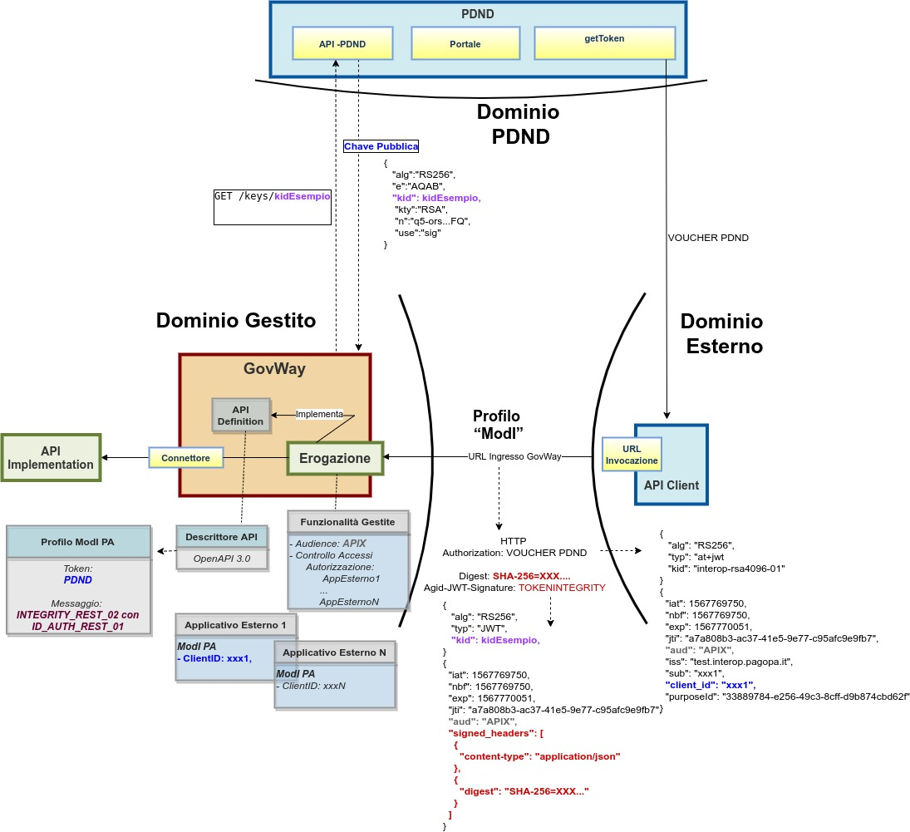
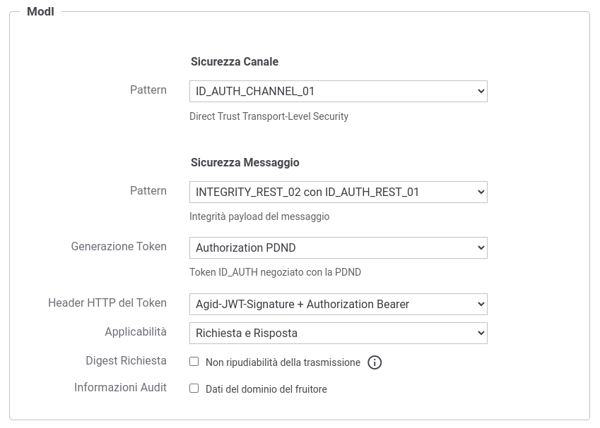

.. _modipa_pdnd_erogazione_integrity:

Erogazione INTEGRITY_REST_02 (PDND)
------------------------------------

In un'erogazione di una API le richieste provengono da amministrazioni esterne al dominio e sono dirette ad applicativi interni. Prima di procedere con l'inoltro della richiesta verso il backend interno, GovWay valida il token di sicurezza ricevuto rispetto al pattern associato all'operazione invocata: verifica firma, validazione temporale, filtro duplicati, verifica integrità del messaggio, verifica del token di audit etc.

Nella figura ':numref:`ErogazioneModIPA-PDND-IDAuth01-IntegrityRest02`' viene raffigurato lo scenario di erogazione in cui il trust avviene tramite la PDND.

    Erogazione con Profilo di Interoperabilità 'ModI', pattern 'INTEGRITY_REST_02': trust tramite PDND

Di seguito vengono forniti i dettagli di configurazione aggiuntivi o differenti, rispetto ai passi descritti nella sezione ':ref:`modipa_pdnd_erogazione`'.

**API**

La registrazione della API deve essere effettuata agendo nella sezione "ModI - Sicurezza Messaggio", come indicato in :numref:`api_auth_rest_01_integrity_02_pdnd2`:

- selezionare il 'Pattern' "ID_AUTH_REST_01";
- selezionare una 'Generazione Token' di tipo 'Authorization PDND' per far si che il Token 'ID_AUTH' sia negoziato con la PDND.
 

    Selezione del pattern "INTEGRITY_REST_02 con ID_AUTH_REST_01" e 'Generazione Token' di tipo 'Authorization PDND' per l'API

**Erogazione**

Rispetto a quanto indicato nella sezione :ref:`modipa_pdnd_erogazione` l'interfaccia per la creazione dell'erogazione, basata su una API con pattern "INTEGRITY_REST_02 con ID_AUTH_REST_01", presenta le sezioni "ModI - Richiesta" e "ModI - Risposta" (compatibilmente con i criteri di applicabilità impostati nell'API):

- ModI - Richiesta: la maschera relativa alla richiesta prevede la configurazione del meccanismo di validazione del token ricevuto sul messaggio di richiesta:

    - TrustStore Certificati: il pattern 'INTEGRITY_REST_02', prevede che all'interno del token sia presente un identificativo della chiave pubblica (kid) associata alla chiave privata utilizzata dal mittente per firmare il token. L'identificativo kid è stato generato dalla PDND al momento della registrazione del materiale crittografico (chiave pubblica) da parte dell'applicativo mittente ed è recuperabile dall'erogatore tramite le `API messe a disposizione dalla PDND stessa <https://docs.pagopa.it/interoperabilita-1/manuale-operativo/api-esposte-da-pdnd-interoperabilita>`_. Per effettuare la validazione deve essere definito un truststore tramite una delle seguenti modalità alternative:

	- 'Default': può essere utilizzato il truststore di default descritto nella sezione ':ref:`modipa_passiPreliminari_trustStore_x509`'; in questo caso nel truststore deve essere presente un certificato registrato con un alias che corrisponde al 'kid' veicolato nel token INTEGRITY.

	- 'Ridefinito' con keystore di tipo 'JWK Set' o 'JKS': consente di attuare una configurazione statica dove indicare il path su filesystem di un archivio json contenenti chiavi JWK o di un truststore contenenti certificati x509. In entrambi i casi l'archivio indicato deve contenere al suo interno una chiave pubblica o un certificato registrato con un alias che corrisponde al 'kid' veicolato nel token INTEGRITY. (:numref:`erogazione_richiesta_integrity_02_fig`).

          .. figure:: ../../../../_figure_console/modipa_erogazione_richiesta_integrity_02.png
            :scale: 70%
            :name: erogazione_richiesta_integrity_02_fig

            Truststore 'statico' per la validazione del token INTEGRITY sulla richiesta di una erogazione

	- 'Ridefinito' con keystore di tipo 'PDND': consente di attuare una configurazione dinamica in cui GovWay effettuerà lo scaricamento della chiave pubblica dalla PDND attraverso le :ref:`modipa_passiPreliminari_api_pdnd` se l'identificativo kid della chiave non è già presente nella cache locale (:numref:`erogazione_richiesta_integrity_02_pdnd_fig`).

          .. figure:: ../../../../_figure_console/modipa_erogazione_richiesta_integrity_02_pdnd.png
            :scale: 70%
            :name: erogazione_richiesta_integrity_02_pdnd_fig

            Truststore 'dinamico' per la validazione del token INTEGRITY sulla richiesta di una erogazione

    - Time to Live: consente di ridefinire l'intervallo temporale, in secondi, per il quale i token creati precedentemente all'intervallo indicato verranno rifiutati.

    - Audience: consente di indicare il valore del claim 'aud' atteso nel token di sicurezza INTEGRITY. Se non viene fornito un valore, il valore atteso all'interno del security token corrisponderà all'url di invocazione.

    - Coesistenza Token Authorization e Agid-JWT-Signature: consente di indicare da quale header estrarre l'identificativo 'jti' da associare alla traccia come 'ID del Messaggio' (default: Agid-JWT-Signature). Per maggiori dettagli si rimanda alla sezione ':ref:`modipa_sicurezza_avanzate_header_contemporaneita_erogazione`'.

- ModI - Risposta (:numref:`erogazione_risposta_integrity_02_fig`): la maschera prevede la configurazione del meccanismo di firma digitale del messaggio di risposta, e la produzione del relativo token di sicurezza, da inviare all'applicativo mittente:

    + Algoritmo: l'algoritmo che si vuole utilizzare per la firma digitale del messaggio di risposta;
    + Codifica Digest: consente di selezionare l'algoritmo utilizzato per produrre il digest;
    + HTTP Headers da firmare: indicazione degli eventuali Header HTTP da firmare;
    + Keystore: il keystore da utilizzare per la firma del messaggio di risposta. È possibile mantenere il riferimento al keystore di default, fornito in fase di installazione del prodotto, oppure indicare un diverso riferimento (opzione "Ridefinito") fornendo il path sul filesystem, o in alternativa direttamente l'archivio, unitamente a Tipo, Password, Alias Chiave Privata e Password Chiave Privata.
    + Time to Live (secondi): validità temporale del token prodotto.
    + Claims: consente di personalizzare i claims presenti all'interno del token prodotto. Per maggiori dettagli si rimanda alla sezione ':ref:`modipa_sicurezza_avanzate_claims`'.

  .. figure:: ../../../../_figure_console/modipa_erogazione_risposta_integrity_02.png
   :scale: 70%
   :name: erogazione_risposta_integrity_02_fig

   Dati per la configurazione della sicurezza messaggio sulla risposta di una erogazione
