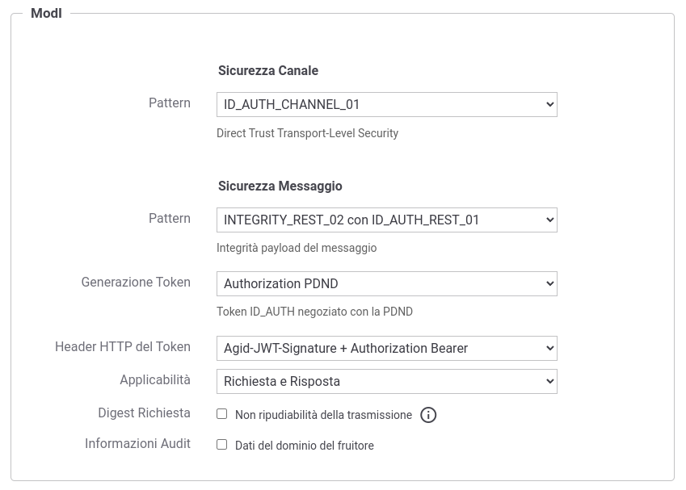

.. _modipa_pdnd_fruizione_integrity:

Fruizione INTEGRITY_REST_02 (PDND)
------------------------------------

Le richieste che provengono dagli applicativi interni del dominio e sono dirette verso altre amministrazioni verranno arricchite del token di sicurezza 'ModI' previsto dall'operazione invocata, come indicato precedentemente nella sezione :ref:`modipa_idar04`. 

Nella figura ':numref:`FruizioneModIPA-PDND-IDAuth01-IntegrityRest02`' viene raffigurato lo scenario di fruizione in cui il trust avviene tramite la PDND e viene prodotto il token 'Agid-JWT-Signature' previsto dal pattern 'INTEGRITY_REST_02'.

.. figure:: ../../../../_figure_console/FruizioneModIPA_PDND_IDAuth01_IntegrityRest02.jpg
    :scale: 70%
    :align: center
    :name: FruizioneModIPA-PDND-IDAuth01-IntegrityRest02

    Fruizione con Profilo di Interoperabilità 'ModI', pattern 'INTEGRITY_REST_02': trust tramite PDND

Di seguito vengono forniti i dettagli di configurazione aggiuntivi o differenti, rispetto ai passi descritti nella sezione ':ref:`modipa_pdnd_fruizione`'.

**API**

La registrazione della API deve essere effettuata agendo nella sezione "ModI - Sicurezza Messaggio", come indicato in :numref:`api_auth_rest_01_integrity_02_pdnd`:

- selezionare il 'Pattern' "INTEGRITY_REST_02 con ID_AUTH_REST_01";
- selezionare una 'Generazione Token' di tipo 'Authorization PDND' per far si che il Token 'ID_AUTH' sia negoziato con la PDND.
 

    Selezione del pattern "INTEGRITY_REST_02 con ID_AUTH_REST_01" e 'Generazione Token' di tipo 'Authorization PDND' per l'API

Le voci 'Header HTTP del Token' e 'Applicabilità' consentono di personalizzare l'header HTTP utilizzato e di indicare se il pattern di sicurezza verrà attuato sia sulla richiesta che sulla risposta. Maggiori informazioni vengono fornite rispettivamente nelle sezioni ':ref:`modipa_sicurezza_avanzate_header`' e ':ref:`modipa_sicurezza_avanzate_applicabilita`'.

**Fruizione**

Rispetto a quanto indicato nella sezione :ref:`modipa_pdnd_fruizione` l'interfaccia per la creazione della fruizione, basata su una API con pattern "INTEGRITY_REST_02 con ID_AUTH_REST_01", presenta le sezioni "ModI - Richiesta" e "ModI - Risposta" (compatibilmente con i criteri di applicabilità impostati nell'API):

- ModI - Richiesta (:numref:`fruizione_richiesta_integrity_02_fig`): la maschera relativa alla richiesta prevede la configurazione del meccanismo di firma digitale del messaggio, ad opera dell'applicativo mittente, e la produzione del relativo token di sicurezza:

    + Algoritmo: l'algoritmo che si vuole utilizzare per la firma digitale del messaggio;
    + Codifica Digest: consente di selezionare l'algoritmo utilizzato per produrre il digest;
    + HTTP Headers da firmare: indicazione degli eventuali Header HTTP da firmare;
    + KeyStore: lo scenario descritto in questa sezione è relativo alla configurazione proposta di default con la voce 'Definito nell'applicativo', mentre scenari differenti sono attuabili utilizzando le configurazioni descritte in :ref:`modipa_sicurezza_avanzate_fruizione_keystore` e :ref:`modipa_sicurezza_avanzate_fruizione_token_policy_keystore`;
    + Time to Live: tempo di validità del token prodotto (in secondi);
    + Audience: identificativo dell'applicativo destinatario da indicare come audience nel token di sicurezza; se non viene indicato alcun valore verrà utilizzato la url del connettore. Il valore fornito può contenere parti dinamiche risolte a runtime dal Gateway (per maggiori dettagli :ref:`valoriDinamici`).
    + Claims: consente di personalizzare i claims presenti all'interno del token prodotto. Per maggiori dettagli si rimanda alla sezione ':ref:`modipa_sicurezza_avanzate_claims`'.

  .. figure:: ../../../../_figure_console/modipa_fruizione_richiesta_integrity_02.png
   :scale: 70%
   :name: fruizione_richiesta_integrity_02_fig

   Dati per la configurazione della sicurezza messaggio sulla richiesta di una fruizione

- ModI - Risposta: la maschera relativa alla risposta è presente solamente se è stato selezionato un criterio di applicabilità nell'API che prevede la ricezione di un token di sicurezza messaggio anche nella risposta. La sezione consente di configurare il meccanismo di validazione del token ricevuto da parte dell'applicativo destinatario:

    - TrustStore Certificati: il pattern 'INTEGRITY_REST_02', prevede che all'interno del token sia presente un identificativo della chiave pubblica (kid) associata alla chiave privata utilizzata dal destinatario per firmare il token di risposta. L'identificativo kid è stato generato dalla PDND al momento della registrazione del materiale crittografico (chiave pubblica) da parte dell'applicativo destinatario ed è recuperabile dal mittente tramite le `API messe a disposizione dalla PDND stessa <https://docs.pagopa.it/interoperabilita-1/manuale-operativo/api-esposte-da-pdnd-interoperabilita>`_. Per effettuare la validazione deve essere definito un truststore tramite una delle seguenti modalità alternative:

	- 'Default': può essere utilizzato il truststore di default descritto nella sezione ':ref:`modipa_passiPreliminari_trustStore_x509`'; in questo caso nel truststore deve essere presente un certificato registrato con un alias che corrisponde al 'kid' veicolato nel token INTEGRITY.

	- 'Ridefinito' con keystore di tipo 'JWK Set' o 'JKS': consente di attuare una configurazione statica dove indicare il path su filesystem di un archivio json contenenti chiavi JWK o di un truststore contenenti certificati x509. In entrambi i casi l'archivio indicato deve contenere al suo interno una chiave pubblica o un certificato registrato con un alias che corrisponde al 'kid' veicolato nel token INTEGRITY. (:numref:`fruizione_risposta_integrity_02_fig`).

          .. figure:: ../../../../_figure_console/modipa_fruizione_risposta_integrity_02.png
            :scale: 70%
            :name: fruizione_risposta_integrity_02_fig

            Truststore 'statico' per la validazione del token INTEGRITY sulla risposta di una fruizione

	- 'Ridefinito' con keystore di tipo 'PDND': consente di attuare una configurazione dinamica in cui GovWay effettuerà lo scaricamento della chiave pubblica dalla PDND attraverso le :ref:`modipa_passiPreliminari_api_pdnd` se l'identificativo kid della chiave non è già presente nella cache locale (:numref:`fruizione_risposta_integrity_02_pdnd_fig`).

          .. figure:: ../../../../_figure_console/modipa_fruizione_risposta_integrity_02_pdnd.png
            :scale: 70%
            :name: fruizione_risposta_integrity_02_pdnd_fig

            Truststore 'dinamico' per la validazione del token INTEGRITY sulla risposta di una fruizione

	  Nella figura ':numref:`FruizioneModIPA-PDND-IDAuth01-IntegrityRest02-risposta`' viene raffigurato lo scenario di fruizione durante la fase di validazione del token di risposta tramite un truststore dinamico in cui GovWay utilizza le API PDND per ottenere la chiave pubblica necessaria a validare il token di risposta.

	  .. figure:: ../../../../_figure_console/FruizioneModIPA_PDND_IDAuth01_IntegrityRest02_risposta.jpg
	      :scale: 70%
	      :align: center
	      :name: FruizioneModIPA-PDND-IDAuth01-IntegrityRest02-risposta

              Fruizione con Profilo di Interoperabilità 'ModI', pattern 'INTEGRITY_REST_02': trust tramite PDND e utilizzo delle API PDND per ottenere la chiave pubblica per validare la risposta

    - Time to Live: consente di ridefinire l'intervallo temporale, in secondi, per il quale i token creati precedentemente all'intervallo indicato verranno rifiutati.

    - Verifica Audience: Se l'opzione è abilitata, viene effettuata la verifica che il campo Audience, presente nel token di sicurezza della risposta, corrisponda al valore presente nel campo successivo, se indicato, o altrimenti a quello configurato nell'applicativo mittente nella voce 'Identificativo Client'.

