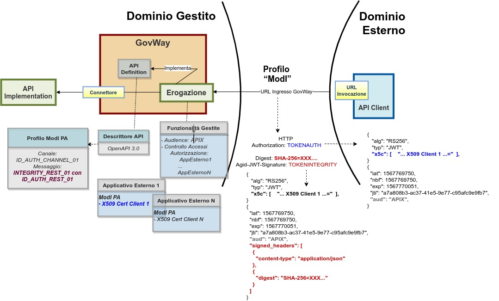

.. _modipa_idar03_erogazione:

Erogazione INTEGRITY_REST_01 / INTEGRITY_SOAP_01 (X509)
-------------------------------------------------------

In un'erogazione di una API le richieste provengono da amministrazioni esterne al dominio e sono dirette ad applicativi interni. Prima di procedere con l'inoltro della richiesta verso il backend interno, GovWay valida il token di sicurezza ricevuto rispetto al pattern associato all'operazione invocata: verifica firma, validazione temporale, filtro duplicati, verifica integrità del messaggio, verifica del token di audit etc.

Nella figura ':numref:`ErogazioneModIPA2_integrity_01`' viene raffigurato lo scenario di erogazione in cui il trust avviene tra fruitore ed erogatore tramite certificati x509.

 Erogazione con Profilo di Interoperabilità 'ModI', pattern 'INTEGRITY_REST_01': trust tra fruitore ed erogatore tramite certificati x509

Di seguito vengono forniti i dettagli di configurazione aggiuntivi o differenti, rispetto ai passi descritti nella sezione ':ref:`modipa_idar01_erogazione`'.

**API**

La registrazione della API deve essere effettuata seguendo le indicazioni descritte nella sezione :ref:`modipa_idar03`

**Erogazione**

Nel contesto della configurazione di una erogazione di una API di tipo REST, relativamente alla sezione "ModI - Risposta", oltre ai dati da fornire per la produzione della firma digitale deve essere aggiunta anche l'indicazione degli eventuali Header HTTP da firmare. Tale indicazione viene fornita con il campo "HTTP Headers da firmare" (:numref:`erogazione_risposta_headers_fig`).

.. figure:: ../../../../_figure_console/modipa_erogazione_risposta_headers.png
 :scale: 50%
 :align: center
 :name: erogazione_risposta_headers_fig

 Erogazione "INTEGRITY_REST_01" - Configurazione risposta con indicazione HTTP Headers da firmare
