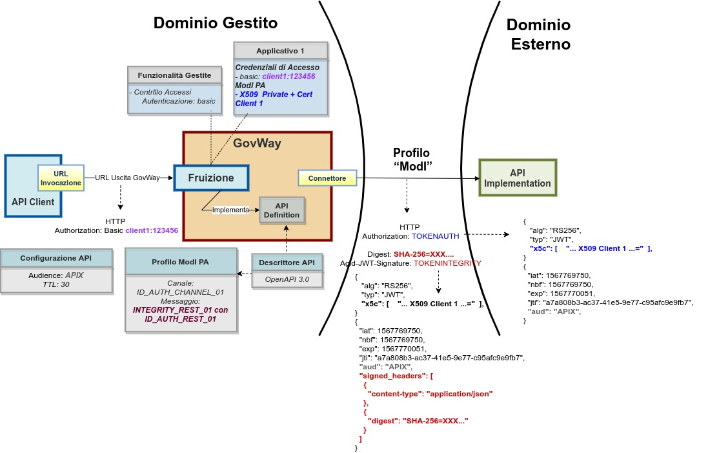

.. _modipa_idar03_fruizione:

Fruizione INTEGRITY_REST_01 / INTEGRITY_SOAP_01 (X509)
-------------------------------------------------------

Le richieste che provengono dagli applicativi interni del dominio e sono dirette verso altre amministrazioni verranno arricchite del token di sicurezza 'ModI' previsto dall'operazione invocata, come indicato precedentemente nella sezione :ref:`modipa_idar03`. 

Per la configurazione delle fruizioni con i pattern di sicurezza messaggio è necessario registrare ciascun applicativo interno coinvolto al fine principale di associargli una chiave privata e un certificato X509 che GovWay utilizza per firmare il token di sicurezza 'ModI' prodotto. Gli applicativi vengono identificati da GovWay tramite una delle modalità di autenticazione supportate descritte nella sezione :ref:`apiGwAutenticazione` (:numref:`FruizioneModIPA2`).

Nella figura ':numref:`FruizioneModIPA2_integrity_01`' viene raffigurato lo scenario di fruizione in cui il trust avviene tra fruitore ed erogatore tramite certificati x509.

 Fruizione con Profilo di Interoperabilità 'ModI', pattern 'INTEGRITY_REST_01': trust tra fruitore ed erogatore tramite certificati x509

Di seguito vengono forniti i dettagli di configurazione aggiuntivi o differenti, rispetto ai passi descritti nella sezione ':ref:`modipa_idar01_fruizione`'.

**API**

La registrazione della API deve essere effettuata seguendo le indicazioni descritte nella sezione :ref:`modipa_idar03`

**Fruizione**

Nel contesto della configurazione di una fruizione di una API di tipo REST, relativamente alla sezione "ModI - Richiesta", oltre ai dati da fornire per la produzione della firma digitale deve essere aggiunta anche l'indicazione degli eventuali Header HTTP da firmare. Tale indicazione viene fornita con il campo "HTTP Headers da firmare" (:numref:`fruizione_richiesta_headers_fig`).

.. figure:: ../../../../_figure_console/modipa_fruizione_richiesta_headers.png
 :scale: 50%
 :align: center
 :name: fruizione_richiesta_headers_fig

 Fruizione "INTEGRITY_REST_01" - Configurazione richiesta con indicazione HTTP Headers da firmare
