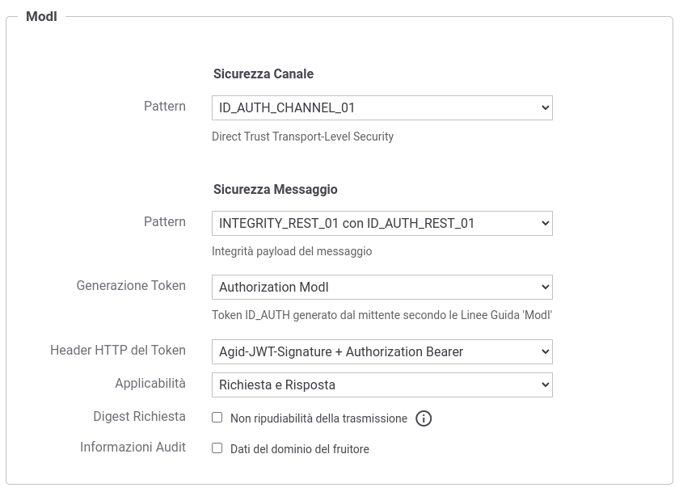
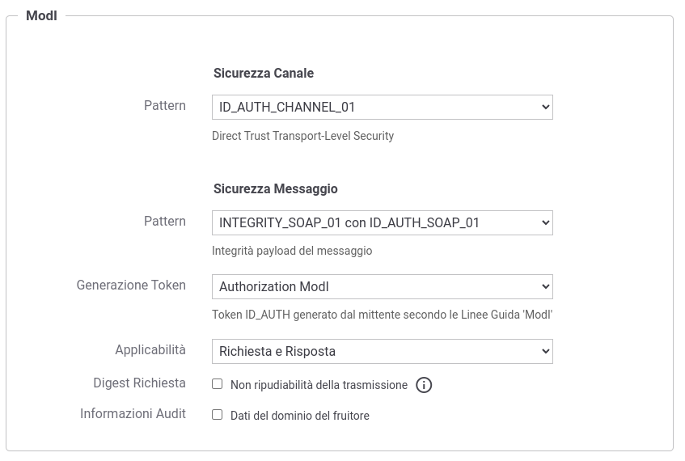

.. _modipa_idar03:

[INTEGRITY_SOAP_01 / INTEGRITY_REST_01] Integrità payload del messaggio
~~~~~~~~~~~~~~~~~~~~~~~~~~~~~~~~~~~~~~~~~~~~~~~~~~~~~~~~~~~~~~~~~~~~~~~~

.. note::
    La sigla che identifica il pattern di sicurezza messaggio varia a seconda se l'API sia di tipo REST, per cui la sigla corrisponde a *INTEGRITY_REST_01*, o SOAP dove viene utilizzata la sigla *INTEGRITY_SOAP_01*.

Questo pattern di sicurezza consente di estendere "ID_AUTH_REST_01" o "ID_AUTH_REST_02" aggiungendo un meccanismo che garantisce garantisce l'integrità del payload del messaggio.

**API**

L'attivazione di questo pattern avviene a livello della relativa API, nella sezione "ModI", elemento "Sicurezza Messaggio" come indicato rispettavamente per una API REST in :numref:`api_messaggio3_fig` e per una API SOAP in :numref:`api_messaggio3_soap_fig`:

- selezionare il pattern "INTEGRITY_REST_01 con ID_AUTH_REST_01" nel caso si voglia estendere "ID_AUTH_REST_01", oppure il pattern "INTEGRITY_REST_01 con ID_AUTH_REST_02" nel caso si voglia estendere "ID_AUTH_REST_02" con il meccanismo di garanzia dell'integrità del payload (:numref:`api_messaggio3_fig`).
- selezionare una 'Generazione Token' di tipo 'Authorization ModI' per far si che il Token 'ID_AUTH' sia generato dalla parte mittente.

  Pattern di sicurezza messaggio "INTEGRITY_REST_01" per un API REST

  Pattern di sicurezza messaggio "INTEGRITY_SOAP_01" per un API SOAP

Le voci 'Header HTTP del Token' (presente solamente su API di tipo REST) e 'Applicabilità' consentono di personalizzare gli header HTTP utilizzati (nomi e coesistenza) e di indicare se il pattern di sicurezza verrà attuato sia sulla richiesta che sulla risposta. Su API di tipo SOAP è possibile selezionare una 'Applicatibilità' che firmi oltre al body anche gli attachments, se presenti. Maggiori informazioni vengono fornite rispettivamente nelle sezioni ':ref:`modipa_sicurezza_avanzate_header`' e ':ref:`modipa_sicurezza_avanzate_applicabilita`'.

Di seguito vengono forniti i dettagli di configurazione aggiuntivi, rispetto ai passi descritti nella sezione ':ref:`modipa_idar01`', per gli scenari di fruizione o erogazione di un servizio.

.. toctree::
   :maxdepth: 2

    Passi per la configurazione di una fruizione <idar03_fruizione>
    Passi per la configurazione di una erogazione <idar03_erogazione>

