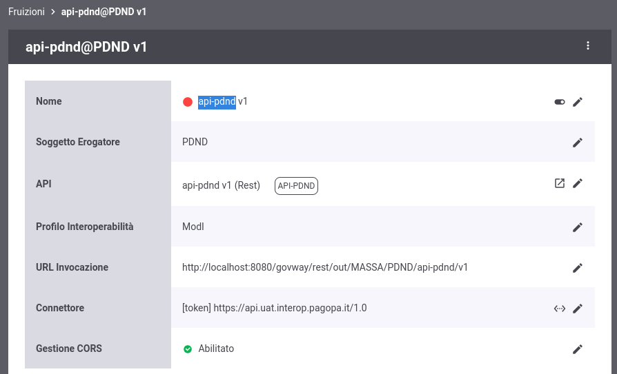

.. _modipa_passiPreliminari_api_pdnd:

API PDND
----------

**Introduzione**

La PDND mette a disposizione delle `API <https://docs.pagopa.it/interoperabilita-1/manuale-operativo/api-esposte-da-pdnd-interoperabilita>`_ che consentono tra le varie funzionalità:

- *GET /keys/{kid}*: di ottenere la chiave pubblica rispetto al kid indicato nel parametro della url; questa risorsa viene utilizzata da GovWay per poter validare i token con pattern 'INTEGRITY_REST_02' e/o pattern di audit 'AUDIT_REST_01' o 'AUDIT_REST_02' in cui il trust avviene tramite PDND, in cui l'identificativo kid è presente all'interno del token.

- *GET /events/keys*: consente di ottenere informazioni relative alle modifiche delle chiavi crittografiche registrate sulla PDND; la risorsa viene utilizzata da GovWay per mantenere aggiornata la cache locale delle chiavi scaricate dalla PDND.

- *GET /clients/{clientId}*: consente di ottenere le informazioni associate al clientId indicato nel parametro della url; la risorsa viene utilizzata da GovWay per arricchire le informazioni tracciate sul mittente.

- *GET /organizations/{organizationId}*: consente di ottenere le informazioni associate all'organizzazione indicata nel parametro della url; la risorsa viene utilizzata da GovWay per arricchire le informazioni tracciate sul mittente.

L'endpoint di esposizione delle API e la specifica OpenAPI, come indicato nella sezione `API PDND - Dove si trovano? <https://docs.pagopa.it/interoperabilita-1/manuale-operativo/api-esposte-da-pdnd-interoperabilita#dove-si-trovano>`_,  sono reperibili all'interno della sezione "Fruizione > I tuoi client api interop" e variano in funzione dell'ambiente in cui ci si trova.

Per poter fruire delle API delle PDND deve essere registrato sulla PDND un `client di tipo 'api interop' <https://docs.pagopa.it/interoperabilita-1/manuale-operativo/client-e-materiale-crittografico>`_ caricando il certificato di firma che verrà utilizzato per richiedere il token. Al termina della registrazione si otterrà un identificativo univoco della propria identità ('*client_id*' o '*sub*') e un identificativo associato al certificato caricato ('*kid*').

.. note::
	
	**Materiale crittografico differente tra client di tipo 'api interop' e 'e-service'**

	La chiave registrata sulla PDND per quanto concerne il client di tipo 'api interop' DEVE essere differente da quello che verrà utilizzato per firmare i normali token previsti dai pattern di sicurezza messaggio e audit (es. differente dalla chiave indicata nella sezione ':ref:`modipa_passiPreliminari_keystore`').

**Configurazione di GovWay**

Per consentire a GovWay di utilizzare le risorse precedentemente descritte, viene fornita built-in la fruizione con profilo di interoperabilità 'ModI' e nome 'api-pdnd' (figura :numref:`fruizioneAPIPDNDpassiPreliminari`) da finalizzare negli aspetti descritti di seguito.

    Fruizione delle API PDND

- *Endpoint di esposizione delle API della PDND*: nella sezione 'connettore' deve essere indicata la corretta url di esposizione delle API PDND (figura :numref:`fruizioneAPIPDNDpassiPreliminariConnettore`):

	- ambiente di collaudo: https://api.uat.interop.pagopa.it/1.0
	- ambiente di produzione: https://api.interop.pagopa.it/1.0

	.. note::
	
		Le url indicate potrebbero variare; si raccomanda di ottenere sempre dalla PDND le url aggiornate come indicato nella sezione `API PDND - Dove si trovano? <https://docs.pagopa.it/interoperabilita-1/manuale-operativo/api-esposte-da-pdnd-interoperabilita#dove-si-trovano>`_.

  .. figure:: ../../../_figure_console/fruizioneAPI_PDND_connettore.png
    :scale: 70%
    :name: fruizioneAPIPDNDpassiPreliminariConnettore

    Fruizione delle API PDND: connettore

- *Token Policy di negoziazione del voucher*: nella precedente sezione 'connettore' si è potuto vedere come sia stata associata al connettore una Token Policy di Negoziazione del tipo descritto nella sezione ':ref:`tokenNegoziazionePolicy_jwt`'. La token policy 'api-pdnd' riferita (figura :numref:`fruizioneAPIPDNDpassiPreliminariTokenPolicy`) deve essere finalizzata nei seguenti aspetti:

	- Url: deve essere indicato l'endpoint di negoziazione del voucher esposto dalla PDND:

		- ambiente di collaudo: https://auth.uat.interop.pagopa.it/token.oauth2
		- ambiente di produzione: https://auth.interop.pagopa.it/token.oauth2

	        .. note::
	
		      Le url indicate potrebbero variare; si raccomanda di ottenere sempre dalla PDND le url aggiornate come indicato nella sezione `Richiesta di un voucher spendibile presso le API di Interoperabilità <https://docs.pagopa.it/interoperabilita-1/manuale-operativo/utilizzare-i-voucher#richiesta-di-un-voucher-spendibile-presso-le-api-di-interoperabilita>`_ dove viene indicato che l'URL dell'endpoint cambia in funzione dell'ambiente e sarà chiaramente visibile sull'interfaccia all'interno del back office.

	- Audience: deve essere indicato il corretto valore atteso dal servizio della PDND, valore che cambia in funzione dell'ambiente:

		- ambiente di collaudo: auth.uat.interop.pagopa.it/client-assertion
		- ambiente di produzione: auth.interop.pagopa.it/client-assertion

	        .. note::
	
		      I valori indicati potrebbero variare; si raccomanda di ottenere sempre dalla PDND i valori aggiornati.

  .. figure:: ../../../_figure_console/fruizioneAPI_PDND_tokenPolicy.png
    :scale: 70%
    :name: fruizioneAPIPDNDpassiPreliminariTokenPolicy

    Fruizione delle API PDND: token policy

- *Materiale crittografico e dati della PDND*: nella sezione 'ModI' devono essere configurati tutti i parametri relativi al materiale crittografico e ai dati identificativi ottenuti dalla PDND in seguito alla registrazione del client di tipo 'api interop' (figura :numref:`fruizioneAPIPDNDpassiPreliminariModI`):

	- Key Id (kid) del Certificato: identificativo kid della chiave pubblica;
	- Identificativo: clientId associato alla chiave pubblica;
	- Chiave Privata e Chiave Pubblica: indica il path su file system rispettivamente delle chiavi private e pubbliche in formato PEM o DER (sono supportati sia i formati pkcs1 che pkcs8);
	- Password Chiave Privata: se la chiave privata è cifrata deve essere indicata la password.

	.. note::
	
		Tramite il campo 'Tipo' è possibile utilizzare un tipo di archivio differente dalla coppia di chiavi pubblica e privata come un keystore 'PKCS12', 'JKS' o un archivio json 'JWK'.

  .. figure:: ../../../_figure_console/fruizioneAPI_PDND_modi.png
    :scale: 70%
    :name: fruizioneAPIPDNDpassiPreliminariModI

    Fruizione delle API PDND: profilo 'ModI'

- *Controllo degli Accessi*: si può notare come la fruizione riporta uno "stato rosso" che evidenzia una configurazione incompleta nella parte relativa al *Controllo degli Accessi*. Procedere con la configurazione del :ref:`apiGwControlloAccessi` al fine di renderla invocabile secondo la modalità di autenticazione ed autorizzazione desiderata. Le modalità scelte dovranno poi comportare una configurazione adeguata, descritta nel punto successivo, in modo da consentire a GovWay di invocare la fruizione. 

- *Fruizione dell'API PDND da parte di GovWay*: la modalità di invocazione della fruizione viene definita tramite le proprietà presenti nel file "/etc/govway/modipa_local.properties" tutte con prefisso 'org.openspcoop2.protocol.modipa.sicurezzaMessaggio.certificati.remoteStore.pdnd.':

	- *baseUrl* (obbligatorio): definisce la url invocata per ottenere la chiave pubblica rispetto ad un identificativo kid;
	- *connectTimeout* e *readTimeout* (obbligatorio): consentono di impostare rispettivamente i limiti temporali per l'instaurazione di una connessione e la ricezione di una risposta dalla PDND;
	- *http.username* e *http.password* (opzionale): se definite GovWay invocherà la fruizione utilizzando le credenziali http basic indicate;
	- *https.keyStore*, *keyStore.type*, *keyStore.password*, *key.alias*, *key.password* (opzionale): le seguenti proprietà consentono di specificare un certificato tls client con cui GovWay invocherà la fruizione delle API PDND.
	- *https.hostnameVerifier* (opzionale): nel caso in cui la baseUrl indicata sia https consente di attivare o meno la verifica dell'hostname rispetto al CN.
	- *https.trustAllCerts* (opzionale): nel caso in cui la baseUrl indicata sia https disabilta l'autenticazione del certificato server.
	- *https.trustStore*, *https.trustStore.type*, *https.trustStore.password*, *https.trustStore.crl* (opzionale): consente di effettuare una autenticazione del certificato server rispetto ai parametri di truststore indicati.

- *Pull sulla PDND per ottenere gli eventi relativi alle chiavi*: come indicato nella sezione `Endpoint di notifica eventi <https://docs.pagopa.it/interoperabilita-1/manuale-operativo/api-esposte-da-pdnd-interoperabilita#endpoint-di-notifica-eventi>`_, le API della PDND consentono all'aderente di ottenere una lista di eventi che possono essere utilizzate da GovWay per mantenere aggiornata la cache locale delle chiavi scaricate dalla PDND. Per default la consultazione degli eventi è disabilitata e per abilitarla si deve intervenire sulle proprietà presenti nel file "/etc/govway/govway_local.properties" tutte con prefisso 'org.openspcoop2.pdd.gestoreChiaviPDND.':

	- *enabled*: impostare a true la proprietà per abilitare la consultazione degli eventi.
	- *keys.maxLifeMinutes*: indica la vita in minuti di una chiave scaricata dalla PDND e salvata nella cache locale (default: 43200, 30 giorni).
	- *events.keys.limit* indica il numero massimo di eventi recuperati tramite una singola chiamata alla PDND (default: 100).
	- *events.keys.timer.intervalloSecondi*: definisce l'intervallo, in secondi, rispetto al quale vengono controllati eventuali nuovi eventi sulla PDND (default: 3600, un'ora). 
	- *cache.keys.timer.intervalloSecondi*: govway dispone di più livelli di cache (che si differenziano se risiedono in RAM o su Database). Questa proprietà definisce l'intervallo, in secondi, rispetto al quale le chiavi presenti nella cache in RAM vengono verificate rispetto alla chiavi presenti nella cache su Database (default: 300, 5 minuti).

- *Erogazione: maggiori informazioni sul mittente*: le API della PDND consentono anche di ottenere informazioni sull'organizzazione a cui il client afferisce. Tali informazioni possono essere recuperate da GovWay al fine di arricchire le tracce e definire criteri autorizzativi; una volta scaricate vengono mantenute in una cache locale. Per default la consultazione della PDND per ottenere maggiori informazioni sui client è disabilitata e per abilitarla si deve intervenire sulle proprietà presenti nel file "/etc/govway/govway_local.properties" tutte con prefisso 'org.openspcoop2.pdd.gestorePDND.':

	- *clientInfo.enabled*: impostare a true la proprietà per abilitare la raccolta delle informazioni sul client;
	- *clientInfo.maxLifeMinutes*: indica la vita in minuti delle informazioni scaricate dalla PDND e salvate nella cache locale (default: 43200, 30 giorni);
	- *clients.error.abortTransaction* indicazione se far fallire la transazione in caso il recupero delle informazioni sul client fallisca (default: false);
	- *organizations.error.abortTransaction* indicazione se far fallire la transazione in caso il recupero delle informazioni sull'organizzazione fallisca (default: false).

  .. note::
	
 	  La raccolta delle informazioni sul mittente tramite la PDND richiede che la consultazione degli eventi, descritta nel precedente punto, sia stata abilitata nel file "/etc/govway/govway_local.properties" tramite la proprietà 'org.openspcoop2.pdd.gestoreChiaviPDND.enabled'

