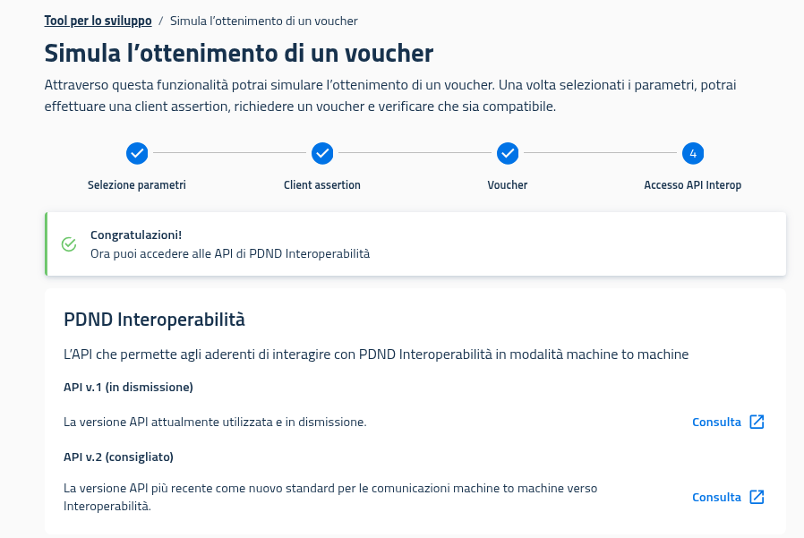
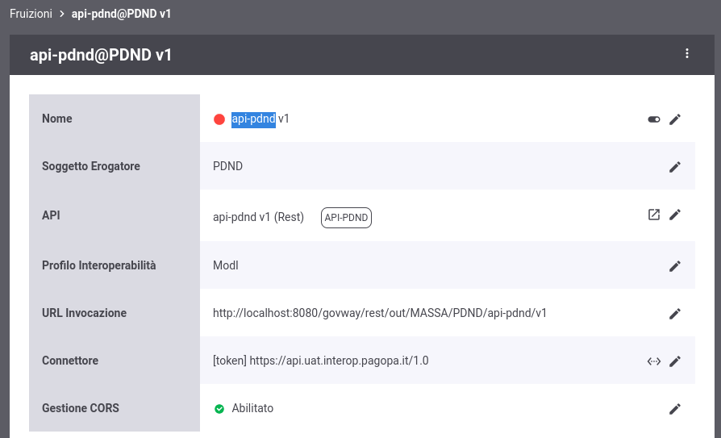

.. _modipa_passiPreliminari_api_pdnd:

API PDND
----------

**Introduzione**

La PDND mette a disposizione delle `API <https://developer.pagopa.it/it/pdnd-interoperabilita/guides/manuale-operativo-pdnd-interoperabilita/v1.0/riferimenti-tecnici/api-esposte-da-pdnd>`_ che consentono tra le varie funzionalità:

- *Recupero delle chiavi*: è possibile ottenere la chiave pubblica rispetto al kid indicato come parametro della url; questa risorsa viene utilizzata da GovWay per poter validare i token con pattern 'INTEGRITY_REST_02' e/o pattern di audit 'AUDIT_REST_01' o 'AUDIT_REST_02' in cui il trust avviene tramite PDND, in cui l'identificativo kid è presente all'interno del token.

- *Consultazione degli eventi*: le API consentono di acquisire informazioni relative alle modifiche delle chiavi crittografiche registrate sulla PDND; la risorsa viene utilizzata da GovWay per mantenere aggiornata la cache locale delle chiavi scaricate dalla PDND.

- *Recupero delle informazioni del client*: è possibile ottenere informazioni di dettaglio su un client tramite un'operazione che richiede il relativo clientId come parametro; la risorsa viene impiegata da GovWay per arricchire i dati tracciati sul mittente.

- *Recupero delle informazioni dell'organizzazione*: è possibile accedere ai dettagli di un'organizzazione tramite un'operazione che richiede il relativo identificativo come parametro; anche questa risorsa viene utilizzata da GovWay per arricchire le informazioni tracciate sul mittente.

**Versioni delle API**

Sono disponibili tre versioni delle API di interoperabilità della PDND (la v2 e la v1 risultano deprecate ma ancora attive):

- **v3** (`documentazione ufficiale on-line <https://developer.pagopa.it/it/pdnd-interoperabilita/api/PDND-core-v3/>`__): le operazioni sopra descritte corrispondono a:

   - *GET /keys/{kid}* per le chiavi client
   - *GET /producerKeys/{kid}* per le chiavi server
   - *GET /keyEvents* per la consultazione degli eventi
   - *GET /clients/{clientId}* per i dettagli sul client
   - *GET /tenants/{tenantId}* per i dettagli sull'organizzazione

- **v2** (`documentazione ufficiale on-line <https://developer.pagopa.it/pdnd-interoperabilita/api/pdnd-core-v2#/>`__): le operazioni corrispondenti sono le medesime della v3.

- **v1**: le operazioni sopra descritte corrispondono alle seguenti chiamate:

   - *GET /keys/{kid}* per le chiavi client e server
   - *GET /events/keys* per la consultazione degli eventi
   - *GET /clients/{clientId}* per i dettagli sul client
   - *GET /organizations/{organizationId}* per i dettagli sull'organizzazione

.. note::

   **Requisiti di sicurezza aggiuntivi della v3**

   La versione 3 delle API di interoperabilità introduce requisiti di sicurezza aggiuntivi rispetto alle versioni precedenti:

   - **DPoP (Demonstration of Proof-of-Possession)**: la v3 implementa il meccanismo DPoP secondo la specifica `IETF RFC 9449 <https://datatracker.ietf.org/doc/html/rfc9449>`_, che prevede il binding crittografico del token di accesso alle chiavi del richiedente. Ciò richiede la generazione di un materiale crittografico dedicato esclusivamente alla creazione delle prove DPoP, distinto da quello utilizzato per la client assertion. Per maggiori dettagli sulla procedura di richiesta del voucher DPoP si rimanda alla `documentazione ufficiale PDND <https://developer.pagopa.it/it/pdnd-interoperabilita/guides/manuale-operativo-pdnd-interoperabilita/v1.0/tutorial/tutorial-generali/come-richiedere-un-voucher-bearer-per-le-api-di-pdnd-interoperabilita-1>`__.

   - **Token di integrità nella risposta**: le risposte delle API v3 includono un token di integrità (header *Agid-JWT-Signature*) che consente di verificare l'autenticità e l'integrità della risposta ricevuta. Per la validazione di tale token è necessario ottenere la chiave pubblica della PDND tramite l'endpoint *.well-known/jwks.json* esposto pubblicamente. Per maggiori dettagli si rimanda alla `documentazione ufficiale PDND sulla verifica delle risposte firmate <https://developer.pagopa.it/it/pdnd-interoperabilita/guides/manuale-operativo-pdnd-interoperabilita/v1.0/tutorial/tutorial-generali/come-verificare-una-risposta-firmata-da-un-erogatore#step-1b-verifica-della-firma-di-una-risposta-firmata-da-pdnd-interoperabilita>`__.

**Endpoint e specifica OpenAPI**

L'endpoint di esposizione delle API e la specifica OpenAPI sono reperibili tramite la documentazione ufficiale on-line (`v3 <https://developer.pagopa.it/it/pdnd-interoperabilita/api/PDND-core-v3/>`_, `v2 <https://developer.pagopa.it/pdnd-interoperabilita/api/pdnd-core-v2#/>`_) e tramite la sezione "Tool per lo sviluppo > Simula l'ottenimento di un voucher > Simulazione per Interoperabilità" della PDND che varia in funzione dell'ambiente in cui ci si trova (figura :numref:`fruizioneAPIPDNDpassiPreliminariToolSviluppoOpenAPI`).

    Tool per lo sviluppo PDND - Simulazione per Interoperabilità - OpenAPI

Di seguito gli endpoint per ciascuna versione e ambiente:

.. list-table::
   :header-rows: 1
   :widths: 20 30 30 30

   * - Ambiente
     - v3
     - v2
     - v1
   * - Attestazione
     - \https://api.att.interop.pagopa.it/v3
     - \https://api.att.interop.pagopa.it/v2
     - \https://api.att.interop.pagopa.it/1.0
   * - Collaudo
     - \https://api.uat.interop.pagopa.it/v3
     - \https://api.uat.interop.pagopa.it/v2
     - \https://api.uat.interop.pagopa.it/1.0
   * - Produzione
     - \https://api.interop.pagopa.it/v3
     - \https://api.interop.pagopa.it/v2
     - \https://api.interop.pagopa.it/1.0

Per poter fruire delle API delle PDND deve essere registrato sulla PDND un `client di tipo 'api interoperabilità' <https://developer.pagopa.it/it/pdnd-interoperabilita/guides/manuale-operativo-pdnd-interoperabilita/v1.0/riferimenti-tecnici/client-e-materiale-crittografico>`_ caricando il certificato di firma che verrà utilizzato per richiedere il token. Al termine della registrazione si otterrà un identificativo univoco della propria identità ('*client_id*' o '*sub*') e un identificativo associato al certificato caricato ('*kid*').

.. note::

	**Materiale crittografico differente tra client di tipo 'api interoperabilità' e 'e-service'**

	La chiave registrata sulla PDND per quanto concerne il client di tipo 'api interoperabilità' DEVE essere differente da quello che verrà utilizzato per firmare i normali token previsti dai pattern di sicurezza messaggio e audit (es. differente dalla chiave indicata nella sezione ':ref:`modipa_passiPreliminari_keystore`').

.. note::

	**Passaggio ad una differente versione delle API**

	Di seguito vengono fornite tutte le indicazioni per configurare l'integrazione con le API di interoperabilità. Se un'integrazione era già stata attivata e la raccolta eventi era già attiva, il cambio di versione richiede un'operazione aggiuntiva una volta riavviato il sistema con la nuova versione indicata (es. passaggio da 1 a 2). Le operazioni necessarie vengono descritte nella sezione :ref:`modipa_sicurezza_avanzate_pdndConfAvanzata_api_verificaEventi`.

**Configurazione di GovWay**

Per consentire a GovWay di utilizzare le risorse precedentemente descritte, vengono fornite built-in tre fruizioni con profilo di interoperabilità 'ModI' e nome 'api-pdnd' (figura :numref:`fruizioneAPIPDNDpassiPreliminari`) per le tre versioni precedentemente descritte. Le fruizioni devono essere finalizzate negli aspetti descritti di seguito.

    Fruizione delle API PDND

- *Endpoint di esposizione delle API della PDND*: nella sezione 'connettore' deve essere indicata la corretta url di esposizione delle API PDND tra quelle elencate nella tabella precedente, in base alla versione e all'ambiente in uso (figura :numref:`fruizioneAPIPDNDpassiPreliminariConnettore`).

  .. figure:: ../../../_figure_console/fruizioneAPI_PDND_connettore.png
    :scale: 70%
    :name: fruizioneAPIPDNDpassiPreliminariConnettore

    Fruizione delle API PDND: connettore

- *Token Policy di negoziazione del voucher*: nella precedente sezione 'connettore' si è potuto vedere come sia stata associata al connettore una Token Policy di Negoziazione del tipo descritto nella sezione ':ref:`tokenNegoziazionePolicy_jwt`'. La token policy 'api-pdnd-dpop' (per v3) o 'api-pdnd' (per v2 e v1) riferita (figura :numref:`fruizioneAPIPDNDpassiPreliminariTokenPolicy`) deve essere finalizzata nei seguenti aspetti:

	- Url: deve essere indicato l'endpoint di negoziazione del voucher esposto dalla PDND:

		- ambiente di attestazione: \https://auth.att.interop.pagopa.it/token.oauth2
		- ambiente di collaudo: \https://auth.uat.interop.pagopa.it/token.oauth2
		- ambiente di produzione: \https://auth.interop.pagopa.it/token.oauth2

	        .. note::

		      Le url indicate potrebbero variare; si raccomanda di ottenere sempre i valori aggiornati tramite la sezione "Tool per lo sviluppo > Simula l'ottenimento di un voucher > Simulazione per Interoperabilità" della PDND (figura :numref:`fruizioneAPIPDNDpassiPreliminariToolSviluppoUrl`).

  .. figure:: ../../../_figure_console/fruizioneAPI_PDND_ToolSviluppoUrl.png
    :scale: 70%
    :name: fruizioneAPIPDNDpassiPreliminariToolSviluppoUrl

    Tool per lo sviluppo PDND - Simulazione per Interoperabilità - Endpoint

	- Audience: deve essere indicato il corretto valore atteso dal servizio della PDND, valore che cambia in funzione dell'ambiente:

		- ambiente di attestazione: auth.att.interop.pagopa.it/client-assertion
		- ambiente di collaudo: auth.uat.interop.pagopa.it/client-assertion
		- ambiente di produzione: auth.interop.pagopa.it/client-assertion

	        .. note::

		      I valori indicati potrebbero variare; si raccomanda di ottenere sempre dalla PDND i valori aggiornati.

  .. figure:: ../../../_figure_console/fruizioneAPI_PDND_tokenPolicy.png
    :scale: 70%
    :name: fruizioneAPIPDNDpassiPreliminariTokenPolicy

    Fruizione delle API PDND: token policy

- *Materiale crittografico e dati della PDND*: nella sezione 'ModI - Richiesta' (o 'ModI - Authorization OAuth' per api v2 o v1) devono essere configurati tutti i parametri relativi al materiale crittografico e ai dati identificativi ottenuti dalla PDND in seguito alla registrazione del client di tipo 'api interoperabilità' (figura :numref:`fruizioneAPIPDNDpassiPreliminariModIV3` per v3 o :numref:`fruizioneAPIPDNDpassiPreliminariModI` per v2 o v1):

	- Key Id (kid) del Certificato: identificativo kid della chiave pubblica;
	- Identificativo: clientId associato alla chiave pubblica;
	- Chiave Privata e Chiave Pubblica: indica il path su file system rispettivamente delle chiavi private e pubbliche in formato PEM o DER (sono supportati sia i formati pkcs1 che pkcs8);
	- Password Chiave Privata: se la chiave privata è cifrata deve essere indicata la password.

	.. note::

		Tramite il campo 'Tipo' è possibile utilizzare un tipo di archivio differente dalla coppia di chiavi pubblica e privata come un keystore 'PKCS12', 'JKS' o un archivio json 'JWK'.

  .. figure:: ../../../_figure_console/fruizioneAPI_PDND_modi_v3.png
    :scale: 70%
    :name: fruizioneAPIPDNDpassiPreliminariModIV3

    Fruizione delle API PDND: profilo 'ModI - Richiesta' (api v3)

  .. figure:: ../../../_figure_console/fruizioneAPI_PDND_modi.png
    :scale: 70%
    :name: fruizioneAPIPDNDpassiPreliminariModI

    Fruizione delle API PDND: profilo 'ModI - Authorization OAuth' (api v2 o v1)

- *Materiale crittografico del DPoP* (solamente per v3): nella sezione 'ModI - DPoP' devono essere configurati tutti i parametri relativi al materiale crittografico utilizzato per generare il DPoP token (figura :numref:`fruizioneAPIPDNDpassiPreliminariModIDPoP`). Tale materiale crittografico deve essere dedicato esclusivamente alla generazione delle prove DPoP e deve essere distinto sia da quello utilizzato per la client assertion sia da quello impiegato per i pattern di sicurezza messaggio.

  .. figure:: ../../../_figure_console/fruizioneAPI_PDND_modi_dpop.png
    :scale: 70%
    :name: fruizioneAPIPDNDpassiPreliminariModIDPoP

    Fruizione delle API PDND: profilo 'ModI - DPoP'

- *Validazione token di integrità della risposta PDND* (solamente per v3): nella sezione 'ModI - Risposta' deve essere configurata la validazione del token di integrità incluso nelle risposte delle API v3 della PDND. Il TrustStore Certificati deve essere ridefinito con tipo 'JWK Set' indicando la well-known URL fornita dalla PDND per l'ambiente in uso, oppure in alternativa un percorso nel file system contenente il JWK Set scaricato tramite tale URL:

	- ambiente di attestazione: \https://api.att.interop.pagopa.it/.well-known/jwks.json
	- ambiente di collaudo: \https://api.uat.interop.pagopa.it/.well-known/jwks.json
	- ambiente di produzione: \https://api.interop.pagopa.it/.well-known/jwks.json

	.. note::

		Le url indicate potrebbero variare; si raccomanda di ottenere sempre dalla PDND le url aggiornate. Per ulteriori dettagli sulla verifica delle risposte firmate si rimanda alla `documentazione ufficiale PDND <https://developer.pagopa.it/it/pdnd-interoperabilita/guides/manuale-operativo-pdnd-interoperabilita/v1.0/tutorial/tutorial-generali/come-verificare-una-risposta-firmata-da-un-erogatore#step-1b-verifica-della-firma-di-una-risposta-firmata-da-pdnd-interoperabilita>`__.

  .. figure:: ../../../_figure_console/fruizioneAPI_PDND_modi_integrityResponse.png
    :scale: 70%
    :name: fruizioneAPIPDNDpassiPreliminariModIIntegrityRisposta

    Fruizione delle API PDND: profilo 'ModI - Risposta'

- *Controllo degli Accessi*: si può notare come la fruizione riporta uno "stato rosso" che evidenzia una configurazione incompleta nella parte relativa al *Controllo degli Accessi*. Procedere con la configurazione del :ref:`apiGwControlloAccessi` al fine di renderla invocabile secondo la modalità di autenticazione ed autorizzazione desiderata. Le modalità scelte dovranno poi comportare una configurazione adeguata, descritta nel punto successivo, in modo da consentire a GovWay di invocare la fruizione.

- *Fruizione dell'API PDND da parte di GovWay*: la modalità di invocazione della fruizione viene definita tramite le proprietà presenti nel file "/etc/govway/modipa_local.properties" tutte con prefisso 'org.openspcoop2.protocol.modipa.sicurezzaMessaggio.certificati.remoteStore.pdnd.':

	- *baseUrl* (obbligatorio): definisce la base url dell'API di interoperabilità PDND; indicare nella url la versione dell'API PDND che si desidera utilizzare.

	  .. note::

	  	  È possibile utilizzare una versione differente delle API di interoperabilità per operazioni specifiche, configurando nel file "/etc/govway/modipa_local.properties" le seguenti proprietà:

	  	  - *org.openspcoop2.protocol.modipa.sicurezzaMessaggio.certificati.remoteStore.pdnd.api.keys.version*: versione dell'API per il recupero delle chiavi
	  	  - *org.openspcoop2.protocol.modipa.sicurezzaMessaggio.certificati.remoteStore.pdnd.api.events.version*: versione dell'API per la consultazione degli eventi
	  	  - *org.openspcoop2.protocol.modipa.sicurezzaMessaggio.certificati.remoteStore.pdnd.api.clients.version*: versione dell'API per il recupero delle informazioni del client
	  	  - *org.openspcoop2.protocol.modipa.sicurezzaMessaggio.certificati.remoteStore.pdnd.api.organizations.version*: versione dell'API per il recupero delle informazioni dell'organizzazione

	  	  Questa configurazione richiede che le fruizioni built-in, relative alle versioni indicate nelle proprietà sopra descritte, siano state preventivamente configurate con gli endpoint e i parametri corretti.

	- *connectTimeout* e *readTimeout* (obbligatorio): consentono di impostare rispettivamente i limiti temporali per l'instaurazione di una connessione e la ricezione di una risposta dalla PDND;
	- *http.username* e *http.password* (opzionale): se definite GovWay invocherà la fruizione utilizzando le credenziali http basic indicate; la keyword speciale '#none#' è utilizzabile per ridefinire la configurazione allo scopo di disabilitare l'invio delle credenziali.
	- *http.header.<nome>* (opzionale): consente di inviare http header personalizzati;
	- *http.queryParameter.<nome>* (opzionale): consente di aggiungere parametri personalizzati alla url invocata;
	- *https.keyStore*, *keyStore.type*, *keyStore.password*, *key.alias*, *key.password* (opzionale): le seguenti proprietà consentono di specificare un certificato tls client con cui GovWay invocherà la fruizione delle API PDND.
	- *https.hostnameVerifier* (opzionale): nel caso in cui la baseUrl indicata sia https consente di attivare o meno la verifica dell'hostname rispetto al CN.
	- *https.trustAllCerts* (opzionale): nel caso in cui la baseUrl indicata sia https disabilta l'autenticazione del certificato server.
	- *https.trustStore*, *https.trustStore.type*, *https.trustStore.password*, *https.trustStore.crl* (opzionale): consente di effettuare una autenticazione del certificato server rispetto ai parametri di truststore indicati.
	- *forwardProxy.url*, *forwardProxy.header*, *forwardProxy.queryParameter*, *forwardProxy.base64* (opzionale): consentono di attivare la modalità 'Proxy Applicativo' descritta nella sezione :ref:`avanzate_govway_proxy`.

- *Pull sulla PDND per ottenere gli eventi relativi alle chiavi*: come indicato nella sezione `Endpoint di notifica eventi <https://docs.pagopa.it/interoperabilita-1/manuale-operativo/api-esposte-da-pdnd-interoperabilita#endpoint-di-notifica-eventi>`_, le API della PDND consentono all'aderente di ottenere una lista di eventi che possono essere utilizzate da GovWay per mantenere aggiornata la cache locale delle chiavi scaricate dalla PDND. Per default la consultazione degli eventi è disabilitata e per abilitarla si deve intervenire sulle proprietà presenti nel file "/etc/govway/govway_local.properties" tutte con prefisso 'org.openspcoop2.pdd.gestoreChiaviPDND.':

	- *enabled*: impostare a true la proprietà per abilitare la consultazione degli eventi.
	- *keys.maxLifeMinutes*: indica la vita in minuti di una chiave scaricata dalla PDND e salvata nella cache locale (default: 43200, 30 giorni).
	- *events.keys.limit* indica il numero massimo di eventi recuperati tramite una singola chiamata alla PDND (default: 100).
	- *events.keys.timer.intervalloSecondi*: definisce l'intervallo, in secondi, rispetto al quale vengono controllati eventuali nuovi eventi sulla PDND (default: 3600, un'ora).
	- *cache.keys.timer.intervalloSecondi*: govway dispone di più livelli di cache (che si differenziano se risiedono in RAM o su Database). Questa proprietà definisce l'intervallo, in secondi, rispetto al quale le chiavi presenti nella cache in RAM vengono verificate rispetto alla chiavi presenti nella cache su Database (default: 300, 5 minuti).

- *Erogazione: maggiori informazioni sul mittente*: le API della PDND consentono anche di ottenere informazioni sull'organizzazione a cui il client afferisce. Tali informazioni possono essere recuperate da GovWay al fine di arricchire le tracce e definire criteri autorizzativi; una volta scaricate vengono mantenute in una cache locale. Per default la consultazione della PDND per ottenere maggiori informazioni sui client è disabilitata e per abilitarla si deve intervenire sulle proprietà presenti nel file "/etc/govway/govway_local.properties" tutte con prefisso 'org.openspcoop2.pdd.gestorePDND.':

	- *clientInfo.enabled*: impostare a true la proprietà per abilitare la raccolta delle informazioni sul client;
	- *clientInfo.maxLifeMinutes*: indica la vita in minuti delle informazioni scaricate dalla PDND e salvate nella cache locale (default: 43200, 30 giorni);
	- *clientInfo.cacheFallbackMaxLifeMinutes*: indica la durata, espressa in minuti, delle informazioni sul client ottenute dalla PDND in forma incompleta o non disponibili. Tali informazioni vengono comunque memorizzate temporaneamente nella cache locale (default: 5 minuti) per evitare chiamate ripetute e inutili verso la PDND;
	- *clients.error.abortTransaction* indicazione se far fallire la transazione in caso il recupero delle informazioni sul client fallisca (default: false, vedi :ref:`modipa_sicurezza_avanzate_pdndFailed`);
	- *organizations.error.abortTransaction* indicazione se far fallire la transazione in caso il recupero delle informazioni sull'organizzazione fallisca (default: false, vedi :ref:`modipa_sicurezza_avanzate_pdndFailed`).

  .. note::

 	  La raccolta delle informazioni sul mittente tramite la PDND richiede che la consultazione degli eventi, descritta nel precedente punto, sia stata abilitata nel file "/etc/govway/govway_local.properties" tramite la proprietà 'org.openspcoop2.pdd.gestoreChiaviPDND.enabled'
