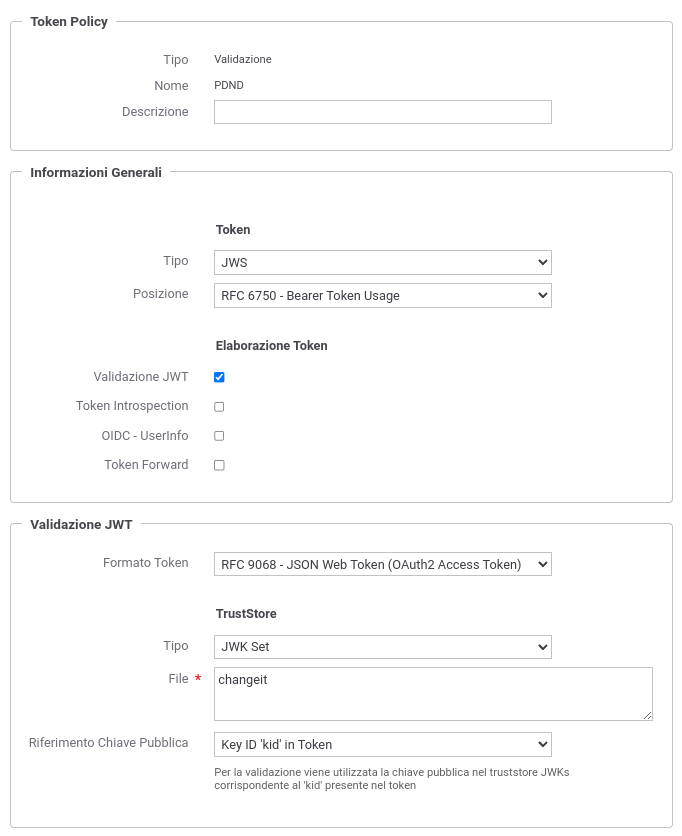
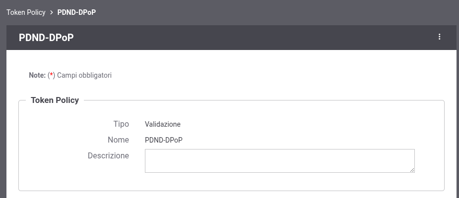
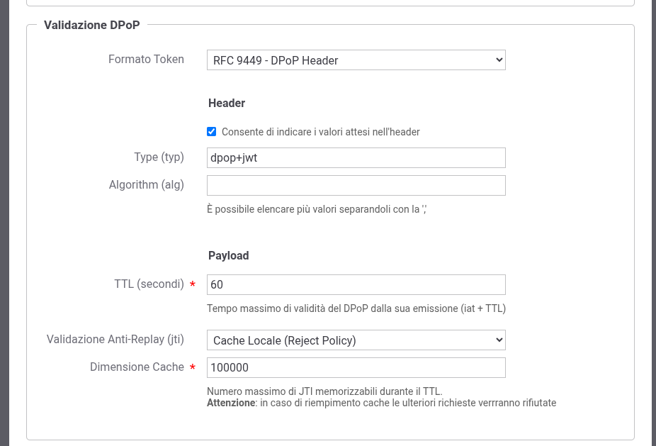

.. _modipa_passiPreliminari_trustStore_pdnd:

Trust tramite PDND
------------------

Per le richieste provenienti da amministrazioni esterne e contenenti token in cui il trust avviene tramite PDND, GovWay deve validare il token 'Authorization' al fine di verificare che sia stato effettivamente rilasciato dalla PDND.

Per la validazione del token GovWay utilizza una ':ref:`tokenValidazionePolicy`' con le seguenti caratteristiche:

- Token:

	- Tipo: JWS

	- Posizione: RFC 6750 - Bearer Token Usage (Authorization Request Header Field)

- Validazione JWT:

	- Formato Token: RFC 9068 - JSON Web Token (OAuth2 Access Token) 
	
	- TrustStore: deve contenere la chiave pubblica utilizzata dalla PDND per firmare i token

Con il prodotto vengono fornite built-in 2 token policy:

- 'PDND' (:numref:`tokenPolicyPDNDpassiPreliminari`)
- 'PDND-DPoP' (:numref:`tokenPolicyPDNDDPoPpassiPreliminari` e :numref:`tokenPolicyPDNDDPoPpassiPreliminari2`) 

entrambe da finalizzare nella sezione 'TrustStore' nei seguenti aspetti:

	- Location: deve essere indicata la well-known URL fornita dalla PDND, oppure in alternativa un percorso nel file system contenente ciò che è stato scaricato tramite la well-known URL:
	
		- ambiente di attestazione: https://att.interop.pagopa.it/.well-known/jwks.json	
		- ambiente di collaudo: https://uat.interop.pagopa.it/.well-known/jwks.json
		- ambiente di produzione: https://interop.pagopa.it/.well-known/jwks.json

		.. note::
	
			Le url indicate sopra potrebbero variare; si raccomanda di ottenere sempre dalla PDND le url aggiornate.

La token policy 'PDND-DPoP' differisce dalla policy 'PDND' per la presenza della validazione DPoP abilitata, che consente di verificare la DPoP proof (RFC 9449) ricevuta insieme all'access token. Per maggiori dettagli sulla configurazione della validazione DPoP si rimanda alla sezione :ref:`tokenValidazionePolicy_dpop`.

    Token Policy PDND

    Token Policy PDND-DPoP

    Token Policy PDND-DPoP: configurazione
