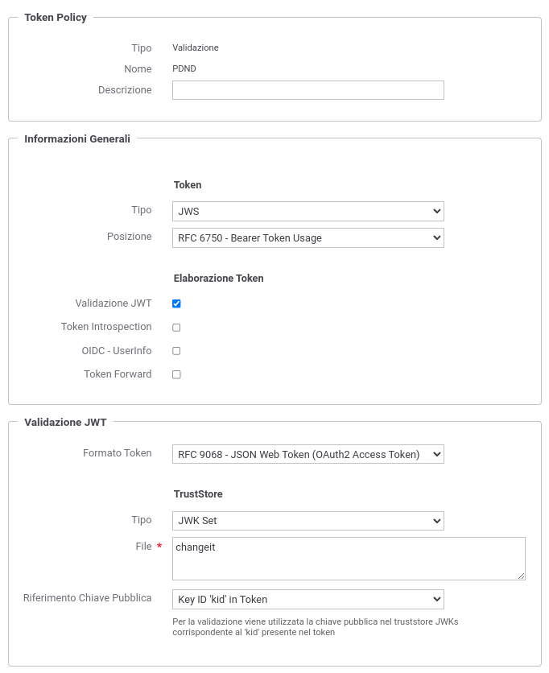

.. _modipa_passiPreliminari_trustStore_pdnd:

Trust tramite PDND
------------------

Per le richieste provenienti da amministrazioni esterne e contenenti token in cui il trust avviene tramite PDND, GovWay deve validare il token 'Authorization' al fine di verificare che sia stato effettivamente rilasciato dalla PDND.

Per la validazione del token GovWay utilizza una ':ref:`tokenValidazionePolicy`' con le seguenti caratteristiche:

- Token:

	- Tipo: JWS

	- Posizione: RFC 6750 - Bearer Token Usage (Authorization Request Header Field)

- Validazione JWT:

	- Formato Token: RFC 9068 - JSON Web Token (OAuth2 Access Token) 
	
	- TrustStore: deve contenere la chiave pubblica utilizzata dalla PDND per firmare i token

Con il prodotto viene fornita built-in la token policy 'PDND' (:numref:`tokenPolicyPDNDpassiPreliminari`) da finalizzare nella sezione 'TrustStore' nei seguenti aspetti:

	- File: deve essere indicato un path su file system che contiene il certificato di firma della PDND ottenibile tramite la well-know-url fornita dalla PDND stessa:
	
		- ambiente di collaudo: https://uat.interop.pagopa.it/.well-known/jwks.json
		- ambiente di produzione: https://interop.pagopa.it/.well-known/jwks.json

		.. note::
	
			Le url indicate sopra potrebbero variare; si raccomanda di ottenere sempre dalla PDND le url aggiornate.

    Token Policy PDND
