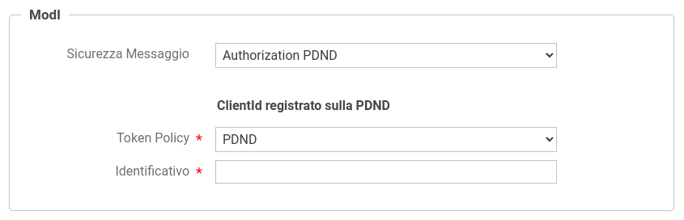
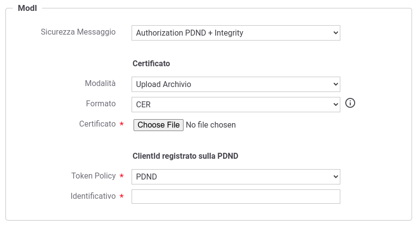

.. _modipa_pdnd_erogazione:

Erogazione (PDND)
-----------------

Nelle erogazioni, le richieste provengono da amministrazioni esterne al dominio e sono dirette ad applicativi interni. Prima di procedere con l'inoltro della richiesta verso il backend interno, GovWay valida il token di sicurezza ricevuto rispetto al pattern descritto nella sezione :ref:`modipa_pdnd`.

Per la configurazione di una erogazione con un pattern di sicurezza via PDND è necessario registrare una ':ref:`tokenValidazionePolicy`' con le seguenti caratteristiche:

- Token:

	- Tipo: JWS

	- Posizione: RFC 6750 - Bearer Token Usage (Authorization Request Header Field)

- Validazione JWT:

	- Formato Token: RFC 9068 - JSON Web Token (OAuth2 Access Token) 
	
	- TrustStore: deve contenere il certificato utilizzato dalla PDND per firmare i token

Con il prodotto viene fornita built-in la token policy 'PDND' (:numref:`tokenPolicyPDND`) da finalizzare nella sezione 'TrustStore' nei seguenti aspetti:

	- File: deve essere indicato un path su file system che contiene il certificato di firma della PDND ottenibile tramite la url '.../.well-known/jwks.json' fornita dalla PDND stessa;

	- Alias Certificato: deve contenere l'alias (il kid) della chiave pubblica utilizzata dalla PDND per firmare i token rilasciati, corrispondente al valore del claim 'kid' presente nel JWKSet configurato al punto precedente.

.. figure:: ../../_figure_console/tokenPolicyPDND.png
    :scale: 70%
    :name: tokenPolicyPDND

    Token Policy PDND

Una volta effettuata la registrazione della Token Policy, per utilizzarla in un'erogazione è necessaria attivarla come policy di autenticazione token nel controllo degli accessi come descritto nella sezione :ref:`apiGwGestioneToken`. 

Il processo di autenticazione token assicura la validità del token ricevuto. 

L'adozione del pattern ID_AUTH_REST_01 rilasciato dalla PDND consente alla ricezione di un messaggio di effettuare i medesimi controlli attuati su un token conforme al pattern descritto nella sezione ':ref:`modipa_idar01`' con la differenza che il token non è più firmato dall'applicativo mittente ma bensì dall'authorization server della PDND e l'identificazione dell'applicativo chiamante non è più attuabile tramite il certificato fornito nell'header del JWT tramite claim 'x5c/x5t/x5u' ma bensì tramite l'identificativo presente nel claim 'client_id'. Per poter identificare gli applicativi chiamanti la modalità di caricamento del certificato di firma, descritto nelle sezioni ':ref:`modipa_idar01_fruizione`' e ':ref:`modipa_idar01_erogazione`', non è più necessaria mentre si dovranno fornire i dati relativi al token OAuth (:numref:`tokenFirmaModIAppOAuth`) o in alternativa aggiungendo tali dati a quelli relativi al certificato (:numref:`tokenFirmaModIAppOAuthFirma`).

    Dati ModI relativi ad un applicativo esterno con configurazione token PDND

    Dati ModI relativi ad un applicativo esterno con configurazione sia del certificato di firma che del token PDND

.. note::

   La registrazione di applicativo esterno può avvenire anche utilizzando una token Policy differente da quella built-in 'PDND' fornita. Per farlo è possibile utilizzare le voci presenti in 'Sicurezza Messaggio' che sono analoghe a quelle documentate ma relative ad altre token policy di validazioni differenti dalla PDND: 'Authorization OAuth' e 'Authorization OAuth + Integrity'.

Una configurazione simile è attuabile anche sugli applicativi di dominio interno per poterli riconoscere su installazioni Multi-Tenant (':ref:`console_multitenant`') dove sia il tenant fruitore che quello erogatore viene gestito sullo stesso GovWay (:numref:`tokenFirmaModIAppOAuthFirmaMultiTenant`).

.. figure:: ../../_figure_console/modipa_applicativo_interno_token.png
    :scale: 70%
    :name: tokenFirmaModIAppOAuthFirmaMultiTenant

    Dati ModI relativi ad un applicativo interno con configurazione token PDND

    Dati ModI relativi ad un applicativo interno con configurazione sia del certificato di firma che del token PDND

Una volta registrati gli applicativi client è possibile attuare criteri di autorizzazione dei singoli applicativi accedendo alla configurazione della sezione "Controllo Accessi" e attivando la sicurezza messaggio. Sarà possibile specificare un elenco puntuale di applicativi autorizzati (:numref:`erogazione_secMessaggio_pdnd_fig`). In alternativa è possibile definire i ruoli che gli applicativi devono possedere.

    Autorizzazione di singoli applicativi token per l'accesso all'erogazione

Per verificare l'audience presente nel token ricevuto dalla PDND è invece possibile utilizzare l':ref:`tokenClaims` definendo il claim 'aud' uguale al valore atteso (:numref:`erogazione_secMessaggio_pdnd_aud_fig`).

    Autorizzazione di singoli applicativi token per l'accesso all'erogazione
