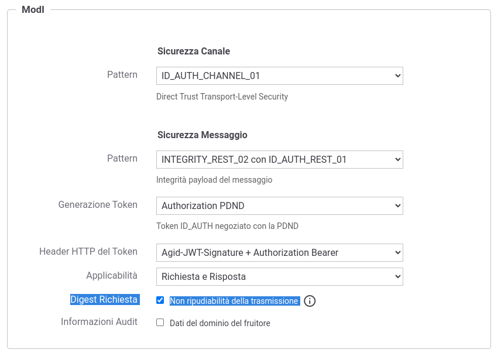

.. _modipa_requestDigest:

PROFILE_NON_REPUDIATION_01
~~~~~~~~~~~~~~~~~~~~~~~~~~~

*Non ripudiabilità della trasmissione*

Questa funzionalità consente di estendere il pattern ':ref:`modipa_sicurezzaMessaggio_ida03`' aggiungendo all'interno del token di sicurezza della risposta il digest della richiesta. 

La funzionalità consente di implementare la soluzione per la non ripudiabilità della trasmissione come suggerito nelle linee guida di interoperabilità (:numref:`api_modipaRequestDigest_fig`) all'interno del documento '03 Profili di interoperabilità.pdf'.

.. figure:: ../../_figure_console/modipa_api_requestDigest.png
  :scale: 50%
  :align: center
  :name: api_modipaRequestDigest_fig

  Punto 'D' della soluzione di sicurezza per la non ripudiabilità della trasmissione

.. note::
    La sigla che identifica il pattern di sicurezza messaggio varia a seconda se l'API sia di tipo REST, per cui la sigla corrisponde a *INTEGRITY_REST_01*, o SOAP dove viene utilizzata la sigla *INTEGRITY_SOAP_01*.

L'attivazione di questo profilo avviene a livello della relativa API, nella sezione "ModI", elemento "Sicurezza Messaggio", selezionando la voce "Digest Richiesta" (:numref:`api_modipaRequestDigest_opzione_fig`).

  Pattern di sicurezza messaggio "INTEGRITY" + Digest Richiesta

.. note::
    Poichè la funzionalità è un'estensione del pattern ':ref:`modipa_sicurezzaMessaggio_ida03`', la voce 'Digest Richiesta' compare solamente se è stato selezionato uno dei pattern "INTEGRITY\_\*"

.. note::
    Nel caso venga disabilitata la generazione della sicurezza messaggio sulla richiesta o sulla risposta, la funzionalità 'Digest della Richiesta' non sarà più attivabile.

Nella figura :numref:`api_modipaRequestDigest_exampleRest_fig` viene riportato un esempio del payload, relativo al token di sicurezza ModI della risposta per una API REST, contenente il digest della richiesta.

.. figure:: ../../_figure_console/modipa_api_requestDigest_example_rest.png
  :scale: 50%
  :align: center
  :name: api_modipaRequestDigest_exampleRest_fig

  Payload del Token di Sicurezza REST con pattern "INTEGRITY_REST" + Digest Richiesta

Nella figura :numref:`api_modipaRequestDigest_exampleSoap_fig` viene riportato un esempio relativo al token di sicurezza ModI della risposta per una API SOAP. Tutti i digest degli elementi firmati nella richiesta vengono riportati all'interno di un header soap 'X-Digest-Richiesta' della risposta. Il nuovo header 'X-Digest-Richiesta' sarà aggiunto agli elementi firmati nella risposta.

.. figure:: ../../_figure_console/modipa_api_requestDigest_example_soap.png
  :scale: 50%
  :align: center
  :name: api_modipaRequestDigest_exampleSoap_fig

  Payload del Token di Sicurezza SOAP con pattern "INTEGRITY_SOAP" + Digest Richiesta

