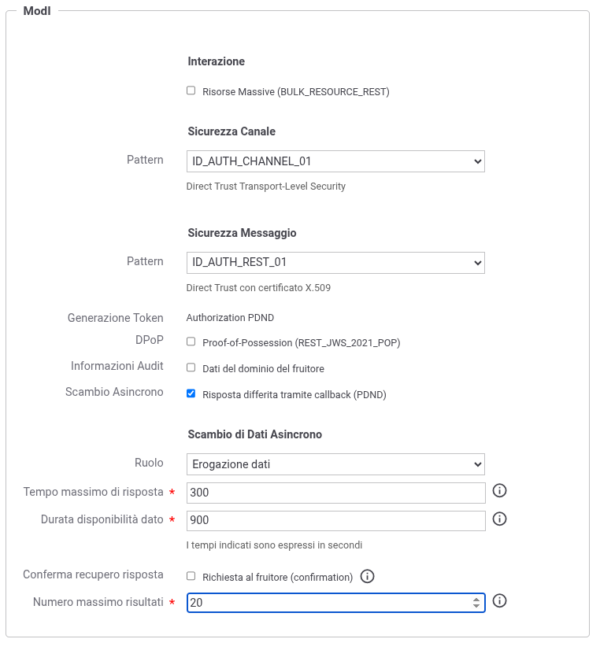
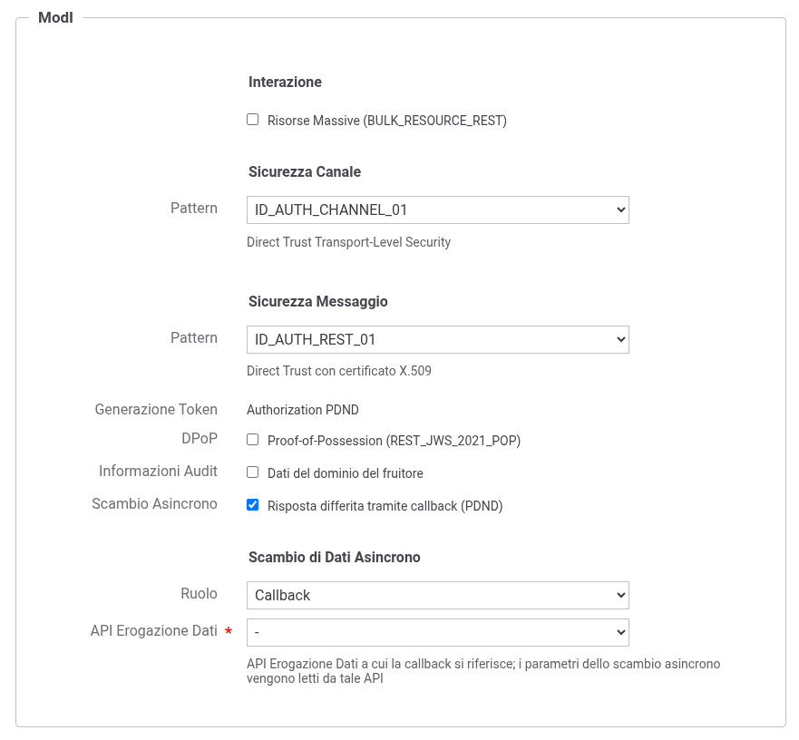
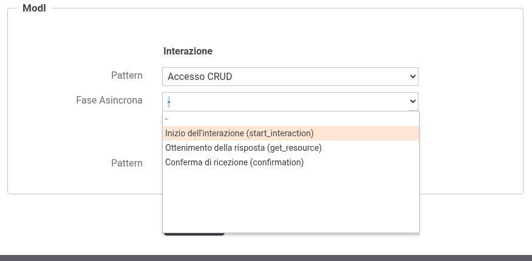
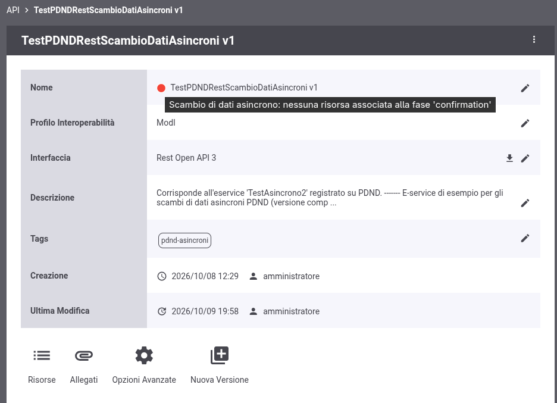
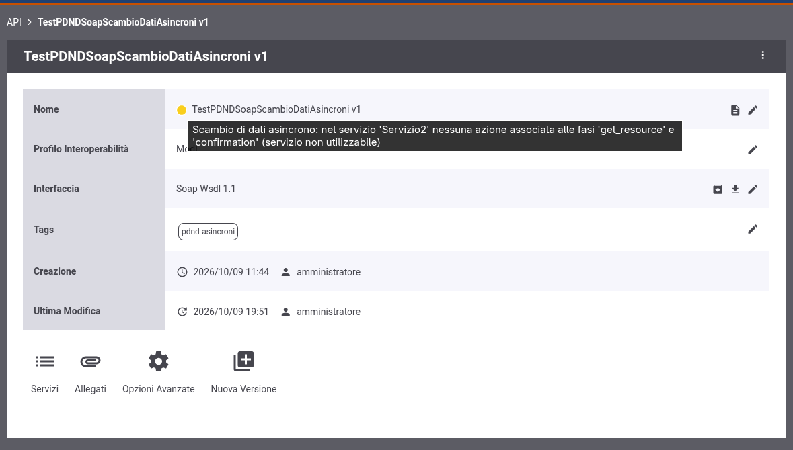

.. _modipa_scambiAsincroni_api:

Configurazione delle API
------------------------

Lo scambio di dati asincrono viene abilitato nella configurazione dell'API, nella sezione "ModI - Sicurezza Messaggio", attraverso il campo *Scambio Asincrono* ('Risposta differita tramite callback (PDND)'). Il campo risulta disponibile solamente quando la *Generazione Token* è impostata su 'Authorization PDND' (:numref:`ModIPdndAsyncApiErogazioneDati`).

Una volta abilitato, nella sezione "Scambio di Dati Asincrono" deve essere indicato il *Ruolo* dell'API:

- *Erogazione dati*: l'API dell'e-service, che contiene le operazioni per avviare l'interazione, ottenere la risposta ed eventualmente confermarne la ricezione;

- *Callback*: l'API con cui l'erogatore notifica al fruitore che la risposta è disponibile.

**API con ruolo 'Erogazione dati'**

Per un'API con ruolo *Erogazione dati* devono essere indicati i parametri dello scambio, che valgono anche per l'API di callback associata (:numref:`ModIPdndAsyncApiErogazioneDati`):

- *Tempo massimo di risposta*: secondi entro cui l'erogatore deve invocare la callback, a partire dall'inizio dell'interazione;

- *Durata disponibilità dato*: secondi in cui la risposta resta disponibile per il fruitore, a partire dall'invocazione della callback;

- *Conferma recupero risposta*: se abilitata ('Richiesta al fruitore (confirmation)'), il fruitore deve confermare il recupero della risposta invocando la fase di conferma; dopo la conferma la risposta non è più recuperabile. L'opzione è necessaria per poter associare la fase di conferma ad una risorsa o azione dell'API;

- *Numero massimo risultati*: numero massimo di entità che l'erogatore può dichiarare nella callback.

    API con ruolo 'Erogazione dati'

**API con ruolo 'Callback'**

Per un'API con ruolo *Callback* deve essere indicata l'*API Erogazione Dati* a cui la callback si riferisce, da cui vengono letti i parametri dello scambio (:numref:`ModIPdndAsyncApiCallback`). L'API indicata deve essere configurata con ruolo *Erogazione dati*, deve essere dello stesso tipo (REST o SOAP) e non deve essere già associata ad un'altra API di callback. Finché un'API di callback la riferisce, il ruolo dell'API di erogazione dati non può essere modificato.

    API con ruolo 'Callback'

**Associazione delle fasi alle operazioni**

Ogni fase dello scambio deve essere associata ad una risorsa (REST) o ad un'azione (SOAP) dell'API, tramite il campo *Fase Asincrona* presente nella sezione ModI della risorsa o dell'azione, sotto il pattern di interazione (:numref:`ModIPdndAsyncFaseRisorsa`):

- *Inizio dell'interazione (start_interaction)*, *Ottenimento della risposta (get_resource)* e *Conferma di ricezione (confirmation)*: selezionabili sulle API con ruolo *Erogazione dati*; la fase di conferma solamente se è abilitata la *Conferma recupero risposta*;

- *Invocazione della callback (callback_invocation)*: selezionabile sulle API con ruolo *Callback*. Se l'API REST possiede un'unica risorsa, o il servizio SOAP un'unica azione, e nessuna fase è stata indicata, la fase viene assegnata implicitamente a tale operazione.

Selezionando una fase, il pattern di interazione dell'operazione viene fissato ad 'Accesso CRUD' per le API REST e a 'Bloccante' per le API SOAP. Ogni fase può essere associata ad una sola risorsa dell'API REST, o ad una sola azione di ciascun servizio SOAP. Le operazioni senza fase (valore '-') non partecipano allo scambio asincrono. Se la risorsa o l'azione ridefinisce la sicurezza messaggio, la configurazione ridefinita deve comunque prevedere la generazione del token 'Authorization PDND' applicata alla richiesta.

    Associazione di una fase dello scambio ad una risorsa

**Stato dell'API**

Lo stato dell'API riporta se le fasi previste dal ruolo sono tutte associate ad un'operazione: start_interaction, get_resource ed eventualmente confirmation per l'API di erogazione dati; callback_invocation per l'API di callback.

- API REST: se una fase non è associata ad alcuna risorsa l'API risulta in errore (stato rosso), con l'indicazione delle fasi mancanti (:numref:`ModIPdndAsyncStatoApiErrore`).

    Stato di un'API REST priva della risorsa associata ad una fase

- API SOAP: vengono verificati solamente i servizi che possiedono almeno un'azione associata ad una fase, mentre gli altri servizi non partecipano allo scambio. L'API risulta in errore se nessun servizio possiede tutte le fasi previste; se invece convivono servizi completi e incompleti, l'API viene segnalata con un avviso (stato giallo) che indica i servizi incompleti, i quali non devono essere utilizzati (:numref:`ModIPdndAsyncStatoApi`).

    Stato di un'API SOAP con un servizio incompleto

Per default, nella creazione di erogazioni e fruizioni e nel cambio di versione dell'API, la console non propone le API in errore e i servizi SOAP incompleti; il comportamento è configurabile (:ref:`modipa_scambiAsincroni_properties`).
