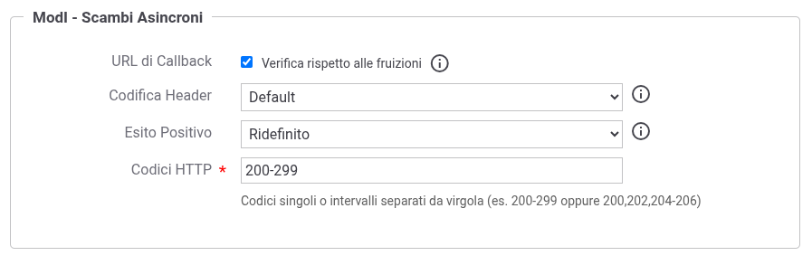
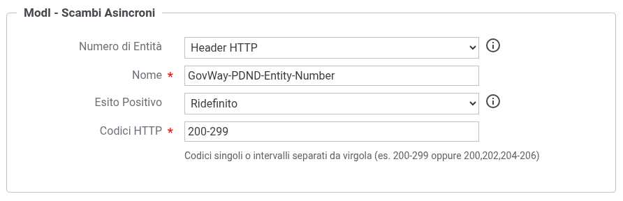
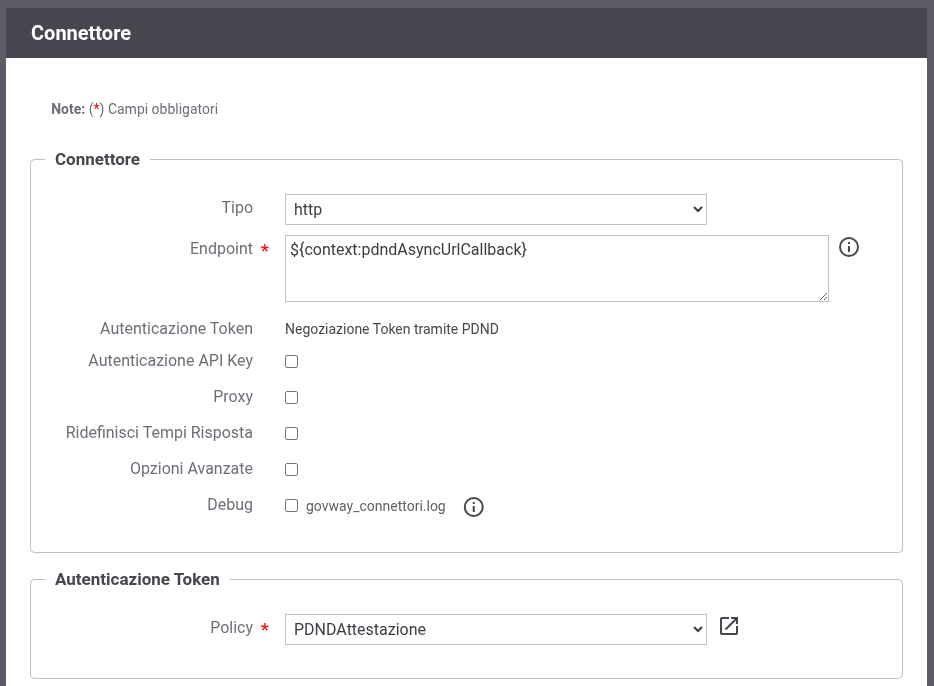

.. _modipa_scambiAsincroni_erogatore:

Configurazione dell'Ente Erogatore
----------------------------------

L'ente che eroga un e-service con scambio di dati asincrono deve configurare su GovWay:

- l'erogazione dell'API con ruolo *Erogazione dati*, tramite cui riceve dai fruitori l'avvio delle interazioni, le richieste di ottenimento della risposta e le conferme di ricezione;

- la fruizione dell'API con ruolo *Callback*, tramite cui l'applicativo notifica al fruitore che la risposta è disponibile.

Entrambe le API devono essere registrate come descritto nella sezione :ref:`modipa_scambiAsincroni_api`.

**Erogazione dell'API con ruolo 'Erogazione dati'**

L'erogazione viene creata come le altre erogazioni ModI con validazione del token 'Authorization PDND' (:ref:`modipa_pdnd`). Oltre alla validazione del voucher, GovWay verifica che la fase invocata sia coerente con lo stato dell'interazione, prima di inoltrare la richiesta all'applicativo.

All'inizio dell'interazione GovWay registra l'interazione, con l'identificativo e la URL di callback presenti nel voucher, e inoltra all'applicativo:

- l'identificativo dell'interazione nell'header 'GovWay-Conversation-ID', che l'applicativo dovrà indicare quando invocherà la callback;

- la URL di callback nell'header 'GovWay-PDND-Url-Callback' (nome configurabile, :ref:`modipa_scambiAsincroni_properties`).

Nelle fasi successive (ottenimento della risposta e conferma) l'identificativo dell'interazione viene inoltrato all'applicativo nel medesimo header 'GovWay-Conversation-ID'.

Nella sezione "ModI - Scambi Asincroni" dell'erogazione è possibile indicare (:numref:`ModIPdndAsyncErogazioneErogazioneDati`):

- *URL di Callback*: se abilitata la *Verifica rispetto alle fruizioni*, all'inizio dell'interazione viene verificato che la URL di callback presente nel voucher corrisponda al connettore di una fruizione, da parte del soggetto erogatore, di un'API di callback associata all'API: la URL di callback deve coincidere con la URL del connettore o estenderla con un ulteriore path (es. la risorsa di callback). Le fruizioni con un connettore dinamico (es. '${context:pdndAsyncUrlCallback}', :ref:`modipa_scambiAsincroni_erogatore_connettoreDinamico`) non vengono considerate; se esistono solamente fruizioni di questo tipo la verifica non viene effettuata;

- *Codifica Header*: codifica del valore dell'header con cui la URL di callback viene inoltrata all'applicativo ('Nessuna (valore in chiaro)', 'Base64' o 'Esadecimale'); con *Default* si applica la configurazione globale, che per default inoltra il valore in chiaro (:ref:`modipa_scambiAsincroni_properties`);

- *Esito Positivo*: codici HTTP della risposta dell'applicativo con cui la fase viene considerata completata e quindi registrata, come codici singoli o intervalli separati da virgola (es. '200-299' oppure '200,202,204-206'); con *Default* si applica la configurazione globale, che per default considera completata la fase con i codici '200-299' (:ref:`modipa_scambiAsincroni_properties`).

    Erogazione di un'API con ruolo 'Erogazione dati'

Ad esempio, se l'applicativo non risponde con successo all'inizio dell'interazione, l'interazione non viene registrata; se non risponde con successo alla conferma, l'interazione resta nello stato precedente e la conferma può essere ripetuta.

**Fruizione dell'API con ruolo 'Callback'**

La fruizione dell'API di callback viene creata come le altre fruizioni ModI con generazione del token 'Authorization PDND', per ciascun ente fruitore dell'e-service. Il connettore della fruizione riporta la URL di callback comunicata dal fruitore, ad esempio nel campo di testo della richiesta di fruizione (:ref:`modipa_scambiAsincroni_fruitore`): disporre di una fruizione esplicita per ogni fruitore consente di autorizzare preventivamente le destinazioni raggiungibili (es. aperture verso l'esterno) e, abilitando la *Verifica rispetto alle fruizioni* nell'erogazione, di rifiutare l'avvio di interazioni con una URL di callback non censita.

L'applicativo invoca la fruizione relativa al fruitore che ha avviato l'interazione, indicando nell'header 'GovWay-Conversation-ID' l'identificativo ricevuto all'inizio della stessa. A differenza di una normale fruizione PDND, nella richiesta del voucher non viene inviato il 'purposeId', anche se previsto dalla token policy: la callback non si riferisce ad una finalità del fruitore ma all'interazione, il cui identificativo, fornito tramite l'header 'GovWay-Conversation-ID', viene inserito da GovWay nella richiesta del voucher. 

Nella sezione "ModI - Scambi Asincroni" della fruizione è possibile indicare (:numref:`ModIPdndAsyncFruizioneCallback`):

- *Numero di Entità*: modalità (header HTTP o parametro della URL) e nome con cui l'applicativo fornisce il numero di entità prodotte (per default 'GovWay-PDND-Entity-Number' come header o 'govway_pdnd_entity_number' come parametro); il valore viene inserito nel voucher e non può superare il *Numero massimo risultati* definito nell'API;

- *Esito Positivo*: codici HTTP con cui la callback viene considerata completata, con le stesse modalità descritte per l'erogazione.

    Fruizione di un'API con ruolo 'Callback'

.. _modipa_scambiAsincroni_erogatore_connettoreDinamico:

Connettore dinamico della fruizione di callback
~~~~~~~~~~~~~~~~~~~~~~~~~~~~~~~~~~~~~~~~~~~~~~~~

In alternativa ad una fruizione per ciascun fruitore, è possibile configurare un'unica fruizione dell'API di callback il cui connettore utilizza la URL di callback ricevuta dalla PDND all'inizio dell'interazione, disponibile tramite la keyword '${context:pdndAsyncUrlCallback}' (:numref:`ModIPdndAsyncConnettoreCallback`). In questo modo la stessa fruizione consente di notificare tutti i fruitori dell'e-service, indipendentemente dal soggetto erogatore indicato nella fruizione; le destinazioni raggiunte non sono però note a priori.

    Connettore dinamico della fruizione dell'API di callback

Per un'API REST il connettore accoda alla URL il path della risorsa invocata: se il fruitore ha comunicato una URL che termina già con il path (statico) della risorsa di callback, tale path viene eliminato per evitare che venga ripetuto. La URL originale, così come ricevuta, resta disponibile con la keyword '${context:pdndAsyncUrlCallbackOriginal}'.

.. note::

    Il connettore dinamico viene risolto solamente per le operazioni associate ad una fase dello scambio. Le operazioni dell'API di callback non associate ad alcuna fase devono essere configurate in un gruppo della fruizione con un connettore statico.
