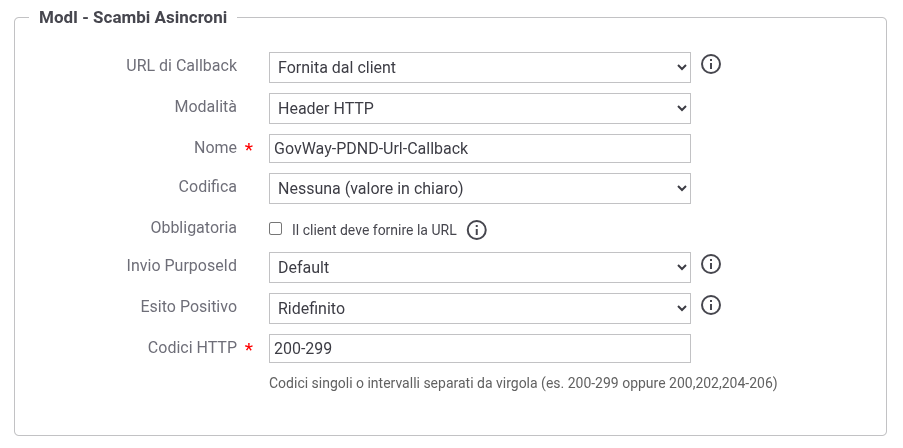

.. _modipa_scambiAsincroni_fruitore:

Configurazione dell'Ente Fruitore
---------------------------------

L'ente che fruisce di un e-service con scambio di dati asincrono deve configurare su GovWay:

- la fruizione dell'API con ruolo *Erogazione dati*, tramite cui l'applicativo avvia l'interazione, ottiene la risposta e ne conferma la ricezione;

- l'erogazione dell'API con ruolo *Callback*, tramite cui riceve dall'erogatore la notifica che la risposta è disponibile.

Entrambe le API devono essere registrate come descritto nella sezione :ref:`modipa_scambiAsincroni_api`.

**Token Policy di negoziazione**

La fruizione viene creata come le altre fruizioni ModI con generazione del token 'Authorization PDND' (:ref:`modipa_pdnd`); la token policy di negoziazione associata alla fruizione viene utilizzata anche per i voucher delle fasi dello scambio.

La PDND fornisce un endpoint dedicato per la negoziazione dei voucher relativi agli scambi di dati asincroni. Nella token policy di negoziazione 'PDND' l'endpoint può essere indicato nel campo *URL Scambi Asincroni*; se non viene valorizzato, l'endpoint viene calcolato aggiungendo il suffisso '.async' alla *URL* della policy, quando questa termina con 'token.oauth2' (:ref:`tokenNegoziazionePolicy_pdnd`).

**Erogazione dell'API di Callback**

L'erogazione dell'API di callback viene creata come le altre erogazioni ModI con validazione del token 'Authorization PDND'. La sua URL di invocazione è la URL di callback dell'ente: deve essere resa raggiungibile dall'erogatore e comunicata all'erogatore stesso, che la utilizzerà per configurare la propria fruizione dell'API di callback (:ref:`modipa_scambiAsincroni_erogatore`).

.. note::

    La PDND non prevede attualmente un momento esplicito di dichiarazione della URL di callback da parte dei fruitori. Un e-service con approvazione manuale delle richieste di fruizione consente al fruitore di indicare la URL nel campo di testo della richiesta, che l'erogatore consulta prima dell'approvazione.

Alla ricezione della callback GovWay verifica che l'interazione sia stata avviata dal soggetto fruitore verso il soggetto mittente della callback, per l'API di erogazione dati associata, e che la callback non sia già stata ricevuta o sia scaduta. Vengono inoltrati all'applicativo:

- l'identificativo dell'interazione nell'header 'GovWay-Conversation-ID';

- il numero di entità prodotte, nell'header 'GovWay-PDND-Entity-Number' (nome configurabile, :ref:`modipa_scambiAsincroni_properties`), solamente se l'informazione è presente nell'access token rilasciato dalla PDND.

Nella sezione "ModI - Scambi Asincroni" dell'erogazione è possibile ridefinire l'*Esito Positivo* (descritto di seguito): la callback viene registrata solamente se l'applicativo risponde con successo; in caso contrario l'erogatore può invocarla nuovamente.

**Fruizione dell'API con ruolo 'Erogazione dati'**

Nella sezione "ModI - Scambi Asincroni" della fruizione è possibile indicare (:numref:`ModIPdndAsyncFruizioneErogazioneDati`):

- *URL di Callback*: URL inviata alla PDND all'inizio dell'interazione, su cui l'erogatore invocherà la callback:

   - *Erogazione API di callback* (default): viene utilizzata la URL di invocazione dell'erogazione, da parte del soggetto fruitore, dell'API di callback associata all'API; l'erogazione deve esistere ed essere unica;

   - *Fornita dal client*: la URL viene fornita dall'applicativo tramite un header HTTP o un parametro della URL (*Modalità*), con il *Nome* indicato (per default 'GovWay-PDND-Url-Callback' come header o 'govway_pdnd_url_callback' come parametro), eventualmente codificata (*Codifica*: 'Nessuna (valore in chiaro)', 'Base64' o 'Esadecimale'). Se l'opzione *Obbligatoria* ('Il client deve fornire la URL') è abilitata, una richiesta priva della URL viene rifiutata; altrimenti viene utilizzata la URL dell'erogazione dell'API di callback.

- *Invio PurposeId*: indica se il 'purposeId' deve essere inserito nella richiesta del voucher per l'ottenimento della risposta e per la conferma di ricezione; nell'inizio dell'interazione viene sempre inviato. Con *Default* si applica la configurazione globale, che per default prevede l'invio (:ref:`modipa_scambiAsincroni_properties`).

- *Esito Positivo*: con *Ridefinito* è possibile indicare nel campo *Codici HTTP* i codici della risposta con cui la fase viene considerata completata e quindi registrata, come codici singoli o intervalli separati da virgola (es. '200-299' oppure '200,202,204-206'); con *Default* si applica la configurazione globale, che per default considera completata la fase con i codici '200-299' (:ref:`modipa_scambiAsincroni_properties`).

    Fruizione di un'API con ruolo 'Erogazione dati'

.. note::

    Come previsto dalla PDND, la URL di callback deve essere quella dell'API di callback, senza il path della risorsa invocata, che viene aggiunto dall'erogatore al momento dell'invocazione.

L'identificativo dell'interazione viene restituito all'applicativo nell'header 'GovWay-Conversation-ID' della risposta all'inizio dell'interazione e deve essere indicato dall'applicativo, nello stesso header, nelle richieste di ottenimento della risposta e di conferma.
