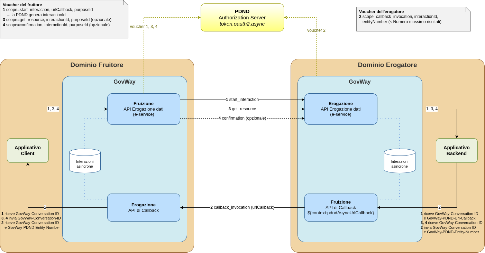

.. _modipa_scambiAsincroni_panoramica:

Panoramica
----------

In uno scambio di dati asincrono PDND sono coinvolte due API, entrambe configurate con generazione del token 'Authorization PDND':

- l'API dell'e-service, con ruolo *Erogazione dati*, offerta dall'erogatore: consente al fruitore di avviare l'interazione, ottenere la risposta e confermarne la ricezione;

- l'API di *Callback*, offerta dal fruitore: viene invocata dall'erogatore per notificare che la risposta è disponibile.

Su ciascun dominio GovWay gestisce quindi una fruizione ed una erogazione (:numref:`ModIPdndAsyncFlusso`):

- il GovWay del fruitore gestisce la fruizione dell'e-service e l'erogazione dell'API di callback;

- il GovWay dell'erogatore gestisce l'erogazione dell'e-service e la fruizione dell'API di callback.

La configurazione richiesta a ciascun ente è descritta nelle sezioni :ref:`modipa_scambiAsincroni_fruitore` e :ref:`modipa_scambiAsincroni_erogatore`.

    Scambio di dati asincrono PDND: fasi e componenti coinvolte

**Fasi dello scambio**

Ogni operazione (risorsa REST o azione SOAP) delle due API può essere associata ad una fase dello scambio. Per ogni fase GovWay negozia con la PDND un voucher dedicato, il cui claim 'scope' indica la fase:

- *Inizio dell'interazione (start_interaction)*: il fruitore invia la richiesta all'erogatore. Il voucher riporta la URL di callback ('urlCallback') e il 'purposeId'; la PDND genera l'identificativo dell'interazione ('interactionId') e lo inserisce nel voucher. L'erogatore registra l'interazione e restituisce una risposta di presa in carico.

- *Invocazione della callback (callback_invocation)*: quando la risposta è pronta, l'erogatore invoca la callback sulla URL ricevuta. Il voucher riporta l'identificativo dell'interazione e il numero di entità prodotte ('entityNumber'), che non può superare il *Numero massimo risultati* indicato nell'API. La callback può essere invocata una sola volta ed entro il *Tempo massimo di risposta*.

- *Ottenimento della risposta (get_resource)*: il fruitore recupera la risposta. Il voucher riporta l'identificativo dell'interazione; l'invio del 'purposeId' è configurabile nella fruizione (:ref:`modipa_scambiAsincroni_fruitore`). La fase può essere ripetuta finché la risposta resta disponibile, cioè entro la *Durata disponibilità dato* a partire dalla callback.

- *Conferma di ricezione (confirmation)*: prevista solamente se nell'API è abilitata la *Conferma recupero risposta*; il fruitore conferma di aver ottenuto la risposta, che da quel momento non è più recuperabile. La conferma è ammessa solamente dopo che la risposta è stata ottenuta almeno una volta.

Le operazioni non associate ad alcuna fase (es. operazioni sincrone dell'API) vengono gestite come le normali operazioni ModI; se invocate indicando l'identificativo di un'interazione esistente, la richiesta viene rifiutata.

**Identificativo dell'interazione**

L'identificativo dell'interazione generato dalla PDND corrisponde all'identificativo di conversazione di GovWay: il fruitore lo riceve nell'header di risposta 'GovWay-Conversation-ID' dell'inizio dell'interazione e lo indica, nello stesso header, nelle richieste successive (ottenimento della risposta e conferma). Lato erogatore GovWay lo inoltra al backend nell'header 'GovWay-Conversation-ID' e il backend lo indica nello stesso header quando invoca la callback.

**Stato dell'interazione**

Sia il GovWay del fruitore che quello dell'erogatore registrano lo stato di ogni interazione e verificano che ogni fase sia ammessa: le fasi devono essere invocate in sequenza: ad esempio la risposta non può essere ottenuta prima della callback, la conferma non può precedere l'ottenimento della risposta, la callback non può essere invocata due volte e, dopo la conferma, l'interazione non accetta più richieste. Le fasi richieste oltre i tempi indicati nell'API vengono rifiutate come scadute.

Una fase viene registrata solamente se la risposta ottenuta indica il suo completamento (per default un codice HTTP 2xx): in caso contrario l'interazione resta nello stato precedente e la fase può essere ripetuta.

Le interazioni sono consultabili nella console (:ref:`configCachePDNDInterazioniAsincrone`) e sono soggette ad uno svecchiamento periodico, che le elimina una volta trascorso un periodo di conservazione dalla loro scadenza (:ref:`modipa_scambiAsincroni_properties`). Le transazioni relative alle fasi riportano la fase e la URL di callback (:ref:`mon_dettaglio_transazione`).
