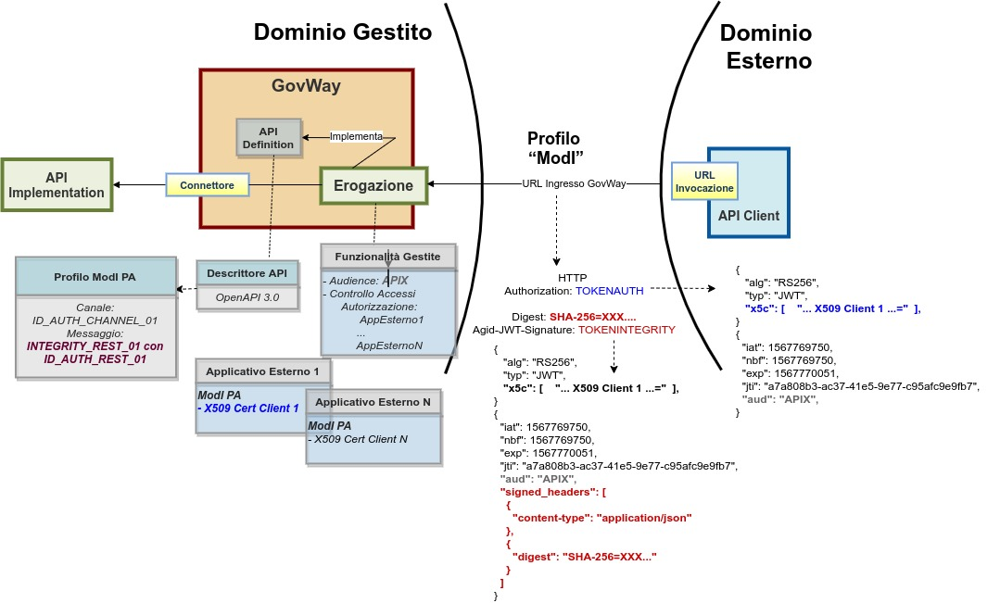

.. _modipa_sicurezzaMessaggio:

Sicurezza Messaggio
-------------------

Il pattern di sicurezza sul messaggio definisce le modalità di comunicazione dei messaggi tra componenti interne  ai domini delle entità coinvolte. Tali pattern sono distinti per il caso SOAP e per quello REST:

- *ID_AUTH_SOAP_01 o ID_AUTH_REST_01 - Direct Trust con certificato X.509 su SOAP o REST*: tramite la validazione del certificato X509, inserito dall'applicazione mittente nel token di sicurezza, l'applicativo destinatario verifica la corrispondenza delle identità e la validità del messaggio, prima di procedere con il processamento del messaggio attraverso un trust tra fruitore e erogatore basato su certificati x509.

- *ID_AUTH_REST_01 tramite la Piattaforma Digitale Nazionale Dati (PDND)*: con l'aggiornamento delle linee guida nella 'Determinazione n. 128 del 23 maggio 2023', viene indicato di utilizzare la PDND per ottenere un token conforme al pattern ID_AUTH_REST_01; la costituzione del trust avviene attraverso il materiale crittografico depositato sulla PDND applicando i profili di emissione dei voucher previsti.

- *ID_AUTH_SOAP_02 o ID_AUTH_REST_02 - Direct Trust con certificato X.509 su SOAP o REST con unicità del messaggio/token*: estensione dei pattern precedenti con l'aggiunta di un meccanismo di filtro che impedisce il processamento di un messaggio duplicato.

- *INTEGRITY_SOAP_01 o INTEGRITY_REST_01 - Integrità del payload del messaggio SOAP o REST*: pattern che estende i precedenti aggiungendo la gestione della firma del payload come verifica di integrità del messaggio ricevuto.

- *INTEGRITY_REST_02 - Integrità del payload delle request REST in PDND*: simile al precedente pattern INTEGRITY_REST_01, assume che il trust avvenga tramite il materiale crittografico depositato sulla PDND applicando i profili di emissione dei voucher previsti. All'interno del token viene indicato l'identificativo della chiave pubblica (kid) associata alla chiave privata utilizzata dal client per firmare il token di integrità; identificativo kid generato dalla PDND e recuperabile dall'erogatore tramite le API messe a disposizione dalla PDND stessa.

- *PROFILE_NON_REPUDIATION_01 - Profilo per la non ripudiabilità della trasmissione*: estende i pattern di integrità allo scopo di fornire una conferma al fruitore da parte dell’erogatore della ricezione del contenuto della richiesta. Descrive inoltre la necessità di definire un arco temporale di persistenza dei messaggi utile per soddisfare l opponibilità ai terzi.

- *AUDIT_REST_01 o AUDIT_REST_02 - Inoltro dati tracciati nel dominio del Fruitore*: consente all'erogatore di identificare la specifica provenienza di ogni singola richiesta di accesso ai dati effettuta dal fruitore. 

Le applicazioni di un dominio interno o esterno, descritte negli scenari del Modello di Interoperabilità, vengono rappresentate in GovWay tramite la registrazione di Applicativi come entità di configurazione. In accordo al modello di GovWay, ciascun applicativo è associato al soggetto di riferimento che, nell'ottica ModI, rappresenta il dominio di appartenenza. Un applicativo viene identificato attraverso il criterio di trust del pattern di sicurezza scelto:

- trust tramite PDND: l'applicativo viene identificato tramite il 'clientId' presente all'interno del token 'Authorization' previsto dal pattern 'ID_AUTH_REST';
- trust tra fruitore ed erogatore tramite certificati X509: l'applicativo viene identificato tramite il certificato di firma utilizzato dal fruitore e riferito all'interno del token 'Authorization' (claim x5c o x5t#256 o x5u) nel caso di pattern 'ID_AUTH_REST' o all'interno dell'header SOAP di WSSecurity nel caso di pattern 'ID_AUTH_SOAP'.

Vedremo nelle sezioni seguenti come si possono effettuare le configurazioni relative ai pattern di sicurezza messaggio, mentre di seguito vengono raffigurati i tipici scenari di utilizzo.

**Fruizioni di API**

Per quanto concerne le fruizioni, le richieste che provengono dagli applicativi interni del dominio e sono dirette verso altre amministrazioni vengono arricchite del token di sicurezza 'ModI' associato all'operazione invocata. Gli applicativi vengono identificati attraverso una delle modalità di autenticazione previste da GovWay (vedi sez. :ref:`apiGwAutenticazione`) ed una volta identificato viene utilizzato il materiale crittografico (keystore pkcs12, jks, jwk, private and public key) associatogli per effettuare la firma dei token di sicurezza 'ModI' (:numref:`FruizioneModIPA`). In alternativa il materiale crittografico da utilizzare per la firma può essere definito direttamente nella fruizione o nella token policy.

Nella figura ':numref:`FruizioneModIPA-PDND`' viene raffigurato lo scenario di fruizione in cui il trust avviene tramite la PDND.

    Fruizione con Profilo di Interoperabilità 'ModI': trust tramite PDND

Nella figura ':numref:`FruizioneModIPA`' viene invece raffigurato lo scenario di fruizione in cui il trust avviene tra fruitore ed erogatore tramite certificati X509.

.. figure:: ../_figure_console/FruizioneModIPA.jpg
    :scale: 70%
    :align: center
    :name: FruizioneModIPA

    Fruizione con Profilo di Interoperabilità 'ModI': trust tra fruitore ed erogatore tramite certificati X509

**Erogazioni di API**

In un'erogazione di una API le richieste provengono da amministrazioni esterne al dominio e sono dirette ad applicativi interni. Prima di procedere con l'inoltro della richiesta verso il backend interno, GovWay valida il token di sicurezza ricevuto rispetto al pattern associato all'operazione invocata: verifica firma, validazione temporale, filtro duplicati, verifica integrità del messaggio, verifica del token di audit etc.

Nella figura ':numref:`ErogazioneModIPA-PDND`' viene raffigurato lo scenario di erogazione in cui il trust avviene tramite la PDND:

- il token di autenticazione (ID_AUTH) viene validato rispetto alla chiave pubblica della PDND;
- i token di integrità (INTEGRITY_REST) e/o il token di audit vengono validati scaricando la chiave pubblica del firmatario del token tramite le API della PDND, utilizzando l'identificativo kid presente all'interno del token.

    Erogazione con Profilo di Interoperabilità 'ModI': trust tramite PDND

Nella figura ':numref:`ErogazioneModIPA`' viene invece raffigurato lo scenario di erogazione in cui il trust avviene tra fruitore ed erogatore tramite certificati X509.

    Erogazione con Profilo di Interoperabilità 'ModI': trust tra fruitore ed erogatore tramite certificati X509

.. toctree::
        :maxdepth: 2

	messaggio/passiPreliminari/index
        messaggio/idar01/index
        messaggio/idar02/index
        messaggio/idar03/index
	messaggio/requestDigest
	messaggio/audit/index
	messaggio/avanzata/index
