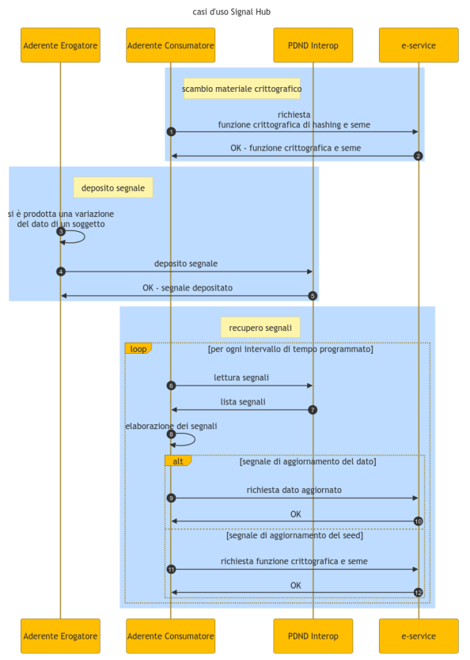

.. _modipa_signalHub:

Signal Hub
----------------------

**Panoramica**

Signal Hub è una funzionalità offerta dalla PDND che permette di rimanere aggiornati sulle modifiche dei dati di determinati servizi registrati nella PDND.

Gli erogatori di tali servizi possono pubblicare dei segnali che avvertono la PDND di un cambiamento relativo ad un oggetto all'interno del proprio sistema.

Successivamente, un consumatore di tale servizio può reperire la lista dei segnali depositati dall'erogatore per identificare quali oggetti sono cambiati. In tal modo, può recuperare puntualmente l'oggetto modificato comunicando con il servizio erogato, senza dover richiedere l'intero database.

Ogni segnale depositato conterrà le seguenti informazioni: 

   - objectId: ID relativo all'oggetto che è stato modificato (cifrato come descritto in seguito)
   - objectType: tipologia dell'oggetto modificato
   - signalType: tipologia di modifica sull'oggetto [``CREATE``, ``UPDATE``, ``DELETE``, ``SEEDUPDATE``]
   - signalId: ID univoco del segnale

La PDND si occuperà di mantenere i segnali relativi a un determinato servizio per 30 giorni.

Per garantire l'anonimità dell'ID di un oggetto, l'informazione objectId deve passare attraverso un processo di pseudoanonimizzazione prima di essere inviata alla PDND. Per fare ciò, tale campo dovrà essere processato tramite una funzione di hash insieme a un seme, al fine di impedire attacchi di tipo "rainbow tables".

Il servizio erogato dovrà esporre, tramite un endpoint specifico, una risorsa che contenga le informazioni di pseudoanonimizzazione (funzione di hash + seme).

Le informazioni di pseudoanonimizzazione dovranno essere aggiornate periodicamente per garantire una maggiore sicurezza.

**Diagramma di sequenza**

Il diagramma di sequenza è rappresentato nella figura ':numref:`SignalHubSequenceDiagram`'

    Diagramma di sequenza per l'utilizzo da parte di un aderente della funzionalita Signal Hub

1-2) Quando un Consumatore vuole tenere traccia dei cambiamenti all'interno di una base dati di un e-service, dopo essersi iscritto tramite la PDND a tale servizio, deve richiedere a tale e-service le informazioni di pseudoanonimizzazione (hash e seme). Il formato di tale richiesta non è esplicitamente fornito dalle specifiche della PDND, ma dovrà essere correttamente documentato dall'e-service specifico.

3-5) Quando un oggetto all'interno della base dati subisce un cambiamento (eliminazione, creazione o modifica), il soggetto Erogatore deve inviare un segnale di deposito alla PDND come descritto nell' `openapi <https://raw.githubusercontent.com/pagopa/interop-signalhub-core/refs/tags/1.0.1/docs/openAPI/push-signals.yaml>`__.

6-12) A quel punto, la PDND manterrà in memoria il segnale depositato per 30 giorni, durante i quali un soggetto Consumatore potrà accedere alla lista dei segnali depositati, come descritto nell' `openapi <https://raw.githubusercontent.com/pagopa/interop-signalhub-core/refs/tags/1.0.1/docs/openAPI/pull-signals.yaml>`__ Tramite l'objectId pseudoanonimizzato ricevuto, potrà risalire al nuovo valore dell'oggetto riferito, chiamando direttamente l'e-service. Per fare ciò, dovrà usare le informazioni di pseudoanonimizzazione per individuare a quale ID si riferisce.

Periodicamente, l'e-service dovrà aggiornare le informazioni crittografiche inviando alla PDND un segnale di tipo ``SEEDUPDATE``. Tale segnale informerà il Consumatore che dovrà aggiornare il proprio DB per ricalcolare l'hash degli ID di tutti gli oggetti di cui vuole tenere traccia.

**Cifratura**

La PDND fornisce indicazioni sulle funzioni di hashing da utilizzare, la lunghezza del seme e il periodo di rotazione delle informazioni crittografiche.

Il modo in cui concatenare l'ID e il seme non è formalizzato e può essere deciso e documentato dall'e-service.

Le seguenti funzioni di hash sono disponibili:

   - SHA-2:
      - SHA-256
      - SHA-512/256
      - SHA-384
      - SHA-512
   - SHA-3:
      - SHA3-256
      - SHA3-384
      - SHA3-512
      - SHAKE128
      - SHAKE256

Le raccomandazioni fornite dalla PDND su funzioni di hash, lunghezza del seme e periodo di rotazione sono le seguenti:

.. list-table:: Raccomandazioni PDND
   :widths: 40 20 20 20
   :header-rows: 1

   * - tipologia dei dati
     - versione algoritmo
     - gg rotazione seme
     - dimensione seme
   * - | Dati che permettono 
       | l'identificazione indiretta
       | della persona fisica
     - | Nessuna raccomandazione
       | specifica
     -
     -
   * - | Dati che permettono 
       | l'identificazione diretta 
       | della persona fisica
     - | Nessuna raccomandazione
       | specifica
     - <= 120gg
     - >= 16 caratteri
   * - | Dati sensibili della 
       | persona fisica (origine 
       | razziale o etnica, 
       | convinzioni religiose, 
       | filosofiche, opinioni 
       | politiche, appartenenza 
       | sindacale, relativi alla 
       | salute o alla vita sessuale)
     - - SHA384
       - SHA512
       - SHA3384
       - SHA3512
       - SHAKE128
       - SHAKE256
     - <= 80gg
     - >= 32 caratteri
   * - | Dati giudiziari della persona
       | fisica (esistenza di 
       | determinati provvedimenti 
       | giudiziari soggetti ad 
       | iscrizione nel casellario 
       | giudiziale)
     - - SHA512
       - SHA3512
       - SHAKE128
       - SHAKE256
     - <= 60gg
     - >= 64 caratteri
   * - | Altri dati della persona 
       | fisica (relativi alle 
       | comunicazioni elettroniche e 
       | che consentono la 
       | geolocalizzazione)
     - | Nessuna raccomandazione 
       | specifica
     - <= 120gg
     - >= 16 caratteri

.. toctree::
        :maxdepth: 2

	signalHub/configurazioneConsole
	signalHub/configurazioneProperties
