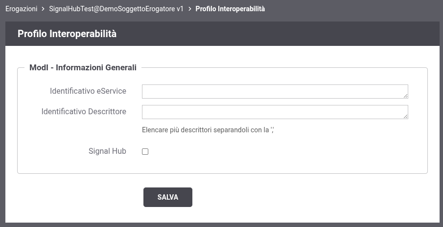
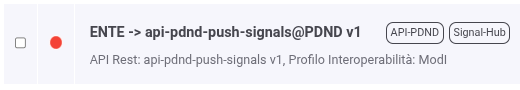
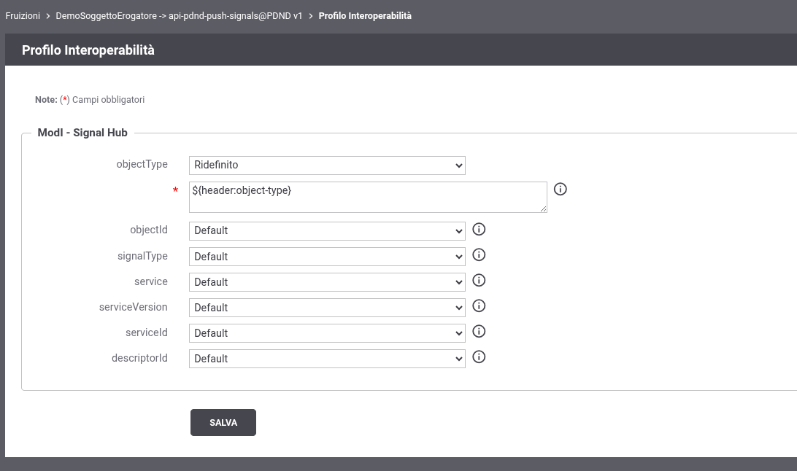

.. _modipa_signalhub_console:

Configurazione Console Gestione
-------------------------------

GovWay semplifica per il soggetto erogatore e per l’e-service l’utilizzo della funzionalità Signal-Hub offerta dalla PDND. Infatti, tramite GovWay sarà possibile configurare un’erogazione in modo che il processo di pseudoanonimizzazione, così come la comunicazione con la PDND, sia completamente trasparente per l’e-service.

**Ottenimento informazioni crittografiche**

È possibile abilitare il supporto a Signal-Hub per tutte le erogazioni di API di tipo ModI con generazione token impostata al valore ``PDND``. In tal modo, nella schermata dei dettagli di un’erogazione nella modifica del profilo di interoperabilità, sarà presente la schermata mostrata nella figura ':numref:`SignalHubErogazioneBase`'.

    Schermata di modifica profilo interoperabilità

In questa schermata sarà possibile abilitare il supporto a Signal-Hub e specificare l’ID dell’e-service correlato all’erogazione selezionata. In caso di supporto a Signal-Hub abilitato, l’ID sarà un campo obbligatorio come mostrato in figura ':numref:`SignalHubErogazione`'.

.. figure:: ../../_figure_console/SignalHubErogazione.png
    :scale: 90%
    :align: center
    :name: SignalHubErogazione

    Schermata di modifica profilo interoperabilità con supporto a Signal-Hub abilitato

Come si può vedere dalla figura, in questa schermata sarà possibile selezionare quale risorsa esporrà le informazioni di pseudoanonimizzazione, l’algoritmo utilizzato per generare l’hash dell’objectId, la dimensione del seme e il periodo di rotazione delle informazioni crittografiche.

GovWay si occuperà di gestire l’endpoint selezionato per restituire, ad ogni richiesta, le informazioni crittografiche attuali esposte dal servizio. Inoltre, sarà possibile, tramite un parametro nella query, selezionare le informazioni crittografiche associate a un determinato signalId, seguendo la seguente specifica OpenAPI:

.. code-block:: yaml
   :caption: Specifica OpenAPI - Risorsa di pseudoanonimizzazione
   :linenos:

   openapi: 3.0.1
   info:
     title: Risorsa di pseudoanonimizzazione implementata da GovWay
     version: 1.0.0
   paths:
     /pseudonymization:
       get:
         summary: Gets a pseudonymization info
         description: Info about crypto hash function and seed
         parameters:
           - in: query
             name: signalId
             schema:
               type: integer
             required: false
             description: SignalID
         responses:
           "200":
             description: Success
             content:
               application/json:
                 schema:
                   type: object
                   properties:
                     seed:
                       example: 3b9942ce-1f07-4512-8f34-f31b1a7b0061
                       type: string
                     cryptoHashFunction:
                       example: sha256
                       type: string
                   required:
                     - seed
                     - cryptoHashFunction
                   description: Success

La seconda parte della configurazione consente di indicare quali servizi applicativi o ruoli sono abilitati a pubblicare segnali per il servizio selezionato. Solo tali applicativi/ruoli potranno accedere alla fruizione built-in (descritta nel paragrafo successivo) per pubblicare nuovi segnali. I servizi applicativi disponibili sono solo quelli inseriti nell’autorizzazione per richiedente della fruizione built-in.

**Pubblicazione segnali**

Invece di comunicare direttamente con la PDND, il soggetto erogatore dovrà inviare a GovWay le informazioni relative all’oggetto modificato. GovWay si occuperà di cifrare tali informazioni secondo la configurazione precedentemente descritta, generare l’ID del segnale e depositarlo sulla PDND.

Per fare ciò sarà disponibile una fruizione ':numref:`SignalHubFuizione`' (chiamata ``api-pdnd-push-signals``), erogata dal soggetto PDND e fruita dal soggetto di default definito durante l’installazione. Tale fruizione sarà presente automaticamente se, durante l’installazione di GovWay, viene scelto il profilo ModI tra quelli abilitati.

    Fruizione built-in per la pubblicazione dei segnali

Questa fruizione deve essere configurata in fase di installazione per collegarsi correttamente alla PDND.

Sarà poi possibile personalizzare il modo in cui vengono comunicate le informazioni relative al record modificato e all’e-service corrispondente.

Per effettuare queste personalizzazioni sarà necessario aprire la scheda di modifica del profilo di interoperabilità relativa alla fruizione built-in. A quel punto si dovrebbe visualizzare la schermata mostrata in figura ':numref:`SignalHubFuizioneConfigurazione`'.

    Personalizzazione della fruizione built-in

In questa schermata sarà possibile selezionare il modo in cui fornire i parametri per effettuare il deposito del segnale. Come mostrato, non sarà necessario fornire il signalId (generato direttamente da GovWay), ma sarà necessario indicare il serviceId (che deve coincidere con quello inserito nell’erogazione corrispondente) oppure il nome e la versione dell’erogazione relativa all’e-service.

I vari parametri possono:
 - seguire il valore di default (definito nel file di properties, descritto nella sezione successiva)
 - essere inseriti in varie parti della richiesta: header HTTP, parametri della query, contenuto JSON (tramite jsonPath) o contenuto XML (tramite xpath).

Per personalizzare la posizione dei parametri, è possibile consultare tutte le wildcard disponibili tramite il pulsante di help presente accanto all’input del parametro ridefinito.

**Multi Tenant**

Nel caso di un contesto multi-tenant sarà necessario creare una fruizione per ciascun soggetto multi-tenant interno. Ogni fruizione dovrà avere come soggetto erogatore il soggetto built-in PDND e come fruitore il soggetto che eroga l’e-service specifico.
