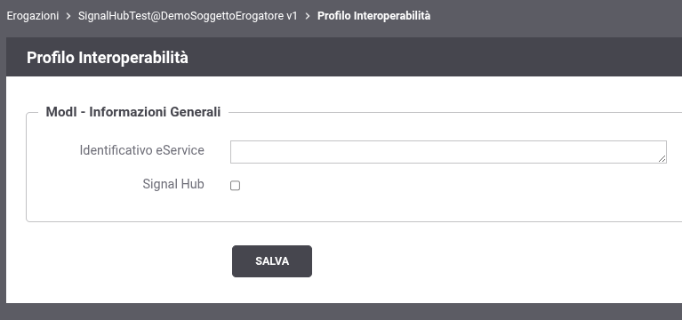

.. _modipa_signalhub_console:

Configurazione
--------------

GovWay semplifica l’integrazione con la funzionalità Signal-Hub fornita dalla PDND, rendendola trasparente sia per il soggetto erogatore che per l’e-service.

Grazie a GovWay, l’erogazione dei servizi può essere configurata in modo che le complessità legate alla pseudoanonimizzazione dei dati e alla comunicazione con la PDND siano completamente gestite dalla piattaforma, senza richiedere interventi diretti da parte dell’e-service.

In particolare, l’integrazione trasparente si articola in due componenti:

- :doc:`configurazioneErogazione`. GovWay espone un servizio che consente ai fruitori di recuperare le informazioni crittografiche necessarie per la pseudoanonimizzazione degli identificativi relativi ai dati oggetto di variazione e pubblicati tramite Signal-Hub. Il servizio è completamente gestito da GovWay e reso trasparente all’e-service, che non deve implementare alcuna logica specifica.

- :doc:`configurazioneFruizione`. GovWay espone una interfaccia semplificata di fruizione, che l’e-service può invocare per pubblicare una variazione di dato (segnale), senza doversi preoccupare della generazione dell’identificativo pseudoanonimizzato né di rispettare i vincoli complessi imposti dal protocollo Signal-Hub come l'identificativo incrementale relativo ad ogni variazione di dato.

È possibile abilitare il supporto a Signal-Hub su tutte le erogazioni di API erogate su PDND (:ref:`modipa_pdnd`) accedendo alla schermata dei dettagli del profilo di interoperabilità come mostrato nella figura ':numref:`SignalHubErogazioneBase`'.

    Schermata di modifica profilo interoperabilità

Abilitando il supporto alla funzionalità Signal-Hub, diventa obbligatorio indicare l’ID dell’e-service corrispondente alla registrazione del servizio presso la PDND. (':numref:`SignalHubErogazione`').

.. figure:: ../../_figure_console/SignalHubErogazione.png
    :scale: 90%
    :align: center
    :name: SignalHubErogazione

    Schermata di modifica profilo interoperabilità con supporto a Signal-Hub abilitato

Come si può vedere dalla figura ':numref:`SignalHubErogazione`', in questa schermata sarà possibile attuare la configurazione che interessa sia alla :doc:`configurazioneErogazione` che alla :doc:`configurazioneFruizione`. Maggiori dettagli verranno forniti nelle due sezioni riferite.

.. toctree::
    :maxdepth: 2

    configurazioneErogazione
    configurazioneFruizione
