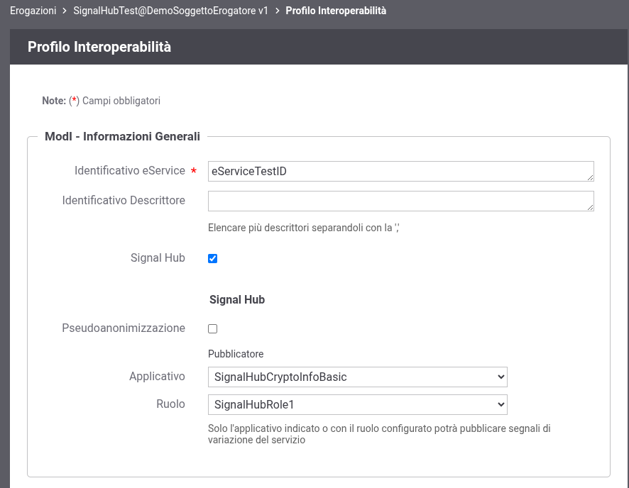

.. _modipa_signalhub_configurazione_erogazione:

Abilitazione e configurazione Signal-Hub su un'erogazione
-----------------------------------------------------------

Come descritto nella sezione :ref:`modipa_signalhub_console`, è possibile abilitare il supporto Signal-Hub su un'erogazione. L'abilitazione consente di pubblicare variazioni di dato secondo la fruizione descritta nella sezione :ref:`modipa_signalhub_configurazione_fruizione` e permette di configurare la funzionalità di pseudoanonimizzazione degli identificativi e, di conseguenza, il servizio per il recupero delle informazioni crittografiche (funzione di hashing e seme) che GovWay espone ai fruitori.

**Pseudoanonimizzazione**

L'opzione "Pseudoanonimizzazione" consente di abilitare o disabilitare la funzionalità di pseudoanonimizzazione degli identificativi. Quando disabilitata, i campi relativi alla configurazione crittografica (Risorsa, Algoritmo, Dimensione Seme, Giorni Rotazione Seme) non vengono visualizzati poiché non necessari (':numref:`SignalHubErogazioneSenzaPseudoanonimizzazione`'). L'opzione è visibile solamente se abilitata tramite la proprietà ``org.openspcoop2.protocol.modipa.signalHub.pseudonymization.choice.enabled`` descritta nella sezione :ref:`modipa_signalhub_properties`; il valore di default è "abilitata".

Quando la pseudoanonimizzazione è abilitata, è possibile configurare i parametri crittografici tramite i seguenti campi (':numref:`SignalHubErogazione2`):

- Risorsa: va selezionata la risorsa che esporrà le informazioni di informazioni crittografiche utilizzate per la pseudoanonimizzazione tramite l'interfaccia descritta di seguito in questa sezione;
- Algoritmo: algoritmo utilizzato per generare l'hash dell'identificativo del dato oggetto di variazione;
- Dimensione Seme: la dimensione del seme che concorre alla generazione dell'hash
- Giorni Rotazione Seme: indicazione in giorni dopo i quali il seme verrà variato e una notifica di variazione di seme verrà inviata ai fruitori.

.. figure:: ../../_figure_console/SignalHubErogazione.png
    :scale: 90%
    :align: center
    :name: SignalHubErogazione2

    Schermata di configurazione del servizio Signal-Hub su un'erogazione ModI

    Schermata di configurazione del servizio Signal-Hub senza pseudoanonimizzazione

**Autorizzazione alla pubblicazione dei segnali**

La seconda parte della configurazione consente di specificare puntualmente gli applicativi o i ruoli che tali applicativi debbano possedere per essere autorizzati alla pubblicazione dei segnali tramite la fruizione descritta nella sezione :ref:`modipa_signalhub_configurazione_fruizione` per il servizio configurato. Gli applicativi selezionabili saranno esclusivamente quelli già presenti nella lista di applicaivi autorizzati come richiedenti nella fruizione built-in ``api-pdnd-push-signals`` descritta nella sezione :ref:`modipa_signalhub_configurazione_fruizione`.

**Integrazione delle informazioni crittografiche nell'OpenAPI registrato sulla PDND**

.. note::
	La sezione seguente è applicabile solamente nel caso in cui la pseudoanonimizzazione risulti abilitata.

L'OpenAPI pubblicato sulla Piattaforma Digitale Nazionale Dati (PDND) deve includere, oltre alle consuete operazioni applicative previste dal servizio, un'ulteriore operazione dedicata al recupero delle informazioni crittografiche.

Le sezioni seguenti illustrano nel dettaglio l’operazione esposta da GovWay, sia per API di tipo REST che SOAP, al fine di fornire ai referenti degli e-Service tutte le indicazioni necessarie per estendere correttamente l’interfaccia applicativa con l’operazione richiesta dal Signal Hub.

.. toctree::
    :maxdepth: 2

    configurazioneErogazioneREST
    configurazioneErogazioneSOAP
