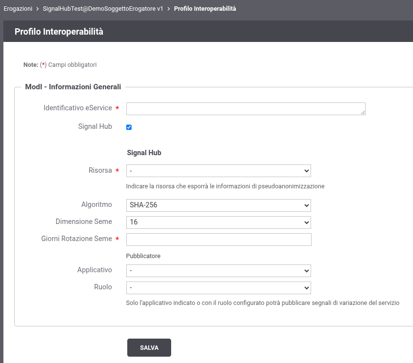

.. _modipa_signalhub_configurazione_erogazione:

Erogazione del servizio per il recupero delle informazioni crittografiche: funzione di hashing e seme
---------------------------------------------------------------------------------------------------------

GovWay espone un servizio che consente ai fruitori di recuperare le informazioni crittografiche necessarie per la pseudoanonimizzazione degli identificativi relativi ai dati oggetto di variazione e pubblicati tramite Signal-Hub.

Come descritto nella sezione :ref:`modipa_signalhub_console` una volta abilitato il supporto a Signal-Hub sull'erogazione è possibile configurare i parametri crittografici tramite i seguenti campi (':numref:`SignalHubErogazione2`):

- Risorsa: va selezionata la risorsa che esporrà le informazioni di informazioni crittografiche utilizzate per la pseudoanonimizzazione tramite l'interfaccia descritta di seguito in questa sezione;
- Algoritmo: algoritmo utilizzato per generare l’hash dell’identificativo del dato oggetto di variazione;
- Dimensione Seme: la dimensione del seme che concorre alla generazione dell'hash
- Giorni Rotazione Seme: indicazione in giorni dopo i quali il seme verrà variato e una notifica di variazione di seme verrà inviata ai fruitori.

    Schermata di configurazione del servizio Signal-Hub su un'erogazione ModI

La seconda parte della configurazione consente di specificare puntualmente gli applicativi o i ruoli che tali applicativi debbano possedere per essere autorizzati alla pubblicazione dei segnali tramite la fruizione descritta nella sezione :ref:`modipa_signalhub_configurazione_fruizione` per il servizio configurato. Gli applicativi selezionabili saranno esclusivamente quelli già presenti nella lista di applicaivi autorizzati come richiedenti nella fruizione built-in ``api-pdnd-push-signals`` descritta nella sezione :ref:`modipa_signalhub_configurazione_fruizione`.

**Interfaccia REST della risorsa che espone le informazioni crittografiche**

GovWay gestisce l’endpoint designato per l’esposizione delle informazioni crittografiche correnti fornite dal servizio, in conformità al formato definito nella specifica OpenAPI riportata di seguito. La risorsa consente, mediante un parametro opzionale nella query string, di richiedere le informazioni crittografiche associate a uno specifico signalId, abilitando così l’accesso a eventuali dati storici.

.. code-block:: yaml
   :caption: Specifica OpenAPI - Risorsa di pseudoanonimizzazione
   :linenos:

   openapi: 3.0.1
   info:
     title: Risorsa di pseudoanonimizzazione implementata da GovWay
     version: 1.0.0
   paths:
     /pseudonymization:
       get:
         summary: Gets a pseudonymization info
         description: Info about crypto hash function and seed
         parameters:
           - in: query
             name: signalId
             schema:
               type: integer
             required: false
             description: SignalID
         responses:
           "200":
             description: Success
             content:
               application/json:
                 schema:
                   type: object
                   properties:
                     seed:
                       example: 3b9942ce-1f07-4512-8f34-f31b1a7b0061
                       type: string
                     cryptoHashFunction:
                       example: sha256
                       type: string
                   required:
                     - seed
                     - cryptoHashFunction
                   description: Success

