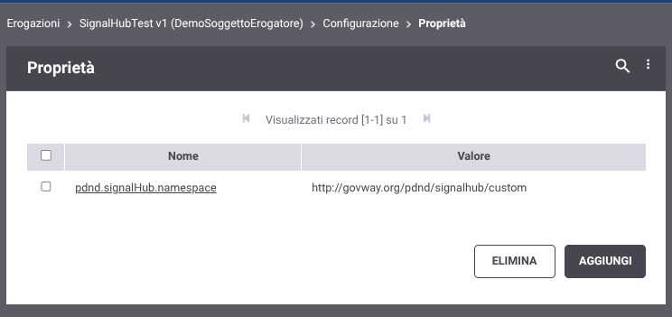

.. _modipa_signalhub_configurazione_erogazione_soap:

Interfaccia SOAP per il recupero delle informazioni crittografiche
------------------------------------------------------------------------

GovWay gestisce l’endpoint dedicato all’esposizione delle informazioni crittografiche correnti, messe a disposizione dal servizio, in conformità al formato previsto dalla specifica WSDL riportata di seguito.

L’endpoint consente inoltre di richiedere, tramite un parametro opzionale incluso nella richiesta, le informazioni crittografiche associate a uno specifico signalId, abilitando l’accesso anche a eventuali dati storici correlati.

.. code-block:: xml
   :caption: Specifica WSDL - Risorsa di pseudoanonimizzazione
   :linenos:

	<?xml version="1.0" encoding="UTF-8"?>
	<wsdl:definitions 
	    name="SignalHubTestSOAP12"
	    targetNamespace="http://govway.org/pdnd/signalhub"
	    xmlns:wsdl="http://schemas.xmlsoap.org/wsdl/"
	    xmlns:soap12="http://schemas.xmlsoap.org/wsdl/soap12/"
	    xmlns:xsd="http://www.w3.org/2001/XMLSchema"
	    xmlns:tns="http://govway.org/pdnd/signalhub">
	
	    <!-- Types -->
	    <wsdl:types>
	        <xsd:schema targetNamespace="http://govway.org/pdnd/signalhub"
	                    elementFormDefault="qualified">
	
	            <!-- Input element -->
	            <xsd:element name="pseudonymization">
	                <xsd:complexType>
	                    <xsd:sequence>
	                        <xsd:element name="signalId" type="xsd:string" minOccurs="0"/>
	                    </xsd:sequence>
	                </xsd:complexType>
	            </xsd:element>
	
	            <!-- Output element -->
	            <xsd:element name="pseudonymizationResponse">
	                <xsd:complexType>
	                    <xsd:sequence>
	                        <xsd:element name="cryptoHashFunction" type="xsd:string"/>
	                        <xsd:element name="seed" type="xsd:string"/>
	                    </xsd:sequence>
	                </xsd:complexType>
	            </xsd:element>
	
	        </xsd:schema>
	    </wsdl:types>
	
	    <!-- Messages -->
	    <wsdl:message name="pseudonymization">
	        <wsdl:part name="parameters" element="tns:pseudonymization"/>
	    </wsdl:message>
	
	    <wsdl:message name="pseudonymizationResponse">
	        <wsdl:part name="parameters" element="tns:pseudonymizationResponse"/>
	    </wsdl:message>
	
	    <!-- Port Type -->
	    <wsdl:portType name="SignalHubTestSOAP12">
	        <wsdl:operation name="pseudonymization">
	            <wsdl:input message="tns:pseudonymization"/>
	            <wsdl:output message="tns:pseudonymizationResponse"/>
	        </wsdl:operation>
	    </wsdl:portType>
	
	    <!-- Binding -->
	    <wsdl:binding name="CryptoInfoBinding" type="tns:SignalHubTestSOAP12">
	        <soap12:binding transport="http://schemas.xmlsoap.org/soap/http" style="document"/>
	        <wsdl:operation name="pseudonymization">
	            <soap12:operation soapAction="pseudonymization"/>
	            <wsdl:input>
	                <soap12:body use="literal"/>
	            </wsdl:input>
	            <wsdl:output>
	                <soap12:body use="literal"/>
	            </wsdl:output>
	        </wsdl:operation>
	    </wsdl:binding>
	
	    <!-- Service -->
	    <wsdl:service name="SignalHubTestSOAP12">
	        <wsdl:port name="CryptoInfoPort" binding="tns:CryptoInfoBinding">
	            <soap12:address location="http://localhost:8080/crypto/GetSeed"/>
	        </wsdl:port>
	    </wsdl:service>
	
	</wsdl:definitions>
	
	
Come definito nel WSDL il target namespace degli elementi inerenti alla pseudoanonimizzazione risulta essere ``http://govway.org/pdnd/signalhub``. L’esposizione dell’operazione si adatta automaticamente alla versione del protocollo SOAP utilizzata nella richiesta ricevuta, garantendo piena compatibilità sia con SOAP 1.1 che con SOAP 1.2.

Il namespace utilizzato può essere personalizzato impostando la :ref:`configProprieta` ``pdnd.signalHub.namespace`` all'interno della schermata di configurazione dell'erogazione interessata come mostrato nella figura ':numref:`SignalHubErogazioneCustomNamespace`'

    Schermata di configurazione della proprietà per impostare un namespace personalizzato.
