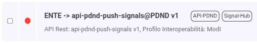
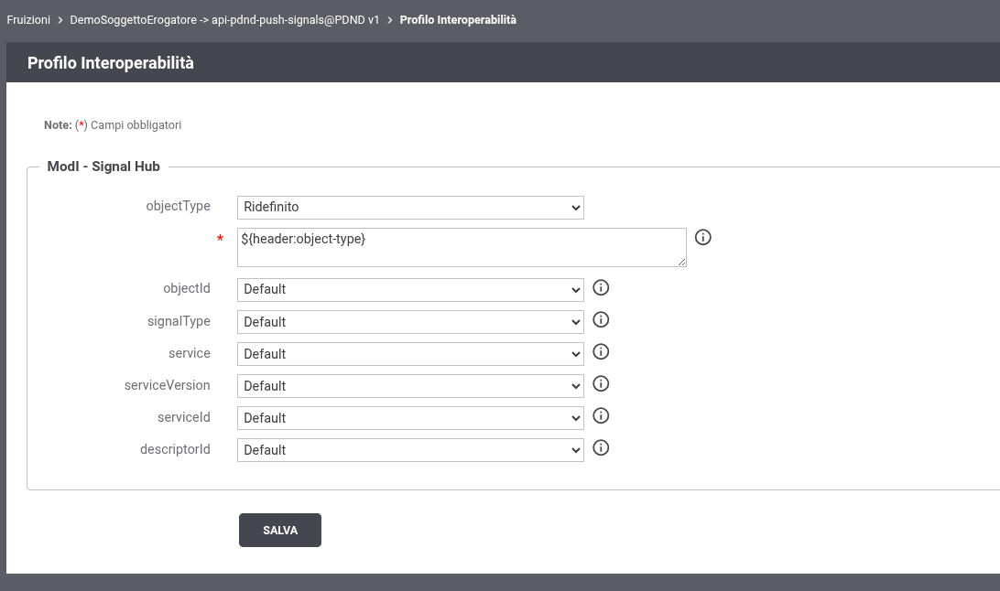

.. _modipa_signalhub_configurazione_fruizione:

Fruizione del servizio per il deposito dei segnali
----------------------------------------------------

In alternativa alla comunicazione diretta con la PDND, il soggetto erogatore può utilizzare una fruizione messa a disposizione da GovWay tramite un’interfaccia semplificata (descritta di seguito nel paragrafo 'Interfaccia di pubblicazione'), che consente di inviare le informazioni relative al dato oggetto della variazione. GovWay si occuperà di cifrare tali informazioni secondo la configurazione descritta nella sezione :ref:`modipa_signalhub_configurazione_erogazione`, generare l’ID del segnale e depositarlo sulla PDND.

Per fare ciò il prodotto rende disponibile una fruizione build-in ':numref:`SignalHubFuizione`' (chiamata ``api-pdnd-push-signals``), erogata dal soggetto PDND e fruita dal soggetto di default definito durante l’installazione. Tale fruizione sarà presente automaticamente se, durante l’installazione di GovWay, viene scelto il profilo ModI tra quelli abilitati. La fruizione deve essere finalizzata negli aspetti descritti nel paragrafo 'Configurazione della fruizione'.

    Fruizione built-in per la pubblicazione dei segnali

**Interfaccia di pubblicazione**

Per invocare la fruizione built-in è sufficiente utilizzare la base url di invocazione con il suffisso 'signals' tramite un metodo http GET o POST:

- http://localhost:8080/govway/rest/out/<NOME_SOGGETTO>/PDND/api-pdnd-push-signals/v1/signals

L'interfaccia OpenAPI, che descrive la configurazione di default dei parametri, è disponibile nel file `api-pdnd-push-signals.yaml <https://github.com/link-it/govway/blob/3.4.x/protocolli/modipa/example/openapi/api-pdnd-push-signals.yaml>`__.

La pubblicazione di una variazione di dato richiede che siano fornite le seguenti informazioni tramite header HTTP, query parameter o campi di un payload JSON (solo per il metodo POST), come riportato nella tabella seguente.

.. list-table:: Parametri per la pubblicazione dei segnali
   :widths: 15 15 25 30 15
   :header-rows: 1

   * - Parametro
     - Obbligatorio
     - Header HTTP
     - Query Parameter
     - Campo JSON
   * - Object ID
     - sì
     - GovWay-Signal-ObjectId
     - govway_signal_object_id
     - objectId
   * - Object Type
     - sì
     - GovWay-Signal-ObjectType
     - govway_signal_object_type
     - objectType
   * - Signal Type
     - sì
     - GovWay-Signal-Type
     - govway_signal_type
     - signalType
   * - Service ID
     - \(1a\)
     - GovWay-Signal-ServiceId
     - govway_signal_service_id
     - serviceId
   * - Descriptor ID
     - \(2\)
     - GovWay-Signal-DescriptorId
     - govway_signal_descriptor_id
     - descriptorId
   * - Service
     - \(1b\)
     - GovWay-Signal-Service
     - govway_signal_service
     - service
   * - Service Version
     - \(1b\)
     - GovWay-Signal-Service-Version
     - govway_signal_service_version
     - serviceVersion

- \(1\) Il servizio per cui si intende pubblicare una variazione di dato deve essere identificato tramite il *Service ID* \(1a\) oppure, in alternativa, tramite la coppia *Service* e *Service Version* \(1b\). Il *Service ID* corrisponde al service id della PDND configurato nella maschera del servizio descritto nella sezione :ref:`modipa_signalhub_configurazione_erogazione`, mentre *Service* e *Service Version* corrispondono rispettivamente al nome e alla versione dell'erogazione su GovWay.
- \(2\) Obbligatorio solo in presenza di servizi con il medesimo serviceId; corrisponde al descriptor id della PDND configurato nella maschera del servizio descritto nella sezione :ref:`modipa_signalhub_configurazione_erogazione`.

Di seguito la descrizione degli altri parametri:

- *Object ID*: l'identificativo in chiaro che verrà pseudoanonimizzato da GovWay;
- *Object Type*: campo libero; rappresenta il tipo di oggetto a cui fa riferimento il segnale;
- *Signal Type*: deve essere utilizzato un valore tra CREATE, UPDATE o DELETE.

.. note::

    Nel caso in cui lo stesso parametro venga fornito contemporaneamente in più posizioni, viene utilizzato il primo valore trovato secondo il seguente ordine di priorità: header HTTP, query parameter, payload JSON.

È anche possibile personalizzare la modalità di integrazione con la fruizione built-in attuando una personalizzazione nella scheda di modifica del profilo di interoperabilità relativa alla fruizione come mostrata in figura ':numref:`SignalHubFuizioneConfigurazione`'.

    Personalizzazione della fruizione built-in

I vari parametri possono:

 - seguire la configurazione di default secondo i nomi dei parametri e degli header http descritti precedentemente;
 - essere inseriti come parte della richiesta: header HTTP, parametri della query, estratti dal contenuto JSON (tramite jsonPath) etc...

Per personalizzare la posizione dei parametri, è possibile consultare tutte le wildcard disponibili tramite il pulsante di help presente accanto all’input del parametro ridefinito.

**Configurazione della fruizione**

La fruizione built-in ':numref:`SignalHubFuizione`' (chiamata ``api-pdnd-push-signals``) deve essere finalizzata negli aspetti descritti di seguito.

- *Endpoint di esposizione delle API della PDND*: nella sezione 'connettore' deve essere indicata la corretta url di esposizione delle API PDND (figura :numref:`fruizioneAPIPDNDpassiPreliminariConnettoreSignalHub`):

	- ambiente di collaudo: https://api.att.signalhub.interop.pagopa.it/1.0/push
	- ambiente di produzione: https://api.signalhub.interop.pagopa.it/1.0/push

	.. note::
	
		Le url indicate potrebbero variare; si raccomanda di ottenere sempre dalla PDND le url aggiornate.

  .. figure:: ../../_figure_console/SignalHubFruizione_connettore.png
    :scale: 70%
    :name: fruizioneAPIPDNDpassiPreliminariConnettoreSignalHub

    Fruizione della API di pubblicazione del segnale: connettore

- *Token Policy di negoziazione del voucher*: nella precedente sezione 'connettore' si è potuto vedere come sia stata associata al connettore una Token Policy di Negoziazione del tipo descritto nella sezione ':ref:`tokenNegoziazionePolicy_jwt`'. La token policy 'api-pdnd' riferita (figura :numref:`fruizioneAPIPDNDpassiPreliminariTokenPolicySignalHub`) deve essere finalizzata nei seguenti aspetti:

	- Url: deve essere indicato l'endpoint di negoziazione del voucher esposto dalla PDND:

		- ambiente di collaudo: https://auth.uat.interop.pagopa.it/token.oauth2
		- ambiente di produzione: https://auth.interop.pagopa.it/token.oauth2

	        .. note::
	
		      Le url indicate potrebbero variare; si raccomanda di ottenere sempre dalla PDND le url aggiornate come indicato nella sezione `Richiesta di un voucher spendibile presso le API di Interoperabilità <https://docs.pagopa.it/interoperabilita-1/manuale-operativo/utilizzare-i-voucher#richiesta-di-un-voucher-spendibile-presso-le-api-di-interoperabilita>`_ dove viene indicato che l'URL dell'endpoint cambia in funzione dell'ambiente e sarà chiaramente visibile sull'interfaccia all'interno del back office.

	- Audience: deve essere indicato il corretto valore atteso dal servizio della PDND, valore che cambia in funzione dell'ambiente:

		- ambiente di collaudo: auth.uat.interop.pagopa.it/client-assertion
		- ambiente di produzione: auth.interop.pagopa.it/client-assertion

	        .. note::
	
		      I valori indicati potrebbero variare; si raccomanda di ottenere sempre dalla PDND i valori aggiornati.

  .. figure:: ../../_figure_console/fruizioneAPI_PDND_tokenPolicy.png
    :scale: 70%
    :name: fruizioneAPIPDNDpassiPreliminariTokenPolicySignalHub

    Fruizione della API di pubblicazione del segnale: token policy

- *Materiale crittografico e dati della PDND*: nella sezione 'ModI' devono essere configurati tutti i parametri relativi al materiale crittografico e ai dati identificativi ottenuti dalla PDND in seguito alla registrazione del client di tipo 'api interop' (figura :numref:`fruizioneAPIPDNDpassiPreliminariModISignalHub`):

	- Key Id (kid) del Certificato: identificativo kid della chiave pubblica;
	- Identificativo: clientId associato alla chiave pubblica;
	- Chiave Privata e Chiave Pubblica: indica il path su file system rispettivamente delle chiavi private e pubbliche in formato PEM o DER (sono supportati sia i formati pkcs1 che pkcs8);
	- Password Chiave Privata: se la chiave privata è cifrata deve essere indicata la password.

	.. note::
	
		Tramite il campo 'Tipo' è possibile utilizzare un tipo di archivio differente dalla coppia di chiavi pubblica e privata come un keystore 'PKCS12', 'JKS' o un archivio json 'JWK'.

  .. figure:: ../../_figure_console/fruizioneAPI_PDND_signalHub.png
    :scale: 70%
    :name: fruizioneAPIPDNDpassiPreliminariModISignalHub

    Fruizione della API di pubblicazione del segnale: profilo 'ModI'

- *Controllo degli Accessi*: si può notare come la fruizione riporta uno "stato rosso" che evidenzia una configurazione incompleta nella parte relativa al *Controllo degli Accessi*. Procedere con la configurazione del :ref:`apiGwControlloAccessi` al fine di registrare almeno un applicativo autorizzato ad invocare la fruizione. Da notare come l'autorizzazione presente 'signal-Hub' attuerà un'ulteriore processo di autorizzazione verificando che l'applicativo identificato sia presente o possieda il ruolo indicato nella configurazione 'Signal-Hub' del servizio per cui si intende depositare un segnale.

**Multi Tenant**

Nel caso di un contesto multi-tenant sarà necessario creare una fruizione per ciascun soggetto multi-tenant interno. Ogni fruizione dovrà possedere come soggetto erogatore il soggetto built-in PDND e come fruitore il soggetto che eroga l’e-service specifico.
