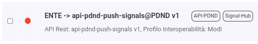
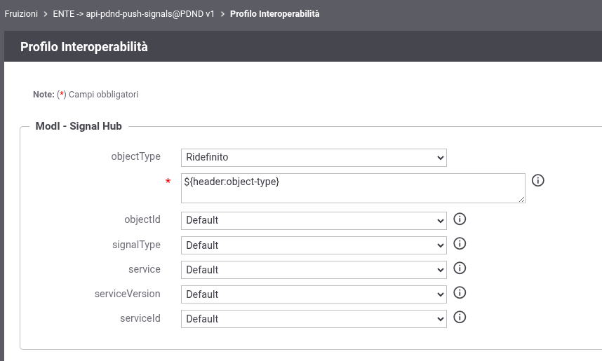

.. _modipa_signalhub_configurazione_fruizione:

Configurazione fruizione di deposito dei segnali
------------------------------------------------

**Pubblicazione segnali**

Invece di comunicare direttamente con la PDND, il soggetto erogatore dovrà inviare a GovWay le informazioni relative all’oggetto modificato. GovWay si occuperà di cifrare tali informazioni secondo la configurazione precedentemente descritta, generare l’ID del segnale e depositarlo sulla PDND.

Per fare ciò sarà disponibile una fruizione ':numref:`SignalHubFuizione`' (chiamata ``api-pdnd-push-signals``), erogata dal soggetto PDND e fruita dal soggetto di default definito durante l’installazione. Tale fruizione sarà presente automaticamente se, durante l’installazione di GovWay, viene scelto il profilo ModI tra quelli abilitati.

    Fruizione built-in per la pubblicazione dei segnali

Questa fruizione deve essere configurata in fase di installazione per collegarsi correttamente alla PDND.

Sarà poi possibile personalizzare il modo in cui vengono comunicate le informazioni relative al record modificato e all’e-service corrispondente.

Per effettuare queste personalizzazioni sarà necessario aprire la scheda di modifica del profilo di interoperabilità relativa alla fruizione built-in. A quel punto si dovrebbe visualizzare la schermata mostrata in figura ':numref:`SignalHubFuizioneConfigurazione`'.

    Personalizzazione della fruizione built-in

In questa schermata sarà possibile selezionare il modo in cui fornire i parametri per effettuare il deposito del segnale. Come mostrato, non sarà necessario fornire il signalId (generato direttamente da GovWay), ma sarà necessario indicare il serviceId (che deve coincidere con quello inserito nell’erogazione corrispondente) oppure il nome e la versione dell’erogazione relativa all’e-service.

I vari parametri possono:
 - seguire il valore di default (definito nel file di properties, descritto nella sezione successiva)
 - essere inseriti in varie parti della richiesta: header HTTP, parametri della query, contenuto JSON (tramite jsonPath) o contenuto XML (tramite xpath).

Per personalizzare la posizione dei parametri, è possibile consultare tutte le wildcard disponibili tramite il pulsante di help presente accanto all’input del parametro ridefinito.

**Multi Tenant**

Nel caso di un contesto multi-tenant sarà necessario creare una fruizione per ciascun soggetto multi-tenant interno. Ogni fruizione dovrà avere come soggetto erogatore il soggetto built-in PDND e come fruitore il soggetto che eroga l’e-service specifico.