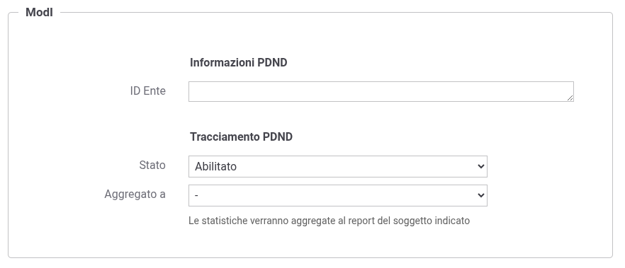
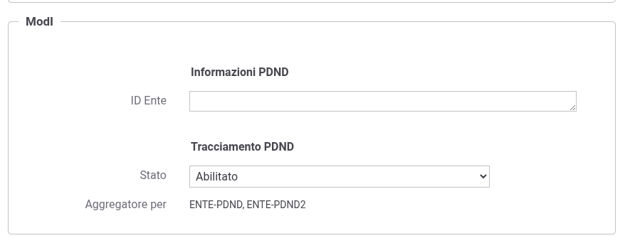

.. _modipa_tracingPdnd_aggregazione:

Aggregazione dei soggetti operativi (scenario multitenant)
-----------------------------------------------------------

In uno scenario :ref:`console_multitenant`, può accadere che più *soggetti operativi* attivati su GovWay non corrispondano ciascuno a un ente diverso registrato sulla PDND. In questi casi, le informazioni statistiche dei soggetti coinvolti devono essere accorpate in un unico record prima della pubblicazione.

Per ottenere questo risultato è necessario aggregare tutti i soggetti a un **soggetto principale**, che diventerà il referente del report.

**Configurazione dell'aggregazione**

1. Identificare il soggetto operativo che fungerà da *soggetto principale*.
2. Aprire la *maschera di gestione* di ciascun soggetto da aggregare.
3. Nel campo ``Aggregato a`` selezionare il soggetto principale (:numref:`TracingPDNDAggregatoA`).
4. Salvare le modifiche.

**Comportamento dell'interfaccia**

- Accedendo alla maschera di gestione del soggetto scelto come *principale*, il campo ``Aggregato a`` **non** è più disponibile.
- Nella stessa maschera viene invece mostrata l’informazione relativa ai soggetti che **sono stati aggregati** al principale (:numref:`TracingPDNDAggregatore`).

.. note::
   L’aggregazione è disponibile solo quando :ref:`console_multitenant` è abilitato.

.. tip::
   Per rimuovere un’aggregazione, aprire la maschera del soggetto secondario e deselezionare il valore del campo ``Aggregato a``, quindi salvare.

  Aggregazione di un soggetto per la produzione di un unico report PDND

  Soggetto aggregatore referente del report PDND

