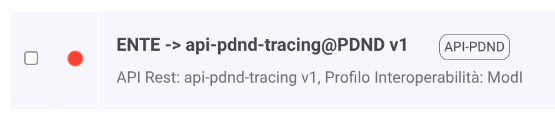

.. _modipa_tracingPdnd_fruizione:

Fruizione built-in
------------------

La pubblicazione dei tracciati sulla PDND avviene attraverso una fruizione build-in ':numref:`TracingPDNDBuiltIn`' (chiamata ``api-pdnd-tracing``), erogata dal soggetto PDND e fruita dal soggetto di default definito durante l’installazione. Tale fruizione sarà presente automaticamente se, durante l’installazione di GovWay, viene scelto il profilo ModI tra quelli abilitati. La fruizione deve essere finalizzata negli aspetti descritti nel paragrafo 'Configurazione della fruizione'.

  Fruizione built-in per la pubblicazione del tracciato giornaliero

La fruizione built-in deve essere finalizzata negli aspetti descritti di seguito.

- *Endpoint di esposizione delle API della PDND*: nella sezione 'connettore' deve essere indicata la corretta url di esposizione delle API PDND (figura :numref:`fruizioneAPIPDNDpassiPreliminariConnettoreTracing`):

	- ambiente di collaudo: https://api.uat.tracing.interop.pagopa.it/
	- ambiente di produzione: https://api.tracing.interop.pagopa.it/

	.. note::
	
		Le url indicate potrebbero variare; si raccomanda di ottenere sempre dalla PDND le url aggiornate.

  .. figure:: ../../../_figure_console/TracingFruizione_connettore.png
    :scale: 70%
    :name: fruizioneAPIPDNDpassiPreliminariConnettoreTracing

    Fruizione della API di pubblicazione del tracciato: connettore

- *Token Policy di negoziazione del voucher*: nella precedente sezione 'connettore' si è potuto vedere come sia stata associata al connettore una Token Policy di Negoziazione del tipo descritto nella sezione ':ref:`tokenNegoziazionePolicy_jwt`'. La token policy 'api-pdnd' riferita (figura :numref:`fruizioneAPIPDNDpassiPreliminariTokenPolicyTracing`) deve essere finalizzata nei seguenti aspetti:

	- Url: deve essere indicato l'endpoint di negoziazione del voucher esposto dalla PDND:

		- ambiente di collaudo: https://auth.uat.interop.pagopa.it/token.oauth2
		- ambiente di produzione: https://auth.interop.pagopa.it/token.oauth2

	        .. note::
	
		      Le url indicate potrebbero variare; si raccomanda di ottenere sempre dalla PDND le url aggiornate come indicato nella sezione `Richiesta di un voucher spendibile presso le API di Interoperabilità <https://docs.pagopa.it/interoperabilita-1/manuale-operativo/utilizzare-i-voucher#richiesta-di-un-voucher-spendibile-presso-le-api-di-interoperabilita>`_ dove viene indicato che l'URL dell'endpoint cambia in funzione dell'ambiente e sarà chiaramente visibile sull'interfaccia all'interno del back office.

	- Audience: deve essere indicato il corretto valore atteso dal servizio della PDND, valore che cambia in funzione dell'ambiente:

		- ambiente di collaudo: auth.uat.interop.pagopa.it/client-assertion
		- ambiente di produzione: auth.interop.pagopa.it/client-assertion

	        .. note::
	
		      I valori indicati potrebbero variare; si raccomanda di ottenere sempre dalla PDND i valori aggiornati.

  .. figure:: ../../../_figure_console/fruizioneAPI_PDND_tokenPolicy.png
    :scale: 70%
    :name: fruizioneAPIPDNDpassiPreliminariTokenPolicyTracing

    Fruizione della API di pubblicazione del tracciato: token policy

- *Materiale crittografico e dati della PDND*: nella sezione 'ModI' devono essere configurati tutti i parametri relativi al materiale crittografico e ai dati identificativi ottenuti dalla PDND in seguito alla registrazione del client di tipo 'api interop' (figura :numref:`fruizioneAPIPDNDpassiPreliminariModITracing`):

	- Key Id (kid) del Certificato: identificativo kid della chiave pubblica;
	- Identificativo: clientId associato alla chiave pubblica;
	- Chiave Privata e Chiave Pubblica: indica il path su file system rispettivamente delle chiavi private e pubbliche in formato PEM o DER (sono supportati sia i formati pkcs1 che pkcs8);
	- Password Chiave Privata: se la chiave privata è cifrata deve essere indicata la password.

	.. note::
	
		Tramite il campo 'Tipo' è possibile utilizzare un tipo di archivio differente dalla coppia di chiavi pubblica e privata come un keystore 'PKCS12', 'JKS' o un archivio json 'JWK'.

  .. figure:: ../../../_figure_console/fruizioneAPI_PDND_tracing.png
    :scale: 70%
    :name: fruizioneAPIPDNDpassiPreliminariModITracing

    Fruizione della API di pubblicazione del tracciato: profilo 'ModI'

- *Controllo degli Accessi*: si può notare come la fruizione riporta uno "stato rosso" che evidenzia una configurazione incompleta nella parte relativa al *Controllo degli Accessi*. Procedere con la configurazione del :ref:`apiGwControlloAccessi` al fine di renderla invocabile secondo la modalità di autenticazione ed autorizzazione desiderata. Le modalità scelte dovranno poi comportare una configurazione adeguata tramite le proprietà descritte nella sezione :ref:`modipa_tracingpdnd_properties`.

