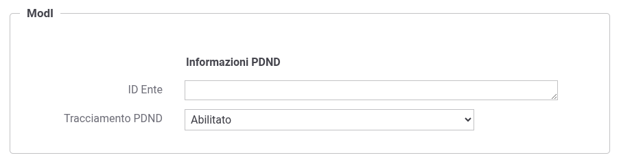

.. _modipa_tracingPdnd_govway:

Configurazione
--------------------------

Il supporto al tracing PDND si divide in due fasi: nella prima fase (generazione) GovWay produce il tracciato CSV da inviare alla PDND mentre nella seconda fase (pubblicazione) GovWay procede a pubblicare sulla PDND tutti i record prodotti in fase di generazione.

La raccolta delle informazioni avviene monitorando tutte le transazioni relative alle erogazioni/fruizioni derivanti da API con generazione token di tipo "Authorization PDND".

Per impostazione predefinita, non viene generato alcun report CSV. La generazione dei report può essere abilitata attivando il tracciamento PDND all'interno della configurazione del Soggetto ModI. In tal caso, verranno prodotti automaticamente i report relativi ai servizi erogati dal soggetto interno. (':numref:`TracingPDNDSoggetto`'). 

  Tracing PDND: abilitazione sul soggetto

.. note::
	
	Abilitando :ref:`console_multitenant`, l’interfaccia visualizza, subito dopo lo stato di abilitazione, un campo aggiuntivo per la selezione dell’aggregazione. Maggiori dettagli a riguardo vengono forniti nella sezione :ref:`modipa_tracingPdnd_aggregazione`.

È possibile modificare il comportamento di default e/o abilitare la generazione dei report relativi anche alle fruizioni di servizio agendo sulle proprietà descritte nella sezione :ref:`modipa_tracingpdnd_properties`.

La fase di generazione e/o pubblicazione può avvenire in due modalità a seconda della modalità scelta in fase di installazione comne descritto nella Guida di installazione nella sezione :ref:`deploy_batch`:

 - Tramite timer interni a GovWay
 - Tramite batch esterni da agganciare a meccanismi di cron jobs.

*Batch*

Nel caso di installazione avanzata tramite batch (:ref:`deploy_batch`) nella cartella ``batch/generatoreStatistiche/`` generata dall’installer, saranno presenti gli script ``generaReportPDND`` e ``pubblicaReportPDND`` che permettono rispettivamente:

 - la generazione dei dati da inviare alla PDND;
 - la pubblicazione, ovvero l’invio effettivo dei file CSV;

*Timers*

Di default, le componenti sono collegate a timer interni di GovWay che consentono l’esecuzione periodica delle funzionalità di generazione e pubblicazione.

È possibile abilitare o disabilitare questi timer dalla console, nella sezione:

``Runtime -> Thread Attivi -> Generazione Tracciamento PDND -> Generazione / Pubblicazione``

**Multi Tenant**

Nel contesto multi-tenant, i servizi di generazione e pubblicazione dei tracciamenti possono operare per ciascun soggetto interno definito.

In caso di personalizzazioni, è possibile accedere alla console nella sezione "Soggetti" per abilitare o disabilitare il supporto al tracciamento per ciascun soggetto specifico. 

Questa operazione può anche essere effettuata direttamente nel file di configurazione delle properties, come descritto nella sezione :ref:`modipa_tracingpdnd_properties`.

.. toctree::
  :maxdepth: 2

  fruizioneBuiltIn
  aggregazione
