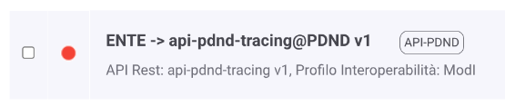

.. _modipa_tracingPdnd_fruizione:

Fruizione built-in
------------------

La pubblicazione sulla PDND dei tracciati avviene attraverso la fruizione built-in che verrà automaticamente inserita durante il processo di installazione se il viene abilitato il supporto al profilo ModI.

Tale fruizione dovrà essere configurata per connettersi correttamente con l'endpoint di tracing della PDND. (:numref:`TracingPDNDBuiltIn`)

  Fruizione built-in per la pubblicazione del tracciato giornaliero

Dopo aver configurato tale fruizione sarà necessario impostare correttamente la componente di pubblicazione del tracciamento per puntare alla fruizione built-in oltre all'autenticazione per permettere al sistema di pubblicazione di utilizzare la fruizione.