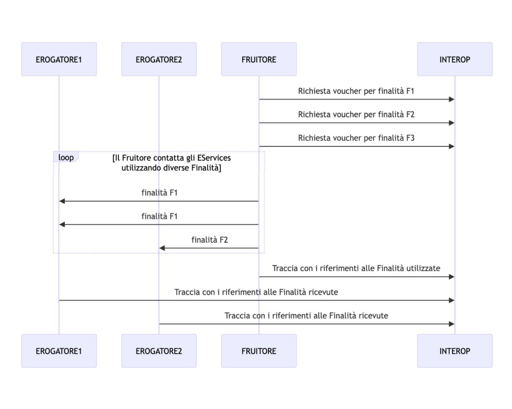
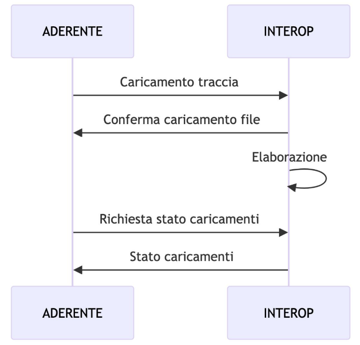
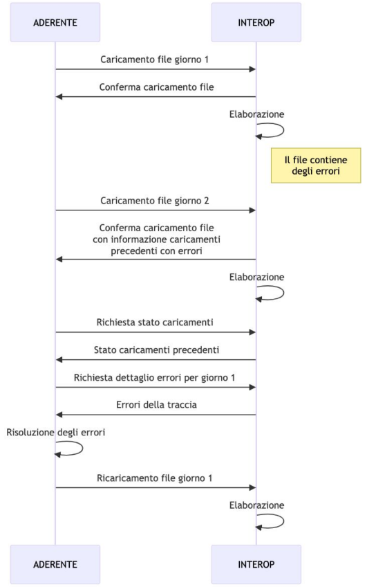

.. _modipa_tracingPdnd_panoramica:

Panoramica
----------------------

La PDND mette a disposizione un'interfaccia `API <https://developer.pagopa.it/pdnd-interoperabilita/guides/manuale-operativo-tracing/panoramica-dellapi>`__ che permette agli e-service di depositare informazioni relative all’esito delle transazioni effettuate, con riferimento a specifiche date, finalità e identificativo del token negoziato.

Un ente erogatore o fruitore di e-service registrati sulla PDND deve quindi, con cadenza giornaliera, depositare un file CSV contenente le informazioni relative a tutte le transazioni effettuate in un determinato giorno. (e.g. ':numref:`TracingPDNDTransazioni`')

  Diagramma di sequenza del caricamento sulla PDND delle informazioni sulle transazioni

Questo `CSV <https://developer.pagopa.it/pdnd-interoperabilita/guides/manuale-operativo-tracing/integrarsi-con-il-tracing>`__ deve includere i seguenti campi:

.. list-table:: Campi richiesti dal tracciamento PDND
   :widths: 10 50
   :header-rows: 1

   * - Campo
     - Descrizione
   * - date
     - La data in cui sono state eseguite le operazioni, nel formato YYYY-MM-DD
   * - purpose_id
     - L’ID della finalità, come presente nella richiesta del fruitore
   * - status
     - Il codice di stato HTTP con cui il servizio ha risposto al chiamante
   * - token_id
     - L’ID del token utilizzato per effettuare la richiesta HTTP verso il servizio
   * - requests_count
     - Il numero di richieste che hanno generato il medesimo codice di stato HTTP

Dopo ogni invio, la PDND provvede a elaborare il file CSV in modalità asincrona. Un ente può controllare lo stato di ogni caricamento. ':numref:`TracingPDNDPubblicazione`'

  Diagramma di sequenza della fase di pubblicazione del tracciato e recupero asincrono dello stato

Quando un tracciato è stato caricato correttamente e la PDND, dopo la fase di parsing, restituisce un errore o conferma il corretto caricamento risulta possibile per un ente sostituire tale tracciato attraverso un operazione di recover o replace. ':numref:`TracingPDNDRecover`'

  Sostituzione di un tracciato caricato contenente errori.

Poiché il caricamento giornaliero è obbligatorio, la PDND segnala i giorni in cui il file non è stato ricevuto, richiedendo all’erogatore l’invio dei CSV mancanti per quei giorni.

Nel caso in cui si voglia sostituire un tracciato già caricato con successo, è comunque possibile effettuare un’operazione di sostituzione, anche se il tracciato risulta già presente.
