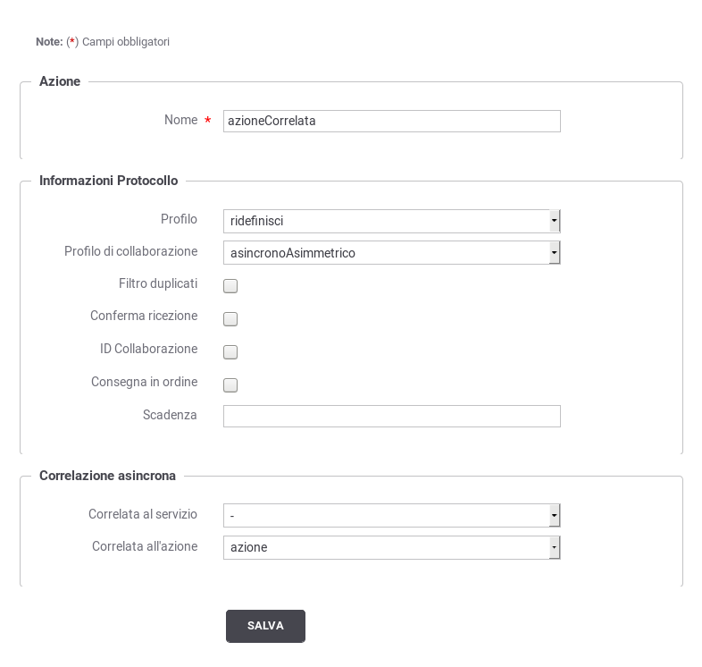
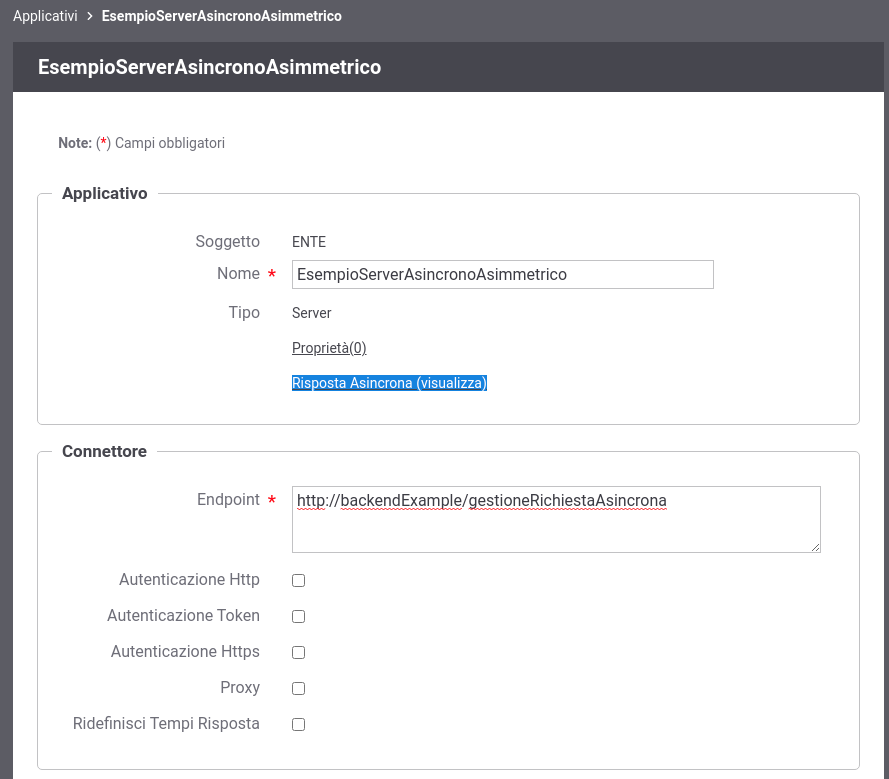
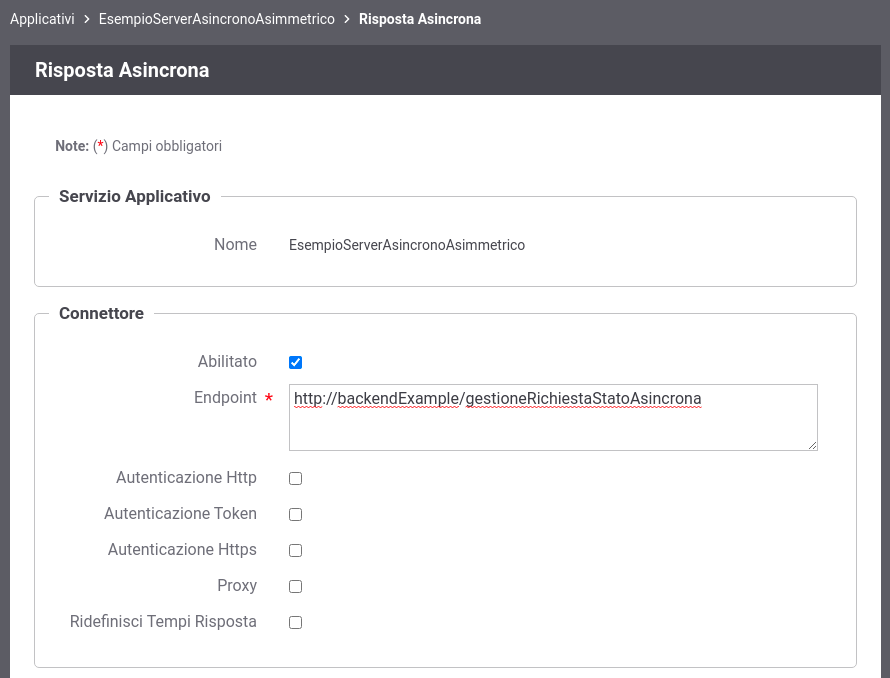
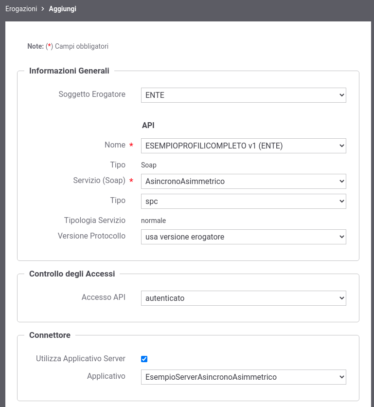

.. _profiloAsincronoAsimmetrico:

Profilo di Collaborazione Asincrono Asimmetrico
~~~~~~~~~~~~~~~~~~~~~~~~~~~~~~~~~~~~~~~~~~~~~~~

La registrazione di un profilo asincrono asimmetrico prevede che vengano
correlati tra di loro due azioni, normalmente di uno stesso servizio,
presenti all'interno dell'accordo di servizio parte comune (API). Di
seguito un esempio di tale configurazione.

    Correlazione Asincrona Asimmetrica

Ruolo Fruitore
^^^^^^^^^^^^^^

Per poter fruire un servizio con il profilo asincrono asimmetrico non
sono richieste particolari configurazioni. Dovrà essere fruito il
servizio su cui inviare la richiesta e richiedere l'esito della
risposta.

Ruolo Erogatore
^^^^^^^^^^^^^^^

Per poter erogare un servizio con il profilo asincrono asimmetrico come prerequisito è richiesto la registrazione di un applicativo server.
Durante la registrazione dell'applicativo possono essere indicati i parametri di accesso al backend a cui consegnare la richiesta asincrona.
Una volta creato l'applicativo è possibile definire i parametri di accesso al backend a cui consegnare la richiesta stato asincrona impostando la modalità avanzata nella console di gestione ed entrando in modifica sull'applicativo server precedentemente registrato, dove sarà disponibile il link 'Risposta Asincrona'.

    Accesso alla configurazione dell'Applicativo server per la Risposta Asincrona

    Configurazione dell'Applicativo server per la Risposta Asincrona

Una volta creato l'applicativo è possibile procedere con la registrazione dell'erogazione del servizio con asincrono asimmetrico selezionando l'applicativo server precedentemente registrato come connettore di backend come mostrato in figura :numref:`aaConfigurazioneApplicativoServer`.

    Selezione dell'Applicativo server per l'erogazione del servizio con profilo asincrono asimmetrico.

