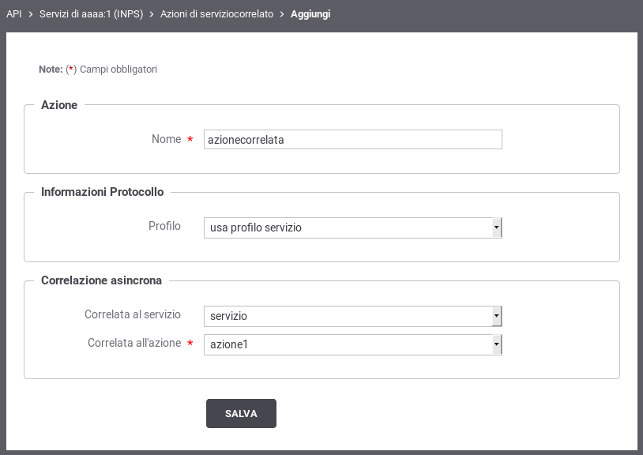
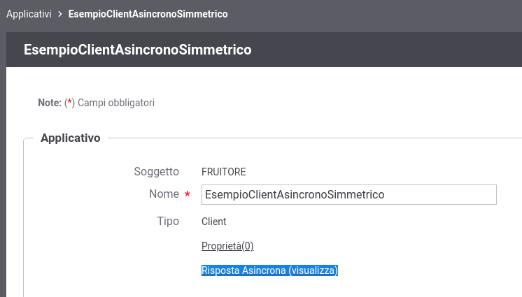
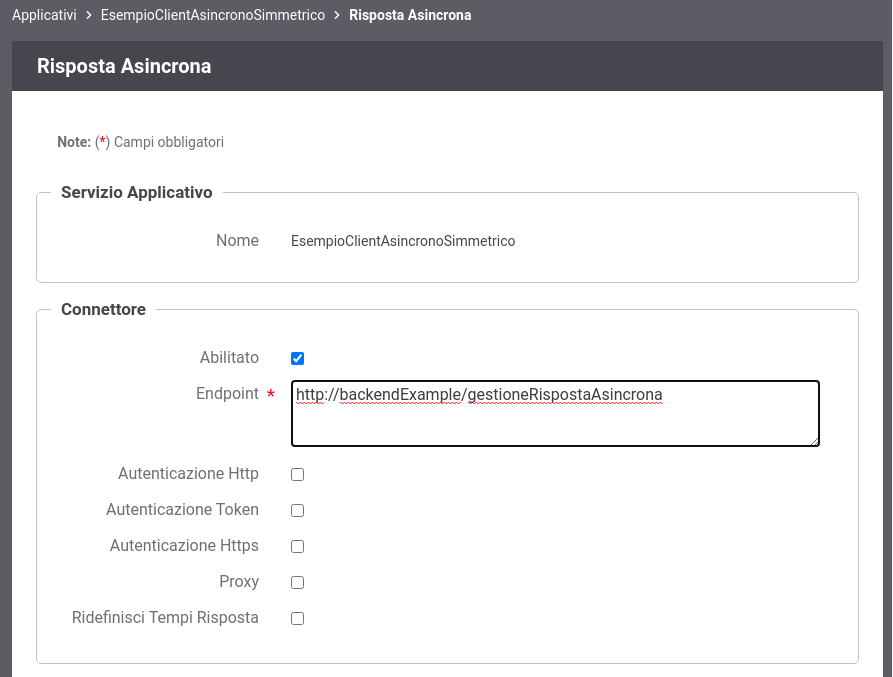

.. _profiloAsincronoSimmetrico:

Profilo di Collaborazione Asincrono Simmetrico
~~~~~~~~~~~~~~~~~~~~~~~~~~~~~~~~~~~~~~~~~~~~~~

La registrazione di un profilo asincrono simmetrico prevede che vengano
correlati tra di loro due azioni di due servizi differenti presenti
all'interno del solito accordo di servizio parte comune (API). Di
seguito un esempio di tale configurazione.

    Correlazione Asincrona Simmetrica

Ruolo Fruitore
^^^^^^^^^^^^^^

Per poter fruire di un servizio con il profilo asincrono simmetrico come prerequisito è richiesto almeno la registrazione di un applicativo client.
La registrazione dell'applicativo fruitore deve prevedere, oltre alle normali configurazioni, la definizione di un connettore attraverso il quale la PdD consegnerà la risposta asincrona. 
È possibile definire un connettore per la 'Risposta Asincrona' impostando la modalità avanzata nella console di gestione e accendo in modifica ad un applicativo client precedentemente registrato.
Il link 'Risposta Asincrona' consentirà di definire i parametri di accesso al backend per la gestione della risposta asincrona.

    Accesso alla configurazione dell'Applicativo client per la Risposta Asincrona

    Configurazione dell'Applicativo client per la Risposta Asincrona

Una volta creato l'applicativo è possibile procedere con la registrazione della fruizione del servizio asincrono simmetrico dedicato all'invio della richiesta. 
Il controllo degli accessi della fruizione deve obbligatoriamente essere configurato per autenticare gli applicativi precedentemente registrati, in modo da identificare l'applicativo chiamante e poterlo associare alla sessione asincrona. 

Terminata la registrazione della fruizione, dovrà essere registrata un'erogazione del servizio asincrono dedicato alla ricezione della risposta. La risposta ricevuta verrà consegnata al connettore definito per la risposta asincrona associato all'applicativo chiamante originario salvato nella sessione asincrona.

.. note::

	**Configurazione Servizio Ricezione della Risposta**

	Durante la registrazione dell'erogazione del servizio di risposta,  al connettore richiesto dalla maschera di configurazione può essere fornito un endpoint qualsiasi. Tale endpoint non verrà effettivamente utilizzato poichè la risposta asincrona ricevuta verrà inoltrata al backend configurato come 'Risposta Asincrona' dell'applicativo client che ha effettuato la richiesta.

Ruolo Erogatore
^^^^^^^^^^^^^^^

Per poter erogare un servizio con il profilo asincrono simmetrico non
sono richieste particolari configurazioni. Dovrà essere erogato il
servizio relativo alla richiesta e fruito il servizio su cui inviare la
risposta.
