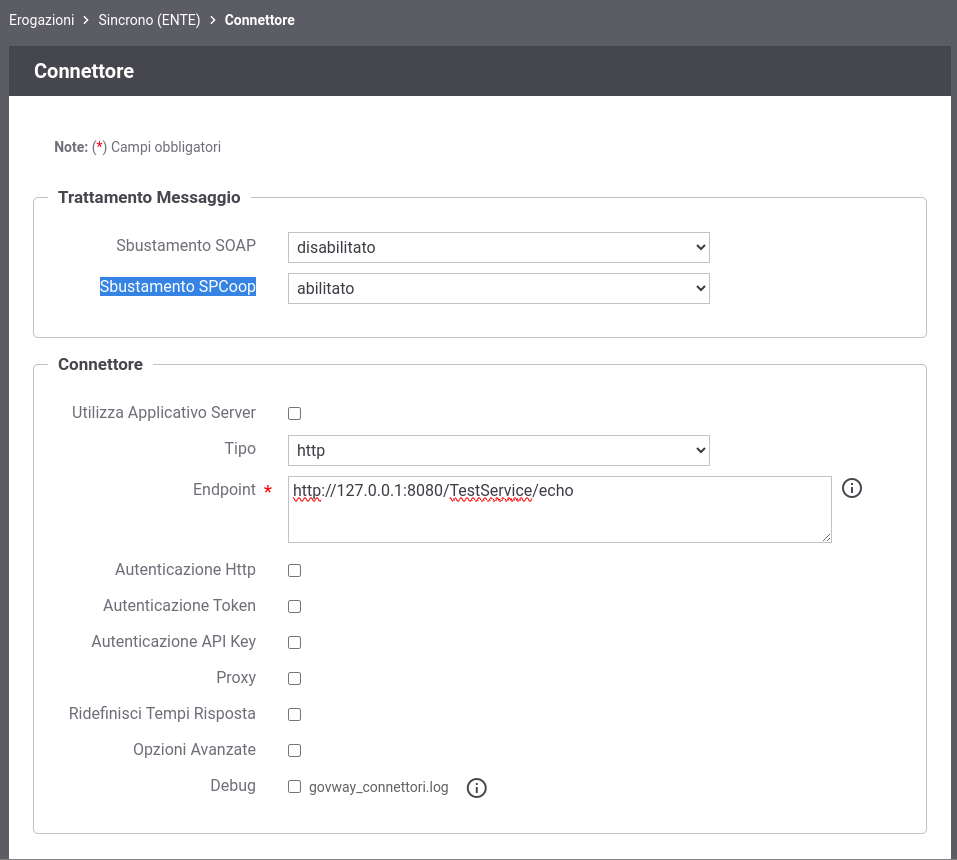

.. _spcoop_avanzate_sbustamento:

Eliminazione SOAP Header contenente l'intestazione della busta eGov
--------------------------------------------------------------------

Le richieste SPCoop sono richieste SOAP che, oltre al body applicativo, contengono un header che definisce l'intestazione della busta eGov.
L'header eGov, una volta validato da GovWay, viene eliminato dal messaggio per rendere trasparente agli applicativi la gestione della busta eGov effettuata dal Gateway.

Se necessario, è possibile configurare GovWay per evitare l'eliminazione dell'header eGov dopo la validazione. Per fare ciò, si deve utilizzare la govwayConsole in modalità avanzata (vedi sezione :ref:`modalitaAvanzata`).

Per quanto riguarda le richieste inoltrate a un backend durante la gestione di un'erogazione, è possibile disabilitare l'eliminazione dell'header eGov intervenendo sul connettore dell'erogazione e disabilitando la voce 'Sbustamento SPCoop' nella sezione 'Trattamento Messaggio', come mostrato nella figura :numref:`spcoop_sbustamento_richiesta`.

    Funzionalità 'Sbustamento SPCoop' disabilitata per la Richiesta

Sulle risposte ritornate all'applicativo mittente, durante la gestione di una fruizione, è possibile disabilitare l'eliminazione dell'header eGov agendo sull'applicativo e disabilitando la voce 'Sbustamento SPCoop' nella sezione 'Trattamento Messaggio', come mostrato nella figura :numref:`spcoop_sbustamento_risposta`.

    Funzionalità 'Sbustamento SPCoop' disabilitata per la Risposta

.. note:: Nota
    Se il gateway fruitore riceve dalla controparte erogatrice del servizio un messaggio di errore SPCoop come risposta, la busta viene validata e viene generato un messaggio applicativo di errore che viene ritornato all'applicativo mittente, come descritto nel documento '*Sistema pubblico di cooperazione: PORTA DI DOMINIO v1.1', voce 'PD_UR-5'*. Anche con la voce 'Sbustamento SPCoop' disabilitata, viene comunque restituito un messaggio applicativo di errore. Se si desidera inoltrare all'applicativo mittente esattamente il messaggio di errore SPCoop ricevuto dalla controparte, oltre a disabilitare la voce 'Sbustamento SPCoop' è necessario modificare il file <directory-lavoro>/govway_local.properties aggiungendo la seguente riga:

     ::

        # In caso di ricezione di una busta di errore eGov, il client riceverà esattamente la stessa busta se la funzionalità di sbustamento del protocollo SPCoop è stata disattivata sull'applicativo fruitore.
        org.openspcoop2.pdd.erroreApplicativo.inoltraClientBustaRispostaErroreRicevuta.spcoop=true

