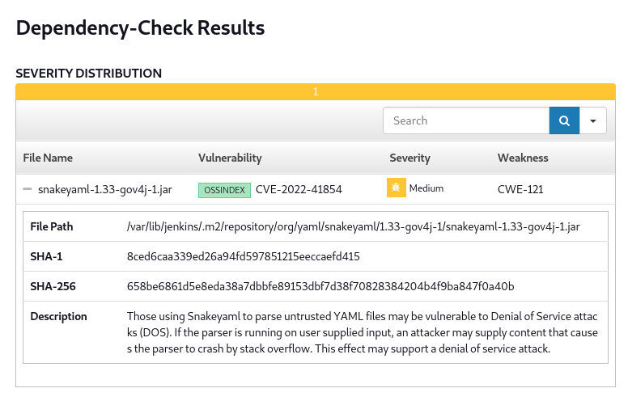
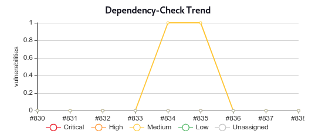
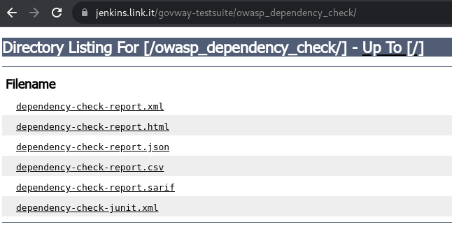
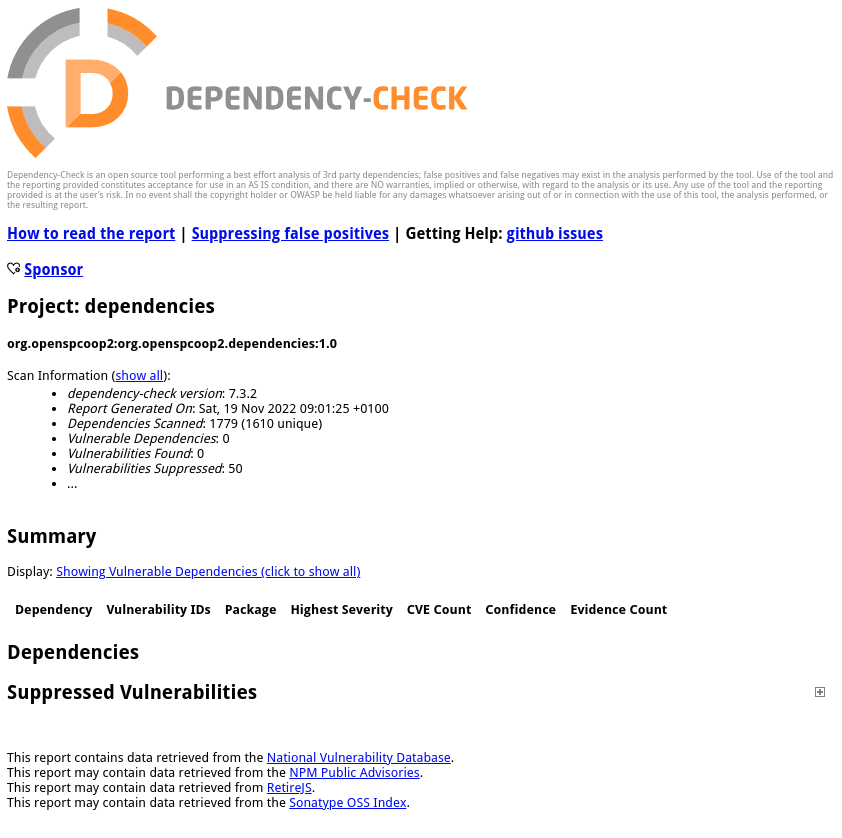

.. _releaseProcessGovWay_thirdPartyDynamicAnalysis_ci:

OWASP Dependency-Check Jenkins Plugin
~~~~~~~~~~~~~~~~~~~~~~~~~~~~~~~~~~~~~~

Ad ogni commit sul `master dei sorgenti del progetto <https://github.com/link-it/govway/>`_ viene avviata automaticamente una verifica delle librerie terza parte nell'ambiente di `Continuous Integration Jenkins di GovWay <https://jenkins.link.it/govway/job/GovWay/>`_. 

L'analisi produce un `report di dettaglio <https://jenkins.link.it/govway/job/GovWay/lastCompletedBuild/dependency-check-findings/>`_ sulle vulnerabilità trovate. Per ogni vulnerabilità identificata vengono forniti maggiori dettagli come la severità, il codice identificativo e la base dati dove di appartenenza (es. :numref:`owasp_vulnerability_details`). 

  OWASP Dependency-Check: dettaglio di una vulnerabilità

Nella `homepage dell'ambiente CI Jenkins di GovWay <https://jenkins.link.it/govway/job/GovWay/>`_ è anche disponibile un report che visualizza il trend delle vulnerabilità rispetto ai commit effettuati nel tempo (es. :numref:`owasp_vulnerability_trend`).

  OWASP Dependency-Check Trend

Sono inoltre disponibili `report di dettaglio in vari formati <https://jenkins.link.it/govway-testsuite/owasp_dependency_check/>`_ (:numref:`owasp_maven_report_elenco_ci`). 

  OWASP Dependency-Check: report in vari formati

La figura :numref:`owasp_maven_report_ci` mostra un esempio di report nel formato HTML.

  OWASP Dependency-Check: html report
