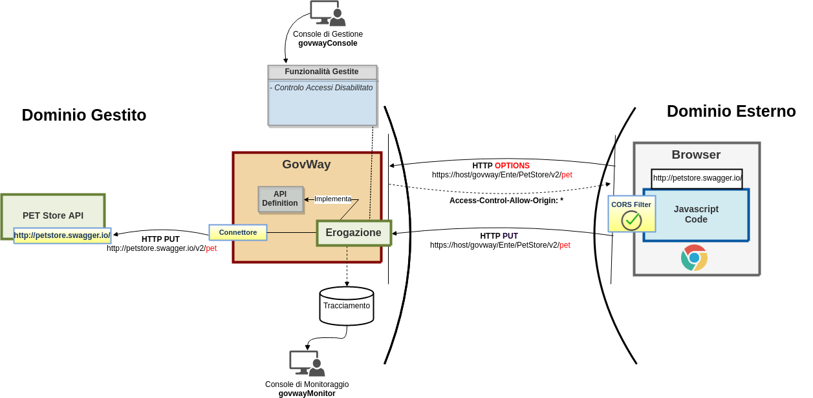
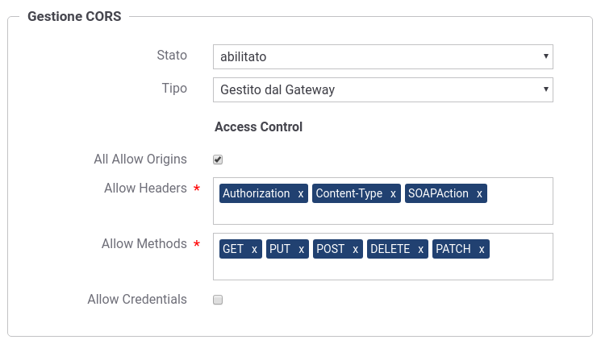
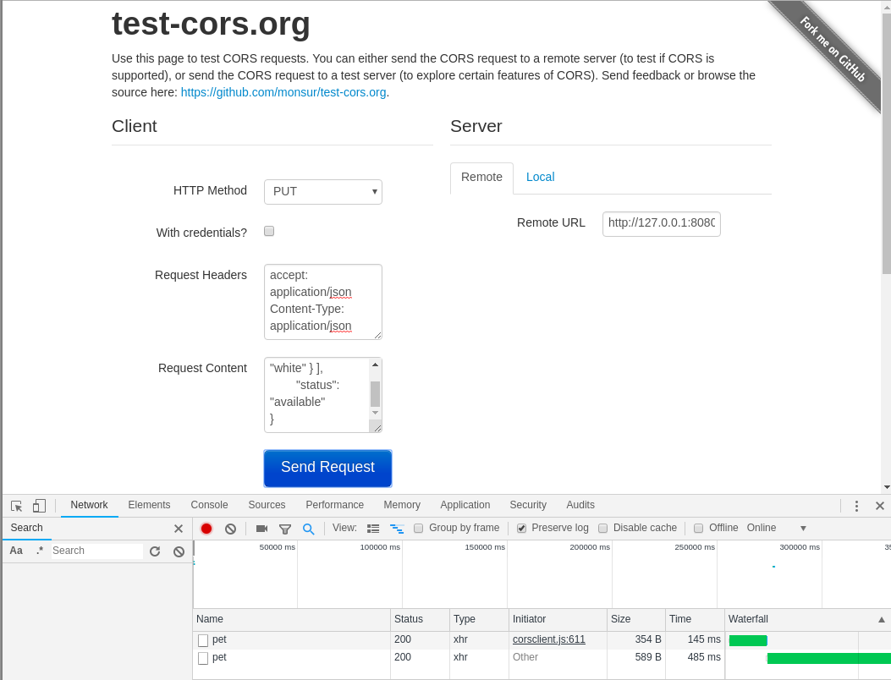
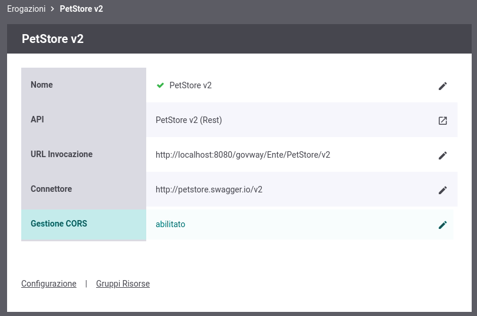
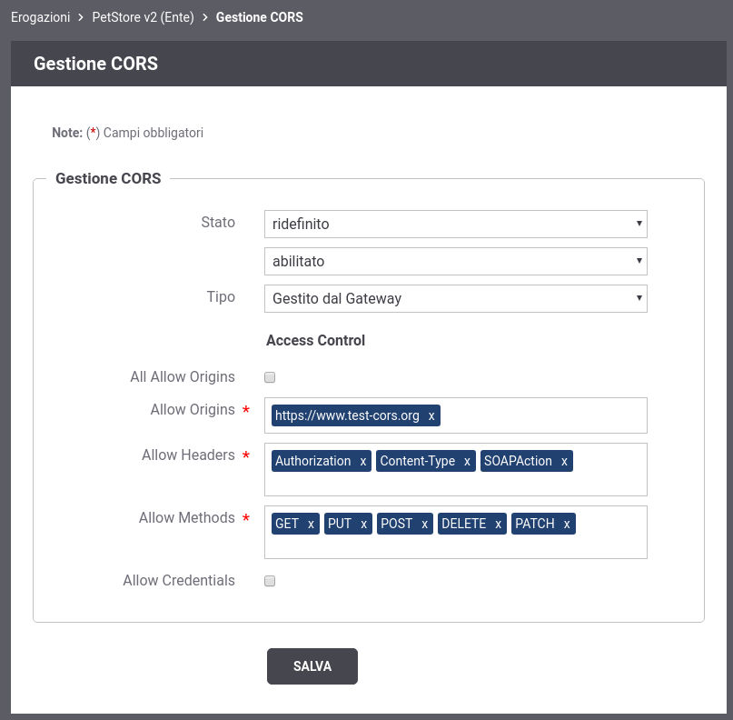

.. _quickCORS:

.. |br| raw:: html

     

=============
Gestione CORS
=============

Quando un'applicazione client in esecuzione su un browser (es. codice
javascript) richiede l'accesso ad una risorsa di un differente dominio,
protocollo o porta tale richiesta viene gestita dal browser tramite una
politica di *cross-origin HTTP request (CORS)*. Il CORS definisce un
modo nel quale un browser ed un server (o il gateway) possono interagire
per abilitare interazioni attraverso differenti domini.

In GovWay è possibile abilitare la gestione del CORS sia globalmente, in
modo che sia valida per tutte le APIs, che singolarmente sulla singola
erogazione o fruizione.

Una rappresentazione di questo scenario è mostrata nella :numref:`quick_cors_fig`.

    Scenario cross-origin HTTP request (CORS)

In GovWay è abilitata per default una gestione globale del CORS. I
dettagli sulla configurazione globale sono accedibili tramite la voce
del menù *'Configurazione - Generale'* all'interno della sezione
*'Gestione CORS'*. Per il dettaglio sul significa di ogni voce si
rimanda alla specifica CORS (https://www.w3.org/TR/cors/). Sono
abilitati per default:

-  *Access-Control-Allow-Origins*: Qualsiasi origine (\*)

-  *Access-Control-Allow-Methods*: i metodi http POST, PUT, GET, DELETE
   e PATCH

-  *Access-Control-Allow-Headers*: gli header http 'Authorization',
   'Content-Type' e 'SOAPAction'

La :numref:`quick_corsConfDefault_fig` mostra la configurazione globale attiva per default.

    CORS - Configurazione di default

Tramite il tool on-line disponibile all'indirizzo
https://www.test-cors.org/ è possibile verificare il funzionamento dello
scenario descritto nella :numref:`quick_cors_fig`. Configurare il tool con i seguenti
parametri per utilizzare il servizio descritto nella sezione :ref:`erogazioneREST`:

-  *HTTP Method*: PUT

-  *Request Headers*:

   -  accept: application/json

   -  Content-Type: application/json

-  *Request Content*:

   ::

       {
               "id": 3,
               "category": { "id": 22, "name": "dog" },
               "name": "doggie",
               "photoUrls": [ "http://image/dog.jpg" ],
               "tags": [ { "id": 23, "name": "white" } ],
               "status": "available"
       }

-  *Remote URL*: http://127.0.0.1:8080/govway/Ente/PetStore/v1/pet

Se si attiva la modalità *Developers Tool* (es. su Chrome 'More Tools -
Developers Tool') è possibile vedere le richieste effettuate dal browser
oltre agli header http scambiati.

Nella :numref:`quick_corsTest1_fig` è possibile vedere come siano state effettuate due
richieste http di cui la prima è stata iniziata dal browser (Initiator:
corsclient.js).

    Verifica CORS

La :numref:`quick_corsTest2_fig` evidenzia gli header scambiati nella prima richiesta
OPTIONS; tra gli header della risposta vi sono gli header relativi alla
configurazione di default del CORS di GovWay tra cui l'header
'Access-Control-Allow-Origins' impostato al valore '\*'.

.. figure:: ../_figure_howto/corsTest_2.png
    :scale: 100%
    :align: center
    :name: quick_corsTest2_fig

    Verifica CORS: richiesta OPTIONS

Vediamo adesso come modificare la gestione del CORS di una singola una
erogazione o fruizione di API utilizzando la console *govwayConsole*.
Per farlo accedere al dettaglio di un'erogazione o di una fruizione e
cliccare sull'icona di modifica presente nella riga relativa alla
gestione del CORS.

    Personalizzazione Gestione CORS di una erogazione

Impostare il campo *Stato* al valore *Ridefinito*. La maschera di
configurazione si aggiornerà presentando i dati relativi alla
configurazione globale di default. Deselezionare a questo punto la voce
*'All Allow Origins'* ed impostare un'origine specifica nel campo
*'Allow Origins'*. Ad esempio utilizzare il valore
*'https://www.test-cors.org'* relativo al tool di test descritto in
precedenza.

    Personalizzazione Gestione CORS: definizione di uno specifico 'origin'

Effettuando un nuovo test tramite il tool on-line *test-cors* è
possibile vedere nella prima richiesta OPTIONS, che tra gli header della
risposta non vi è più l'header 'Access-Control-Allow-Origins' impostato
al valore '\*' ma bensì con il nuovo valore configurato.

.. note:: **Reset Cache delle Configurazioni prima di un nuovo test**
    |br|
    Le configurazioni accedute da GovWay vengono mantenute in una cache
    dopo il primo accesso per 2 ore, è quindi necessario forzare un
    reset della cache. Per farlo accedere alla sezione *'Strumenti' -
    'Runtime'* e selezionare la voce *'ResetAllCaches'*.

.. figure:: ../_figure_howto/corsTest_origin.png
    :scale: 100%
    :align: center
    :name: quick_corsTestOrigin_fig

    Verifica CORS: definizione di uno specifico 'origin'
