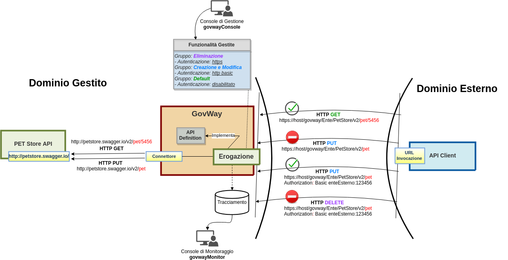

.. _configurazioni:

========================
Gruppi di configurazioni
========================

Nei precedenti esempi tutte le risorse delle API REST o le azioni dei
servizi SOAP vengono gestite dal Gateway tramite un'unica configurazione
di default. Le funzionalità che verranno descritte nelle successive
sezioni della guida possono essere attivate tramite
un'unica configurazione su tutte le risorse/azioni dell'API o possono
essere distinte a seconda delle caratteristiche applicative di ogni
singola risorsa o azione.

Di seguito, per fornire un esempio di raggruppamento delle risorse,
ipotizziamo di classificare le operazioni del servizio *Swagger
Petstore* per il metodo http:

-  *POST*, *PUT*: per queste operazioni viene richiesta
   un'autenticazione *http basic*

-  *DEL*: per queste operazioni viene richiesta un'autenticazione
   *https*

-  *GET*: queste operazioni sono utilizzabili in forma anonima

.. |br| raw:: html

    

.. note:: **Metodologia di classificazione solo a titolo di esempio**
    |br|
    la classificazione per metodo http e i tipi di autenticazione
    utilizzati sono solamente a titolo di esempio per descrivere la
    possibilità di definire configurazioni differenti per gruppi di
    risorse.

Una rappresentazione di questo scenario è mostrata nella :numref:`quick_gruppiRisorse_fig`.

    Configurazioni differenti per gruppi di risorse di una API

Per classificare in gruppi le risorse dell'API *Swagger Petstore*,
utilizzando la console *govwayConsole*, procedere come segue:

1. **Registrazione Gruppo 'Creazione e Modifica'**

   Accedere alla sezione *'Erogazioni'* e selezionare l'API
   precedentemente registrata *'PetStore v1'*. Dopodichè accedere, dal
   dettaglio dell'erogazione, alla sezione di configurazione dell'API cliccando sul pulsante *Configura* posto in basso a destra.
   La successiva maschera consente di configurare l'API e di visualizzare
   i gruppi in cui sono state classificate le risorse. Per
   default non è presente alcun raggruppamento (:numref:`quick_gruppiRisorseIniziale_fig`).

   .. figure:: ../_figure_howto/gruppiRisorseRESTBaseGruppoPredefinito.png
       :scale: 100%
       :align: center
       :name: quick_gruppiRisorseIniziale_fig

       Situazione iniziale con unico gruppo 'Predefinito'

   Selezionare il pulsante *'Crea Nuova'* e fornire i seguenti dati:

   -  *Nome Gruppo*: permette di associare un nome al gruppo delle
      risorse. Per il nostro esempio utilizzare il nome 'Creazione e
      Modifica'.

   -  *Risorse*: tramite la selezione multipla è possibile scegliere una
      o più risorse che dovranno appartenere al gruppo. Per il nostro
      esempio selezionare tutte le risorse con il metodo http *POST* e
      *PUT*.

   -  *Modalità*: indica se deve essere clonata la configurazione a
      partire dal gruppo indicato o se bisogna creare una configurazione
      ex-novo. Per riprodurre lo scenario di esempio precedentemente
      descritto selezionare *Nuova*.

   -  *Controllo degli Accessi - Accesso API*: per esporre l'API in modo che sia
      invocabil da client identificati tramite credenziali selezionare lo
      stato *'autenticato'*.

   .. figure:: ../_figure_howto/gruppiRisorseRESTBaseGruppoCreazioneModifica.png
       :scale: 100%
       :align: center
       :name: quick_gruppiRisorseCreazione_fig

       Registrazione Gruppo 'Creazione e Modifica'

   Terminata la creazione, l'accesso alle risorse del gruppo 'Creazione e Modifica', richiede che il client presenti delle credenziali ssl come indicato nella sezione :ref:`authHTTPS_mittenti` ( :numref:`quick_gruppiRisorseCreazione_step2_fig` ). 

   .. figure:: ../_figure_howto/gruppiRisorseRESTBaseGruppoCreazioneModifica_step2.png
       :scale: 100%
       :align: center
       :name: quick_gruppiRisorseCreazione_step2_fig

       Gruppo 'Creazione e Modifica' configurato con autenticazione 'https'

   Per impostare una autenticazione 'http-basic' accedere in modifica alla configurazione del Controllo degli Accessi indicando un'autenticazione 'http-basic' e disabilitando l'autorizzazione come mostrato nella figura :numref:`quick_gruppiRisorseCreazione_step3_fig`. 

   .. figure:: ../_figure_howto/gruppiRisorseRESTBaseGruppoCreazioneModifica_step3.png
       :scale: 100%
       :align: center
       :name: quick_gruppiRisorseCreazione_step3_fig

       Gruppo 'Creazione e Modifica', Controllo degli Accessi configurazione con autenticazione 'http-basic'

   Una volta salvata la nuova configurazione per il Controllo degli Accessi, per accedere alle risorse associate al gruppo 'Creazione e Modifiche' un client deve presentare delle credenziali http-basic ( :numref:`quick_gruppiRisorseCreazione_step4_fig` ) associate ad un soggetto o un applicativo registrato su GovWay. Al punto 7. verrà descritto come registrare un soggetto che possiede delle credenziali http-basic valide utilizzate in questo scenario di test.

   .. figure:: ../_figure_howto/gruppiRisorseRESTBaseGruppoCreazioneModifica_step4.png
       :scale: 100%
       :align: center
       :name: quick_gruppiRisorseCreazione_step4_fig

       Gruppo 'Creazione e Modifica', Controllo degli Accessi configurato con autenticazione 'http-basic'

2. **Registrazione Gruppo 'Eliminazione'**

   Procedere, come descritto in precedenza, per registrare un ulteriore
   gruppo fornendo i seguenti dati:

   -  *Nome Gruppo*: 'Eliminazione'.

   -  *Risorse*: Selezionare tutte le risorse con il metodo http *DEL*.

   -  *Modalità*: Per riprodurre lo scenario di esempio precedentemente
      descritto selezionare *Nuova*.

   -  *Controllo degli Accessi - Accesso API*: per esporre l'API in modo che sia
      invocabil da client identificati tramite credenziali selezionare lo
      stato *'autenticato'*.

   .. figure:: ../_figure_howto/gruppiRisorseRESTBaseGruppoEliminazione.png
       :scale: 100%
       :align: center
       :name: quick_gruppiRisorseEliminazione_fig

       Registrazione Gruppo 'Eliminazione'

   Come descritto precedentemente per il gruppo 'Creazione e Modifica' modificare la configurazione relativa al Controllo degli Accessi per impostare un'autenticazione 'http-basic'.

3. **Verifica Gruppi Esistenti**

   Dal dettaglio dell'erogazione, accedendo alla sezione di configurazione dell'API cliccando sul pulsante *Configura* posto in basso a destra, è possibile visualizzati tre gruppi, i due gruppi
   creati in precedenza ed il gruppo predefinito che adesso contiene
   solamente le risorse con metodo http GET (:numref:`quick_gruppiRisorseRegistrati_fig`). 

   .. figure:: ../_figure_howto/gruppiRisorseRESTBaseGruppoPredefinitoVerifica.png
       :scale: 100%
       :align: center
       :name: quick_gruppiRisorseRegistrati_fig

       Gruppi Registrati

   Nella sezione di configurazione sarà possibile agire sui gruppi anche in un secondo momento
   aggiungendo o eliminando risorse da un gruppo o creandone di nuovi. Inoltre sarà possibile configurare per ogni gruppo le funzionalità
   disponibili con Govway quali Validazione dei Contenuti, Rate Limiting, Trasformazioni etc... 
 
   Si può notare come i due gruppi creati per l'esempio possiedano un *Controllo Accessi* abilitato ( :numref:`quick_gruppiRisorseCreazione_step4_fig` ), mentre il gruppo *Predefinito* che contiene solo le risorse GET possiede tale funzionalità disabilitata ( :numref:`quick_gruppiRisorseRegistrati_fig` ).

4. **Reset Cache delle Configurazioni di GovWay**

   Le configurazioni accedute da GovWay vengono mantenute in una cache
   dopo il primo accesso per 2 ore. Siccome nei precendenti punti
   abbiamo modificato una configurazione utilizzata nelle sezioni
   precedenti se non sono trascorse 2 ore dall'ultimo utilizzo è
   necessario forzare un reset della cache. Per farlo accedere alla
   sezione *'Strumenti' - 'Runtime'* e selezionare la voce
   *'ResetAllCaches'*. (:numref:`quick_gruppiResetCache_fig`).

   .. figure:: ../_figure_howto/resetCache.png
       :scale: 100%
       :align: center
       :name: quick_gruppiResetCache_fig

       Reset Cache delle Configurazioni di GovWay

5. **Invocazione Anonima di una Risorsa del gruppo 'Predefinito' completata con successo**

   Effettuando una richiesta di un animale tramite http method *GET* si
   può vedere come la richiesta completa con successo:

   ::

       curl -v -X GET "http://127.0.0.1:8080/govway/Ente/PetStore/v1/pet/1" \
       -H "accept: application/json"

   L'esito dell'aggiornamento viene confermato con un codice http 200 e
   una risposta json equivalente alla richiesta:

   ::

       HTTP/1.1 200 OK
       Access-Control-Allow-Origin: *
       Access-Control-Allow-Methods: GET, POST, DELETE, PUT
       Access-Control-Allow-Headers: Content-Type, api_key, Authorization
       Content-Type: application/json
       Transfer-Encoding: chunked
       Server: GovWay
       GovWay-Message-ID: 84e1d9a4-c181-436f-b7f0-4cabf55c370d
       GovWay-Transaction-ID: 6c13b9ac-3d60-45a6-9130-297a4d832824

       {
           "id":1,
           "category": { "id":1, "name":"Akuke" },
           "name":"roy",
           "photoUrls":["https://goo.gl/images/fxk2BX"],
           "tags":[{"id":0,"name":"Naughty Dog"}],"
           status":"available"
       }

6. **Invocazione Anonima di una Risorsa del gruppo 'Creazione e Modifica' terminata con errore**

   Effettuando una modifica di un animale tramite http method *PUT* si
   può vedere come la richiesta termina con errore causato dal fatto che
   non si sono fornite credenziali *http basic*:

   ::

       curl -v -X PUT "http://127.0.0.1:8080/govway/Ente/PetStore/v1/pet" \
       -H "accept: application/json" \
       -H "Content-Type: application/json" \
       -d '{
               "id": 3,
               "category": { "id": 22, "name": "dog" },
               "name": "doggie",
               "photoUrls": [ "http://image/dog.jpg" ],
               "tags": [ { "id": 23, "name": "white" } ],
               "status": "available"
       }'

   L'esito dell'aggiornamento termina con un codice http 401 e una
   risposta contenente un json di errore generato dal Gateway (*Problem
   Details* come definito nella specifica *RFC 7807*:
   https://tools.ietf.org/html/rfc7807):

   ::

       HTTP/1.1 401 Unauthorized
       Connection: keep-alive
       WWW-Authenticate: Basic realm="GovWay"
       Server: GovWay
       Transfer-Encoding: chunked
       GovWay-Transaction-ID: 15a60a91-edc1-4b7c-b7f0-b31739d543a0
       Content-Type: application/problem+json
       Date: Thu, 15 Nov 2018 16:07:10 GMT

       {
           "type":"https://httpstatuses.com/401",
           "title":"Unauthorized",
           "status":401,
           "detail":"Autenticazione fallita, credenziali non fornite",
           "govway_status":"protocol:GOVWAY-109"
       }

   Attraverso la console *govwayMonitor* è possibile consultare lo
   storico delle transazioni che sono transitate nel gateway. Dalla
   :numref:`quick_tracceGW_fig` si può vedere come le transazioni con metodo http *PUT* sono
   terminate con errore con esito *Autenticazione Fallita*. Accedendo al
   dettaglio della singola invocazione fallita è possibile esaminare i
   diagnostici emessi da GovWay nei quali viene evidenziato il motivo
   del fallimento (:numref:`quick_invocazioneBloccata_fig`).

   .. figure:: ../_figure_howto/gruppiRisorseRESTBaseGruppoConsultazioneStoricoTransazioni.png
       :scale: 100%
       :align: center
       :name: quick_tracceGW_fig

       Tracce delle invocazioni transitate sul Gateway

   .. figure:: ../_figure_howto/gruppiRisorseRESTBaseGruppoConsultazioneStoricoTransazioniDettaglio.png
       :scale: 100%
       :align: center
       :name: quick_invocazioneBloccata_fig

       Dettaglio di una invocazione fallita bloccata dal Gateway

7. **Invocazione di una Risorsa del gruppo 'Creazione e Modifica' con credenziali 'http basic' completata con successo**

   Per verificare che l'invocazione http descritta al punto precedente
   termini con successo in presenza di credenziali http basic si deve
   procedere con l'assegnazione di una credenziale ad un soggetto
   esterno al dominio. Di seguito viene descritto come fare tale
   assegnazione per completare l'esempio.

   Accedere al soggetto *EnteEsterno* creato in precedenza durante
   l'esempio descritto nella sezione :ref:`fruizioneAPI` e associargli delle credenziali
   *'http basic'* come ad esempio un username *enteEsterno* ed una
   password *123456* (:numref:`quick_gruppoEliminazione_fig`).

   .. figure:: ../_figure_howto/gruppiRisorseRESTBaseGruppoSoggettoAssociazioneCredenziale.png
       :scale: 100%
       :align: center
       :name: quick_gruppoEliminazione_fig

       Registrazione Gruppo 'Eliminazione'

   Dopo aver associato le credenziali al soggetto effettuare il reset
   della cache delle configurazioni del Gateway come descritto in
   precedenza prima di procere con l'invocazione.

   Effettuando una modifica di un animale tramite http method *PUT* con
   le credenziali *http basic* si può vedere come la richiesta termina
   con successo:

   ::

       curl -v -X PUT "http://127.0.0.1:8080/govway/Ente/PetStore/v1/pet" --basic --user enteEsterno:123456 \
       -H "accept: application/json" \
       -H "Content-Type: application/json" \
       -d '{
               "id": 3,
               "category": { "id": 22, "name": "dog" },
               "name": "doggie",
               "photoUrls": [ "http://image/dog.jpg" ],
               "tags": [ { "id": 23, "name": "white" } ],
               "status": "available"
       }'

   L'esito dell'aggiornamento viene confermato con un codice http 200 e
   una risposta json equivalente alla richiesta:

   ::

       HTTP/1.1 200 OK
       Access-Control-Allow-Origin: *
       Access-Control-Allow-Methods: GET, POST, DELETE, PUT
       Access-Control-Allow-Headers: Content-Type, api_key, Authorization
       Content-Type: application/json
       Transfer-Encoding: chunked
       Server: GovWay
       GovWay-Message-ID: 84e1d9a4-c181-436f-b7f0-4cabf55c370d
       GovWay-Transaction-ID: 6c13b9ac-3d60-45a6-9130-297a4d832824

       {
           "id":3,
           "category":{"id":22,"name":"dog"},
           "name":"doggie",
           "photoUrls":["http://image/dog.jpg"],
           "tags":[{"id":23,"name":"white"}],
           "status":"available"
       }

8. **Invocazione di una Risorsa del gruppo 'Eliminazione' con credenziali 'http basic' terminata con errore**

   Effettuando una eliminazione di un animale tramite http method *DEL*
   si può vedere come la richiesta termina con errore causato dal fatto
   che non si sono fornite credenziali *https*:

   ::

       curl -v -X DELETE "http://127.0.0.1:8080/govway/Ente/PetStore/v1/pet/545646489" --basic --user enteEsterno:123456 \
       -H "accept: application/json"

   L'esito dell'eliminazione termina con un codice http 401 e una
   risposta contenente un json di errore generato dal Gateway (*Problem
   Details* come definito nella specifica *RFC 7807*:
   https://tools.ietf.org/html/rfc7807):

   ::

       HTTP/1.1 401 Unauthorized
       Connection: keep-alive
       Server: GovWay
       Transfer-Encoding: chunked
       GovWay-Transaction-ID: 15a60a91-edc1-4b7c-b7f0-b31739d543a0
       Content-Type: application/problem+json
       Date: Thu, 15 Nov 2018 16:07:10 GMT

       {
           "type":"https://httpstatuses.com/401",
           "title":"Unauthorized",
           "status":401,
           "detail":"Autenticazione fallita, credenziali non fornite",
           "govway_status":"protocol:GOVWAY-109"
       }

   Attraverso la console *govwayMonitor* è possibile consultare lo
   storico delle transazioni che sono transitate nel gateway. Dalla
   :numref:`quick_tracceInvocazioni_fig` si può vedere come le transazioni con metodo http *DEL* sono
   terminate con errore con esito *Autenticazione Fallita*.

   .. figure:: ../_figure_howto/gruppiRisorseRESTBaseGruppoConsultazioneStoricoTransazioni2.png
       :scale: 100%
       :align: center
       :name: quick_tracceInvocazioni_fig

       Tracce delle invocazioni transitate sul Gateway

.. note:: **Ripristino Erogazione API con il solo gruppo predefinito per prosieguo degli scenari**
    |br|
    Negli scenari descritti nelle successive sezioni verrà utilizzato
    sempre il gruppo predefinito per mostrare la funzionalità. Per tale
    motivo si consiglia di ripristinare la situazione iniziale
    eliminando i due gruppi creati in questa sezione accedendo al
    dettaglio dell'erogazione dell'API *PetStore* nella sezione *'Gruppi'*.
