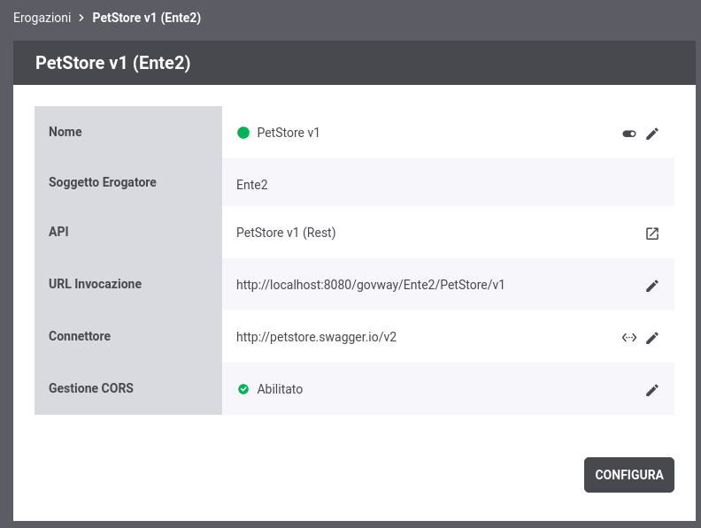

.. _quickMultitenant:

Modalità Multi-Tenant
---------------------

GovWay supporta nativamente il multi-tenant grazie al quale è possibile
gestire più domini. Una API che deve essere erogata su più domini viene
registrata solamente una volta e può poi essere implementata da tutti i
soggetti dei vari domini gestiti. Un applicativo client, per indirizzare
una specifica API di un dominio, deve semplicemente indicare il nome del
soggetto nella url di invocazione. Una rappresentazione di uno scenario
multi-tenant è mostrata nella :numref:`quick_multitenant_fig`.

.. figure:: ../_figure_howto/multitenant.png
    :scale: 100%
    :align: center
    :name: quick_multitenant_fig

    Scenario Multi-Tenant

Di seguito vengono descritti i passi necessari a gestire più domini
(multi-tenant) su GovWay al fine di erogare l'API già registrata
nell'esempio descritto nella sezione :ref:`erogazioneREST` all'interno di un ulteriore
dominio gestito dal soggetto *Ente2*.

1. **Abilitazione Multi-Tenant**

   GovWay viene installato per default con la funzionalità multi-tenant
   disabilitata e quindi l'unico dominio gestito è quello del soggetto
   fornito in fase di installazione. Per abilitare il multi-tenant
   accedere alla sezione *'Configurazione'* e selezionare la voce
   *'Generale'*. Nella maschera visualizzata selezionare il valore
   *'abilitato'* nella sezione *'Multi-Tenant'*.

.. figure:: ../_figure_howto/multitenant_configurazione_abilitato.png
    :scale: 100%
    :align: center
    :name: quick_multitenantAbilitato_fig

    Configurazione Multi-Tenant Abilitato

2. **Registrazione nuovo Soggetto**

   Accedere alla sezione *'Soggetti'* e selezionare il pulsante
   *'Aggiungi'*. Fornire i seguenti dati:

   -  *Dominio*: selezionare la voce *'Interno'*.

   -  *Nome*: indicare il nome del Soggetto che rappresenta il nuovo
      dominio in gestione, ad esempio *'Ente2'*.

   -  *Descrizione*: opzionalmente è possibile fornire una descrizione
      generica del soggetto.

.. figure:: ../_figure_howto/multitenant_configurazione_soggetto.png
    :scale: 100%
    :align: center
    :name: quick_multitenantSoggetto_fig

    Registrazione nuovo Soggetto

3. **Selezione del Dominio da gestire**

   Sia nella console di gestione (*govwayConsole*) che nella console di
   monitoraggio (*govwayMonitor*), una volta abilitato il Multi-Tenant,
   prima di procedere con qualsiasi operazione deve essere selezionato
   il soggetto per cui si intende gestire il dominio attraverso
   l'apposito menù situato in alto a destra nell'intestazione delle
   console.

.. figure:: ../_figure_howto/apiGateway_multitenant_selezione_soggetto.png
    :scale: 100%
    :align: center
    :name: quick_multitenantSelezioneSoggetto_fig

    Selezione del Soggetto

4. **Registrazione Erogazione**

   Procedere con la registrazione della API *'PetStore v2'* così come
   già descritto nella sezione :ref:`erogazioneREST`. Accedere alla sezione *'Erogazioni'* e
   selezionare il pulsante *'Aggiungi'*. Fornire i seguenti dati:

   -  *Nome*: selezionare l'API precedentemente registrata *'PetStore
      v2'*.

   -  *Autenticazione - Stato*: per esporre l'API in modo che sia
      invocabile da qualunque client in forma anonima selezionare lo
      stato *'disabilitato'*.

   -  *Connettore - Endpoint*: indicare la *base uri* dove viene erogata
      l'API nel dominio interno. Per il nostro esempio utilizzare sempre
      la url:

      -  *http://petstore.swagger.io/v2*

   Effettuato il salvataggio, l'API erogata sarà consultabile
   all'interno dell'elenco delle erogazioni. Accedendo al dettaglio si
   potrà conoscere l'\ *url di invocazione* che deve essere comunicata
   ai client che desiderano invocare l'API.

       **Nome del Soggetto presente nella url di invocazione**

       Come si può vedere dalla :numref:`quick_multitenantUrlInvocazione_fig` il soggetto *Ente2* compare nella url indicata.

    URL di Invocazione dell'API erogata

5. **Invocazione API tramite GovWay**

   Al termine di questi passi di configurazione il servizio REST sarà
   raggiungibile dai client utilizzando l'url di invocazione:

   -  *http://host:port/govway/\ **Ente2**/PetStore/v2/<uri-risorsa>*

   ::

       curl -v -X PUT "http://127.0.0.1:8080/govway/Ente2/PetStore/v2/pet" \
       -H "accept: application/json" \
       -H "Content-Type: application/json" \
       -d '{
               "id": 3,
               "category": { "id": 22, "name": "dog" },
               "name": "doggie",
               "photoUrls": [ "http://image/dog.jpg" ],
               "tags": [ { "id": 23, "name": "white" } ],
               "status": "available"
       }'

6. **Consultazione Tracce**

   La consultazione delle tracce per ogni dominio gestito è identica a
   quanto descritto nella sezione :ref:`erogazioneREST`, previa selezione del soggetto in
   gestione tramite il menù situato in alto a destra.
