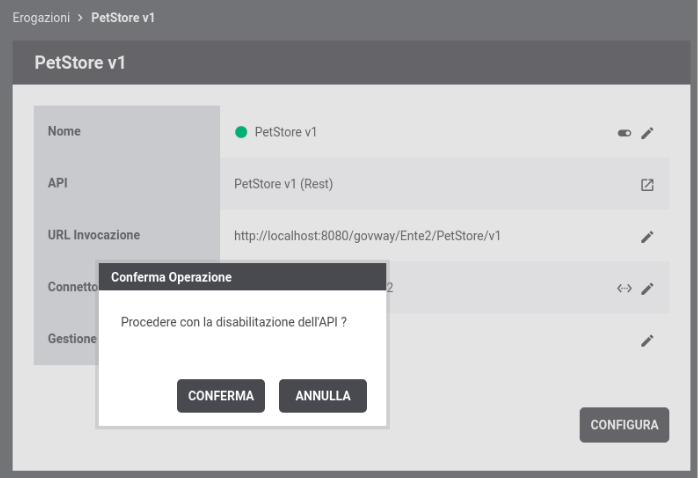
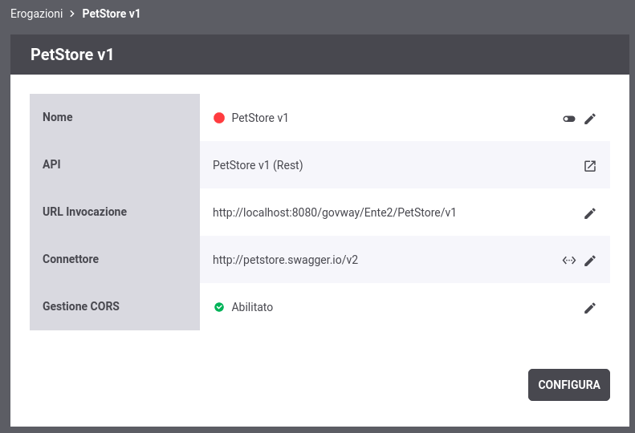
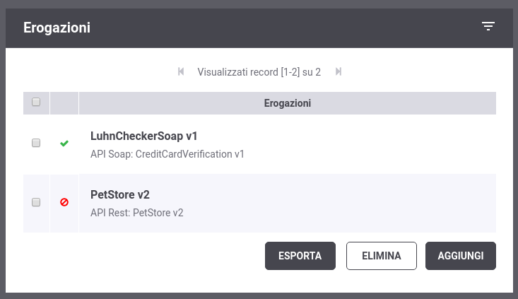
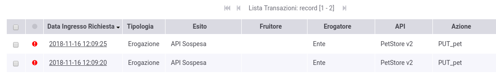
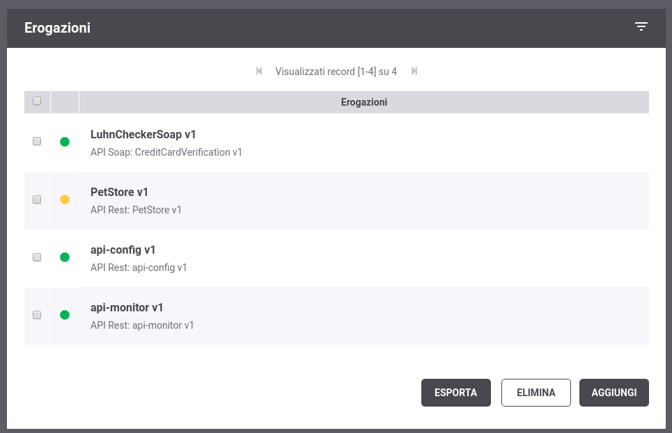

.. _sospensioneAPI:

======================
Sospensione di una API
======================

Una erogazione o una fruizione di API, precedentemente configurata, può
essere temporaneamente sospesa. L'effetto di una sospensione è quella di
bloccare sul gateway le richieste e di ritornare al client oltre
all'informazione che il servizio non è disponibile una indicazione su
quando può riprovare tramite l'header http standard *Retry-After*. Una
sospensione è utile in diversi scenari quali ad esempio:

-  *Aggiornamento applicativo erogatore*: Durante il periodo di
   aggiornamento di un applicativo erogatore una sospensione
   dell'erogazione permette di non intasare di richieste, che andrebbero
   in errore, il backend applicativo.

-  *Problema applicativo client*: Supponiamo che un applicativo client
   produca delle richieste, verso un dominio esterno, che generano
   errori dovuti a problemi del software del client. Una volta
   identificato il problema, per evitare di intasare di richieste errate
   il Dominio esterno può essere funzionale sospendere la fruizione
   dell'API fino a che il problema non viene risolto.

Una rappresentazione di questo scenario è mostrata nella :numref:`quick_sospensione_fig`.

.. figure:: ../_figure_howto/sospensioneBase.png
    :scale: 100%
    :align: center
    :name: quick_sospensione_fig

    Sospensione di una API

Per sospendere una erogazione o fruizione di API, utilizzando la console
*govwayConsole* dal dettaglio dell'erogazione o della fruizione cliccare sul 'toggle' di abilitazione/disabilitazione presente nella prima riga dove viene presentato il nome dell'API.
Comparirà una finestra di dialogo dove viene richiesto di confermare la
sospensione. La :numref:`quick_sospensioneDisattivazione_fig` mostra una sospensione in corso dell'erogazione
registrata nella sezione :ref:`erogazioneREST`.

    Sospensione di una erogazione

Procedendo con la conferma l'erogazione sarà a tutti gli effetti sospesa
come mostra anche l'icona di stato rossa (:numref:`quick_sospensioneElenco_fig`).

    Erogazione sospesa

L'informazione sullo stato di sospensione di una erogazione o una
fruizione viene fornita, tramite l'icona di stato, anche nell'elenco
principale come mostrato nella :numref:`quick_sospensioneElencoErogazioni_fig`.

    Stato disabilitato riportato nell'elenco delle erogazioni

Effettuando una modifica di un animale tramite http method *PUT* si può
vedere come la richiesta termina con errore causato dal fatto che
l'erogazione risulta sospesa:

::

    curl -v -X PUT "http://127.0.0.1:8080/govway/Ente/PetStore/v1/pet" \
    -H "accept: application/json" \
    -H "Content-Type: application/json" \
    -d '{
            "id": 3,
            "category": { "id": 22, "name": "dog" },
            "name": "doggie",
            "photoUrls": [ "http://image/dog.jpg" ],
            "tags": [ { "id": 23, "name": "white" } ],
            "status": "available"
    }'

L'esito dell'aggiornamento termina con un codice http 503, un header
http *Retry-After* contenenete l'indicazione sul numero di secondi dopo
i quali un client dovrebbe ripresentarsi e una risposta contenente un
json di errore generato dal Gateway (*Problem Details* come definito
nella specifica *RFC 7807*: https://tools.ietf.org/html/rfc7807):

::

    HTTP/1.1 503 Service Unavailable
    Connection: keep-alive
    Retry-After: 338
    Server: GovWay
    Transfer-Encoding: chunked
    GovWay-Transaction-ID: 15a60a91-edc1-4b7c-b7f0-b31739d543a0
    Content-Type: application/problem+json
    Date: Thu, 15 Nov 2018 16:07:10 GMT

    {
        "type":"https://httpstatuses.com/503",
        "title":"Service Unavailable",
        "status":503,
        "detail":"Porta disabilitata",
        "govway_status":"integration:GOVWAY-446"
    }

Attraverso la console *govwayMonitor* è possibile consultare lo storico
delle transazioni che sono transitate nel gateway. Dalla :numref:`quick_sospensioneTracce_fig` si può
vedere come le transazioni generate dopo la sospensione sono terminate
con errore con esito *API Sospesa*.

    Tracce delle invocazioni transitate sul Gateway

Se per una erogazione o fruizione di API è stata effettuata la
classificazione delle risorse in gruppi, come mostrato nella sezione :ref:`configurazioni`,
la sospensione può essere effettuata sul singolo gruppo.

La :numref:`quick_sospensioneGruppo_fig` mostra un esempio di sospensione, nello scenario sezione :ref:`configurazioni`, del solo gruppo *'Predefinito'*.

.. figure:: ../_figure_howto/sospensioneGruppiElenco.png
    :scale: 100%
    :align: center
    :name: quick_sospensioneGruppo_fig

    Gruppo di una erogazione sospeso

L'informazione sullo stato di sospensione parziale (relativa a non tutti
i gruppi) di una erogazione o una fruizione viene fornita, tramite un
icona di stato gialla, anche nell'elenco principale come mostrato nella
:numref:`quick_sospensioneGruppoStatoGiallo_fig`.

    Stato disabilitato di un gruppo riportato nell'elenco delle	erogazioni
