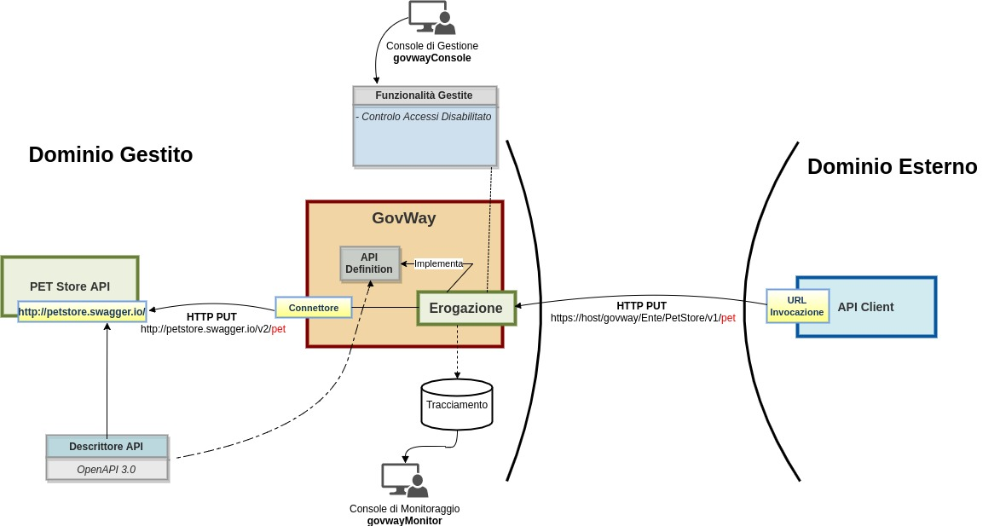
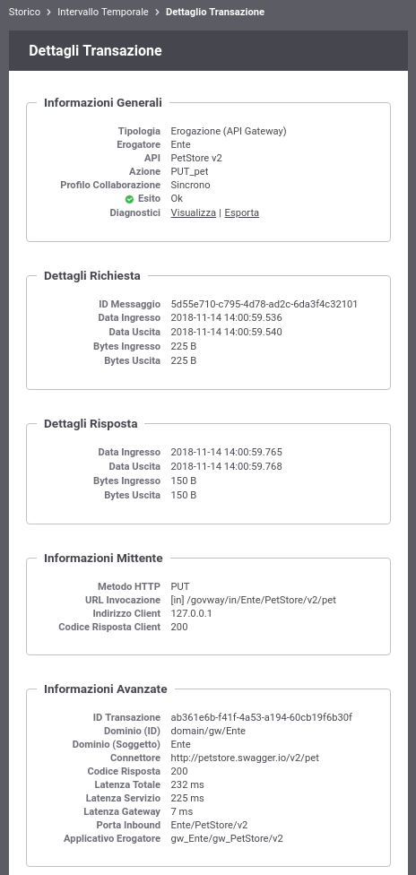

.. |br| raw:: html

     

.. _erogazioneREST:

Erogazione API REST
-------------------

In questa sezione vengono descritti i passi di configurazione
necessari a registrare una API REST implementata da un applicativo
interno al proprio dominio di gestione. 
Nello scenario si
suppone che il servizio *PetStore*, disponibile on line all'indirizzo http://petstore.swagger.io/ , sia erogato all'interno del dominio di gestione.

L'API, per questo primo esempio di utilizzo del Gateway, viene
registrata in modo che sia accessibile in forma anonima da qualunque
client invocando l'url esposta da GovWay. Una rappresentazione di questo
scenario è mostrata nella :numref:`quick_erogazioneREST_fig`. Prima di procedere con la
configurazione effettuare il download dell'interfaccia OpenAPI 3.0 del servizio *PetStore* disponibile
all'indirizzo 'https://raw.githubusercontent.com/Mermade/openapi3-examples/master/fail/apimatic-converted-petstore.json'.

    Erogazione di una API Rest tramite GovWay

Per registrare l'API su Govway, utilizzando la console *govwayConsole*,
procedere come segue:

1. **Registrazione API**.

   Accedere alla sezione *'API'* e selezionare il pulsante *'Aggiungi'*.
   Fornire i seguenti dati:

   -  *Tipo*: selezionare la tipologia *'REST'*.

   -  *Nome*: indicare il nome dell'API che si sta registrando, ad
      esempio *'PetStore'*.

   -  *Descrizione*: opzionalmente è possibile fornire una descrizione
      generica dell'API.

   -  *Versione*: indicare la versione dell'API che si sta registrando;
      nell'esempio utilizziamo la versione *1*.

   -  *Formato Specifica*: selezionare *'OpenAPI 3.0'* tra i formati
      supportati.

   -  *OpenAPI 3.0*: caricare l'interfaccia API scaricata dall'indirizzo
      'https://raw.githubusercontent.com/Mermade/openapi3-examples/master/fail/apimatic-converted-petstore.json'.

   .. figure:: ../_figure_howto/erogazioneRESTBaseRegistrazioneAPI.png
       :scale: 100%
       :align: center
       :name: quick_registrazioneAPI_fig

       Registrazione di una API

   Effettuato il salvataggio, l'API sarà consultabile all'interno dell'elenco delle API registrate. Accedendo al dettaglio si potranno visionare le risorse che tale API dispone come si può vedere dalla :numref:`quick_risorseAPI_fig`.

   .. figure:: ../_figure_howto/erogazioneRESTBaseConsultazioneRisorseAPI.png
       :scale: 100%
       :align: center
       :name: quick_risorseAPI_fig

       Risorse di una API

2. **Registrazione Erogazione**

   Accedere alla sezione *'Erogazioni'* e selezionare il pulsante
   *'Aggiungi'*. Fornire i seguenti dati:

   -  *Nome*: selezionare l'API precedentemente registrata *'PetStore
      v2'*.

   -  *Controllo degli Accessi - Accesso API*: per esporre l'API in modo che sia
      invocabile da qualunque client in forma anonima selezionare lo
      stato *'pubblico'*.

   -  *Connettore - Endpoint*: indicare la *base uri* dove viene erogata
      l'API nel dominio interno. Per il nostro esempio utilizzare la
      url:

      -  *https://petstore.swagger.io/v2*

      .. note:: **Verifica del certificato server**
       |br|
       Per validare il certificato ritornato dal server 'petstore.swagger.io' deve essere effettuata una opportuna configurazione del trustStore tls come descritto nella sezione :ref:`avanzate_connettori_https`.
       Poichè non è obiettivo di questo scenario si suggerisce di disabilitare la validazione del certificato server.

   .. figure:: ../_figure_howto/erogazioneRESTBaseRegistrazioneErogazione.png
       :scale: 100%
       :align: center
       :name: quick_erogazioneAPI_fig

       Registrazione di una erogazione di API

   Effettuato il salvataggio, l'API erogata sarà consultabile all'interno dell'elenco delle erogazioni. Accedendo al dettaglio si potrà conoscere l'\ *url di invocazione* che deve essere comunicata ai client che desiderano invocare l'API.

   .. figure:: ../_figure_howto/erogazioneRESTBaseConsultazioneErogazione.png
       :scale: 100%
       :align: center
       :name: quick_UrlErogazioneAPI_fig

       URL di Invocazione dell'API erogata

3. **Invocazione API tramite GovWay**

   Al termine di questi passi di configurazione il servizio REST sarà
   raggiungibile dai client utilizzando l'url di invocazione:

   -  http://host:port/govway/*<soggetto-dominio-interno>*/PetStore/v1/<uri-risorsa>

       **Soggetto interno al dominio**

       In questo esempio si suppone che il nome del soggetto fornito
       durante la fase di installazione di GovWay sia *Ente*.

   ::

       curl -v -X PUT "http://127.0.0.1:8080/govway/Ente/PetStore/v1/pet" \
       -H "accept: application/json" \
       -H "Content-Type: application/json" \
       -d '{
               "id": 3,
               "category": { "id": 22, "name": "dog" },
               "name": "doggie",
               "photoUrls": [ "http://image/dog.jpg" ],
               "tags": [ { "id": 23, "name": "white" } ],
               "status": "available"
       }'

   L'esito dell'aggiornamento viene confermato con un codice http 200 e
   una risposta json equivalente alla richiesta:

   ::

       HTTP/1.1 200 OK
       Access-Control-Allow-Origin: *
       Access-Control-Allow-Methods: GET, POST, DELETE, PUT
       Access-Control-Allow-Headers: Content-Type, api_key, Authorization
       Content-Type: application/json
       Transfer-Encoding: chunked
       Server: GovWay
       GovWay-Message-ID: 84e1d9a4-c181-436f-b7f0-4cabf55c370d
       GovWay-Transaction-ID: 6c13b9ac-3d60-45a6-9130-297a4d832824

       {
           "id":3,
           "category":{"id":22,"name":"dog"},
           "name":"doggie",
           "photoUrls":["http://image/dog.jpg"],
           "tags":[{"id":23,"name":"white"}],
           "status":"available"
       }

   **Traccia della comunicazione**

   L'invocazione restituisce al client, sotto forma di header HTTP, l'id di transazione con cui è stata salvata la traccia contenente tutti i dati dell'invocazione sul Gateway.

4. **Consultazione Tracce**

   Attraverso la console *govwayMonitor* è possibile consultare lo
   storico delle transazioni che sono transitate nel gateway (:numref:`quick_tracce_fig`)
   e conoscere il dettaglio di una singola invocazione (:numref:`quick_dettaglio_fig`).

.. figure:: ../_figure_howto/erogazioneRESTBaseConsultazioneStoricoTransazioni.png
    :scale: 100%
    :align: center
    :name: quick_tracce_fig

    Tracce delle invocazioni transitate sul Gateway

    Dettaglio di una invocazione transitata sul Gateway
