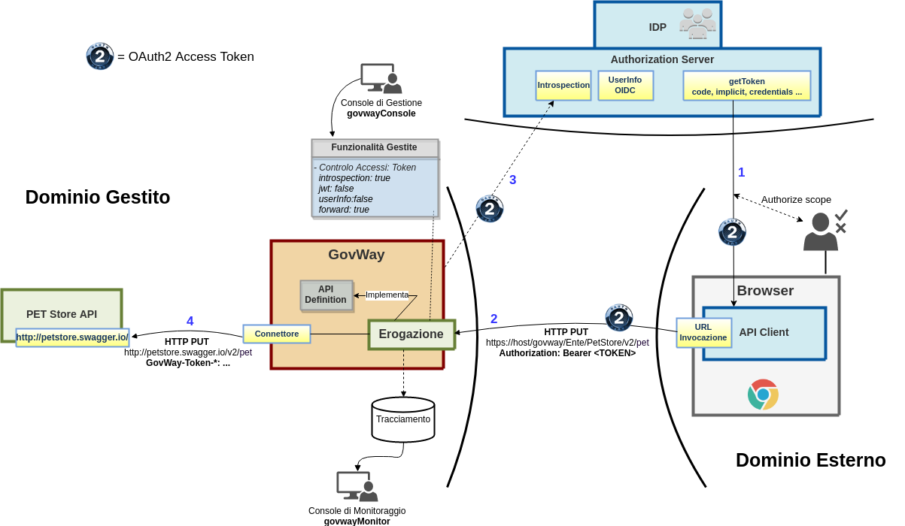

.. |br| raw:: html

     

.. _howto_oauth:

OAuth
-----

GovWay permette di proteggere le erogazioni e/o fruizioni di API tramite
il protocollo *OAuth2*. Una API può essere configurata in modo che ogni
sua invocazione debba essere accompagnata da un *access token* valido
rilasciato da uno degli *Authorization Server* censiti.

La :numref:`quick_oauth_fig` mette in evidenza tutte le comunicazioni e gli attori
coinvolti per riuscire a porta a termine l'invocazione dello scenario
descritto nella sezione ? dove però l'api viene protetta tramite
*OAuth*.

1. *Acquisizione Access Token*

   Un client deve richiedere un *access token* direttamente
   all'\ *Authorization Server* secondo le modalità supportate. In OAuth
   esistono diverse modalità alcune delle quali richiedono anche il
   coinvolgimento dell'utente al quale verrà richiesto di autenticarsi e
   poi di autorizzare le operazioni che il client intende eseguire.
   (`RFC 6749 <https://tools.ietf.org/html/rfc6749>`__)

2. *Richiesta di servizio con Access Token*

   Un client ottenuto l'\ *access token* deve spenderlo all'interno
   della richiesta inoltrata a GovWay già descritta nella sezione :ref:`erogazioneREST`. Un
   *access token* può essere incluso nella richiesta tramite diverse
   modalità definite dalla specifica `RFC
   6750 <https://tools.ietf.org/html/rfc6750>`__. Nello scenario di
   esempio è stato utilizzato l'header http *Authorization* utilizzando
   la modalità *Bearer*.

3. *Validazione Access Token*

   GovWay verifica che la richiesta contenga un *access token* valido.
   Per effettuare tale validazione GovWay supporta differenti modalità:

   -  *Servizio di Introspection*: se l'\ *access token* è '*opaco*\ '
      l'unica maniera per validarlo è accedere al servizio di
      introspection che deve essere disponibile sull'\ *Authorization
      Server*. Tale servizio viene definito dalla specifica `RFC
      7662 <https://tools.ietf.org/html/rfc7662>`__

   -  *Validazione JWT*: se l'\ *access token* è un token '*JWT*\ '
      (`RFC 7519 <https://tools.ietf.org/html/rfc7519>`__) GovWay può
      essere configurato per validarlo secondo la specifica JWS (`RFC
      7515 <https://tools.ietf.org/html/rfc7515>`__) o JWE (`RFC
      7516 <https://tools.ietf.org/html/rfc7516>`__). direttamente sul
      gateway senza accedere ad alcun servizio remoto.

4. *Forward Claims dell'Access Token*

   Effettuata la validazione dell'\ *access token* GovWay può fornire
   all'applicativo erogatore le varie informazioni acquisite durante la
   validazione del token, ad esempio sotto forma di header http.

    Scenario OAuth

Come si evince dalla :numref:`quick_oauth_fig` la creazione del token non è gestita da
GovWay, ma da un qualunque Authorization Server esterno. GovWay è
preconfigurato per poter utilizzare Google come Authorization Server
nell'installazione di base e quindi un applicativo può ottenere il token
da Google e poi spenderlo all'interno delle richieste applicative
spedite verso GovWay.

Lo scenario istanziato su Google sarà utilizzato in tutte le successive
sotto-sezioni per descrivere tutte le funzionalità inerenti *OAuth2*
attivabili su GovWay.

.. note:: **Requisito account gmail**
    |br|
    Per provare gli scenari descritti nelle successive sotto-sezioni è
    necessario avere un account su gmail.

.. toctree::
        :maxdepth: 2

	introspection
	validazioneJWT
	autenticazione
	scope
	claims
	xacml
	tokenForward
	registrazioneAuthServer
