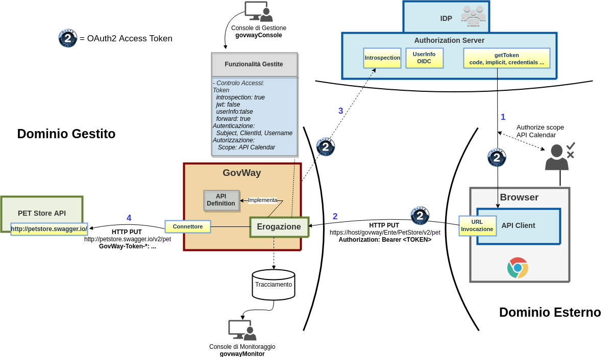
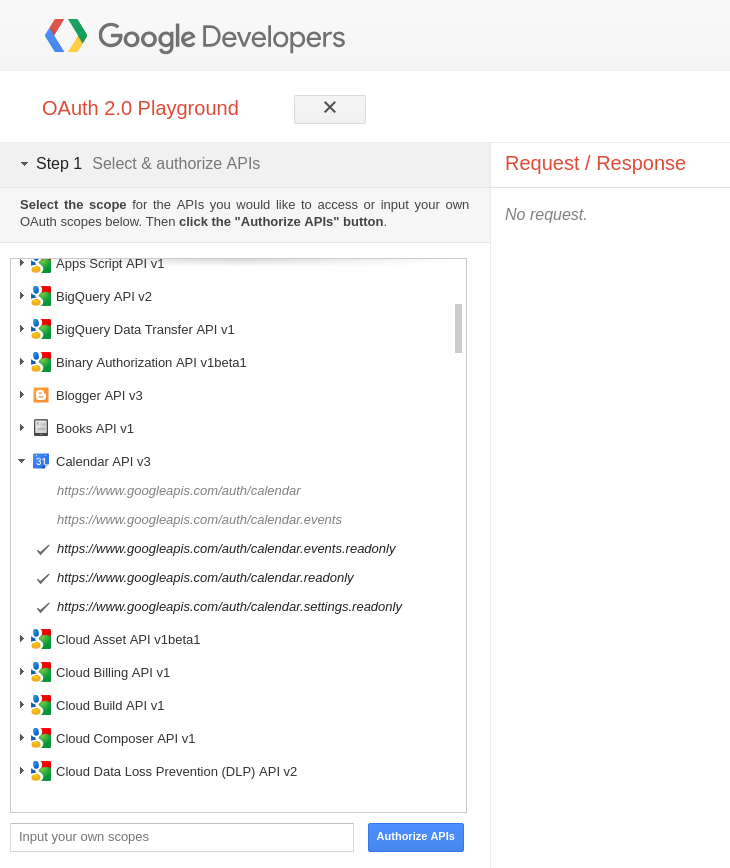
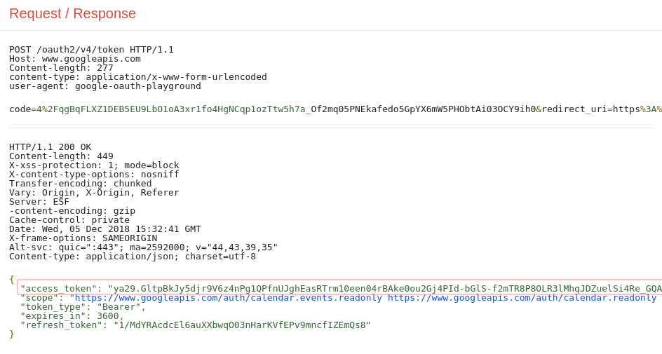
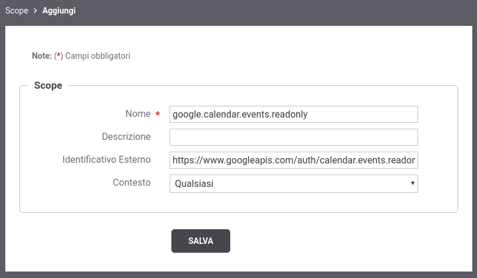
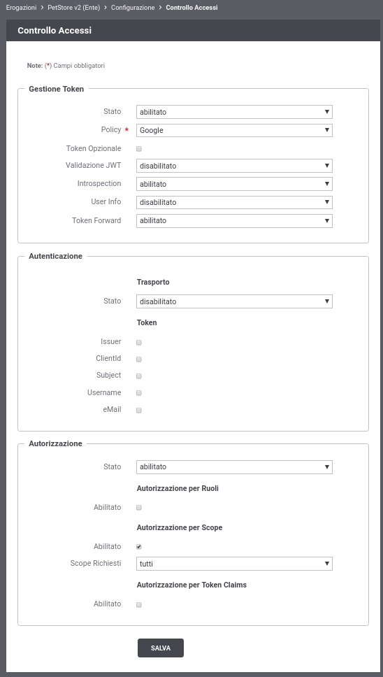
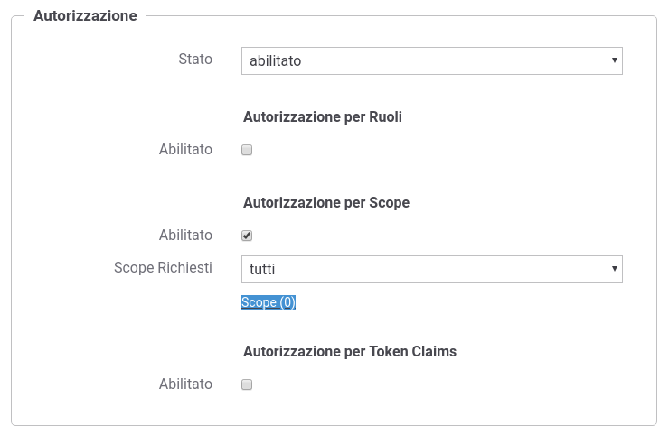
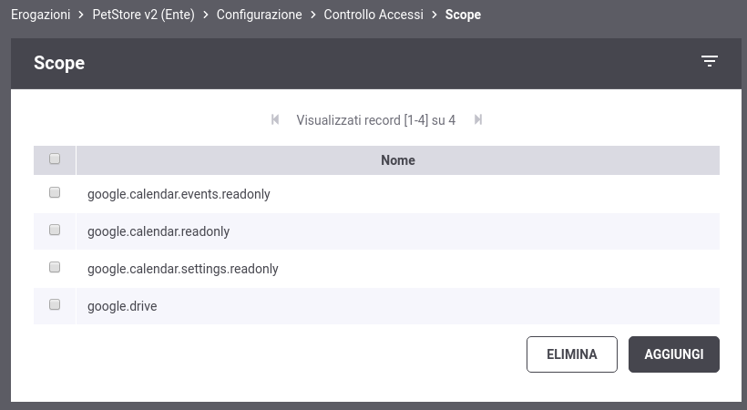
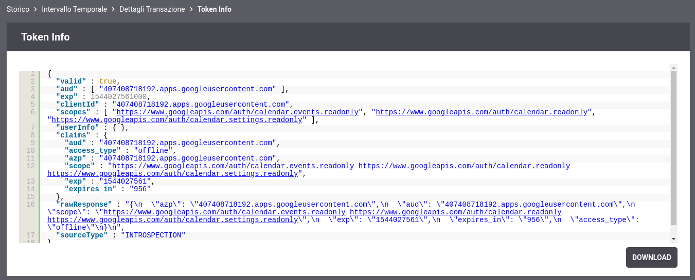

.. |br| raw:: html

     

.. _scopeAuth:

Autorizzazione per Scope
~~~~~~~~~~~~~~~~~~~~~~~~

La verifica di un *access token*, se opaco tramite il servizio di
Introspection (descritto nella sezione :ref:`validazioneIntrospection`), altrimenti tramite la
validazione JWT (sezione :ref:`quickValidazioneJWT`), permette a GovWay di conoscere i claims
associati al token ed in particolare quali sono gli scope autorizzati
dall'utente.

Gli scope permettono di definire delle "funzioni applicative" il cui
utilizzo da parte di un'applicazione deve essere autorizzato da un
utente.

Per simulare lo scenario utilizzeremo sempre il servizio *Playground* e
l'\ *Authorization Server di Google* descritto nella precedente sezione
:ref:`validazioneIntrospection` dove però verranno richiesti altri scope rispetto a quello utilizzato
nel precedente scenario. Simuleremo di aver bisogno di accedere alle API
Calendar di Google e quindi dovremo richiedere tali scope che devono
essere autorizzati una volta che ci siamo autenticati su Google.

Su GovWay è possibile registrare gli scope disponibili su di un
*Authorization Server* ed utilizzarli per definire politiche di
autorizzazione rispetto agli scope presenti nell'access token. Lo
scenario descritto in questa sezione mostra un esempio di registrazione
degli scope *'API Calendar'* di Google dove si configura a titolo
esemplificativo che tali scope sono necessari per poter invocare il
servizio *PetStore*.

    Scenario OAuth con autorizzazione per Scope

-  **Acquisizione Access Token con scope API Calendar**

   Per simulare l'acquisizione di un token è possibile utilizzare
   l'applicazione *Playground*, disponibile all'indirizzo
   ` <https://developers.google.com/oauthplayground/>`__, che consente
   di richiedere un *access token* all'\ *Authorization Server di
   Google*.

   L'applicazione *Playground* consente agevolmente di ottenere
   l'\ *access token* con gli scope richiesti dall'esempio:

   1. *Selezione scope*

      Devono essere selezionati gli *scope*:

      -  https://www.googleapis.com/auth/calendar.events.readonly

      -  https://www.googleapis.com/auth/calendar.readonly

      -  https://www.googleapis.com/auth/calendar.settings.readonly

      Cliccando infine sul pulsante *'Authorize APIs'* si verrà
      rediretti alla pagina di autenticazione in google dove si dovrà
      procedere ad autenticarsi.

    Ottenimento Token: Playground Google, scelta scope API Calendar

2. *Autorizzazione scope API Calendar*

      Effettuata l'autenticazione in Google si viene rediretti ad una
      pagina dove è richiesto all'utente di autorizzare l'applicazione
      Playground all'utilizzo degli scope API Calendar.

.. figure:: ../_figure_howto/oauthScopePlaygroundStep2.png
    :scale: 50%
    :align: center
    :name: quick_oauthScopeAPICalendarStep2_fig

    Ottenimento Token: Playground Google, autorizzazione scope API Calendar

3. *Access Token*

      Autorizzati gli scope si viene rediretti alla seconda fase
      prevista dall'applicazione *Playground* denominata *'Exchange
      authorization code for tokens'*. Cliccando sul pulsante *'Exchange
      authorization code for tokens'* si ottiene infine un *access
      token* da estrarre nella risposta http visualizzata sulla destra
      dell'applicazione.

    Ottenimento Token: Playground Google, Step 3

#. *Registrazione degli scope su GovWay*

   Accedere alla sezione *'Scope'* della *govwayConsole* per registrare
   gli scope relativi ad *API Calendar*. Per registrare un nuovo scope
   cliccare sul pulsante '*Aggiungi*\ '. Effettuare la registrazione
   degli scopes richiesti precedentemente tramite Playground ed anche un
   ulteriore scope (API Google Driver), non richiesto durante
   l'acquisizione del token, che verrà utilizzato nei test descritti in
   questa sezione.

.. table:: Registrazione Scope
   :widths: auto
   :name: quick_scope_tab

   =================================  ==========================================================    =========
   Nome                               Identificativo Esterno                                        Contesto
   =================================  ==========================================================    =========
   google.calendar.events.readonly    https://www.googleapis.com/auth/calendar.events.readonly      Qualsiasi
   google.calendar.readonly           https://www.googleapis.com/auth/calendar.readonly             Qualsiasi
   google.calendar.settings.readonly  https://www.googleapis.com/auth/calendar.settings.readonly    Qualsiasi
   google.drive                       https://www.googleapis.com/auth/drive                         Qualsiasi
   =================================  ==========================================================    =========

    Configurazione OAuth2 - Registrazione Scope

Terminata la registrazione gli scope è possibile specificarli
   all'interno del Controllo degli Accessi di una API.

.. figure:: ../_figure_howto/oauthScopeRegistrazioneConfigList.png
    :scale: 100%
    :align: center
    :name: quick_oauthListaScope_fig

    Configurazione OAuth2 - Lista degli Scope registrati

-  **Configurazione Controllo degli Accessi**

   Accedere alla sezione *'Erogazioni'* e selezionare l'API
   precedentemente registrata *'PetStore v2'*. Dopodichè accedere, dal
   dettaglio dell'erogazione, alla sezione *'Configurazione'* dove
   vengono visualizzate le funzionalità attive. Cliccare sulla voce
   presente nella colonna *'Controllo Accessi'* e procedere con la
   seguente configurazione all'interno della sezione *'Gestione Token'*:

   -  *Stato*: abilitato

   -  *Policy*: Google

   -  *Validazione JWT*: disabilitato

   -  *Introspection*: abilitato

   -  *User Info*: disabilitato

   -  *Token Forward*: abilitato

   Procedere inoltre con la seguente configurazione all'interno della
   sezione *'Autorizzazione'*:

   -  *Autorizzazione - Stato*: abilitato

   -  *Autorizzazione per Scope - Stato*: abilitato

   -  *Autorizzazione per Scope - Scope Richiesti*: tutti

   Effettuata la configurazione salvarla cliccando sul pulsante 'Salva'.

    Configurazione OAuth2 - Autorizzazione

Salvata la configurazione si deve nuovamente accedere al *'Controllo Accessi'* dove nella sezione *'Autorizzazione'* è adesso disponibile
   un link *'Scope (0)'* che permette di registrare gli scope che un
   token deve possedere quando invoca l'api PetStore.

    Configurazione OAuth2 - Autorizzazione - Scope

Tramite il pulsante *'Aggiungi'* aggiungere tutti e 4 gli scope
   precedentemente registrati su GovWay.

    Configurazione OAuth2 - Autorizzazione - Elenco Scope

-  **Invocazione API**

.. note:: **Reset Cache delle Configurazioni prima di un nuovo test**
       |br|
       Le configurazioni accedute da GovWay vengono mantenute in una
       cache dopo il primo accesso per 2 ore, è quindi necessario
       forzare un reset della cache. Per farlo accedere alla sezione
       *'Strumenti' - 'Runtime'* e selezionare la voce
       *'ResetAllCaches'*.

Per effettuare il test utilizzare il token, contenente gli scope API
   Calendar, precedentemente ottenuto.

   ::

       curl -v -X PUT "http://127.0.0.1:8080/govway/Ente/PetStore/v2/pet?access_token=ACCESS_TOKEN" \
       -H "accept: application/json" \
       -H "Content-Type: application/json" \
       -d '{
               "id": 3,
               "category": { "id": 22, "name": "dog" },
               "name": "doggie",
               "photoUrls": [ "http://image/dog.jpg" ],
               "tags": [ { "id": 23, "name": "white" } ],
               "status": "available"
       }'

   L'esito dell'aggiornamento termina con un codice di errore http 403 e
   una risposta problem+json che riporta la motivazione:

   ::

       HTTP/1.1 403 Forbidden
       WWW-Authenticate: Bearer realm="Google", error="insufficient_scope", error_description="The request requires higher privileges than provided by the access token", scope="https://www.googleapis.com/auth/calendar.events.readonly,https://www.googleapis.com/auth/calendar.readonly,https://www.googleapis.com/auth/calendar.settings.readonly,https://www.googleapis.com/auth/drive"
       Content-Type: application/problem+json
       Transfer-Encoding: chunked
       Server: GovWay
       GovWay-Transaction-ID: 6c13b9ac-3d60-45a6-9130-297a4d832824

       {
           "type":"https://httpstatuses.com/403",
           "title":"Forbidden",
           "status":403,
           "detail":"La richiesta presenta un token non sufficiente per fruire del servizio richiesto",
           "govway_status":"protocol:GOVWAY-1368"
       }

-  **Consultazione Tracce in errore**

   Attraverso la console *govwayMonitor* è possibile consultare lo
   storico delle transazioni che sono transitate nel gateway. Dalla
   :numref:`quick_oauthAutorizzazioneNegata_fig` si può vedere come le transazioni generate dopo la
   configurazione sopra indicata sono terminate con errore con esito
   *Autorizzazione Negata*.

.. figure:: ../_figure_howto/oauthConsultazioneStoricoTransazioniErroreScope.png
    :scale: 100%
    :align: center
    :name: quick_oauthAutorizzazioneNegata_fig

    Tracce delle invocazioni terminate con errore 'Autorizzazione Negata'

Accedendo al dettaglio di una transazione terminata in errore, e
   visualizzandone i diagnostici è possibile comprendere l'errore che
   come atteso risulta essere la mancanza dello scope
   *https://www.googleapis.com/auth/drive* richiesto poichè nella
   sezione *'Autorizzazione'* è stato indicato che gli scope registrati
   devono essere tutti presente nell'access token.

.. figure:: ../_figure_howto/oauthConsultazioneStoricoTransazioniErroreScope_diagnostici.png
    :scale: 100%
    :align: center
    :name: quick_oauthErroreScope_fig

    Diagnostici di una invocazione terminata con errore

Cliccando sul link *'Visualizza'* della voce *'Token Info'* è
   possibile vedere tutti i claims presenti nel token, dove si possono
   vedere gli scope richiesti tramite Playground.

    Scope presenti nel Token

-  **Modifica controllo degli scope (Almeno uno) in Configurazione
   Controllo degli Accessi**

   Tramite la *govwayConsole* accedere nuovamente alla maschera di
   configurazione '*Controllo Accessi*\ ' dell'API *'PetStore v2'*;
   all'interno della sezione *'Autorizzare'* modificare il tipo di
   controllo '*Scope Richiesti*\ ' dal valore *'tutti'* al valore
   *'almeno uno'*.

.. figure:: ../_figure_howto/oauthAutorizzazioneConfig2red.png
    :scale: 100%
    :align: center
    :name: quick_oauthAutorizzazioneScopeAlmenoUno_fig

    Configurazione OAuth2 - Autorizzazione degli scope con opzione 'Almeno uno'

-  **Nuova invocazione API**

.. note:: **Reset Cache delle Configurazioni prima di un nuovo test**
       |br|
       Effettuare il reset della cache accedendo alla sezione
       *'Strumenti' - 'Runtime'* e selezionare la voce
       *'ResetAllCaches'*.

Effettuare una nuova invocazione del test.

   ::

       curl -v -X PUT "http://127.0.0.1:8080/govway/Ente/PetStore/v2/pet?access_token=ACCESS_TOKEN" \
       -H "accept: application/json" \
       -H "Content-Type: application/json" \
       -d '{
               "id": 3,
               "category": { "id": 22, "name": "dog" },
               "name": "doggie",
               "photoUrls": [ "http://image/dog.jpg" ],
               "tags": [ { "id": 23, "name": "white" } ],
               "status": "available"
       }'

   L'esito dell'aggiornamento termina stavolta con successo con un
   codice http 200 e una risposta json equivalente alla richiesta.
