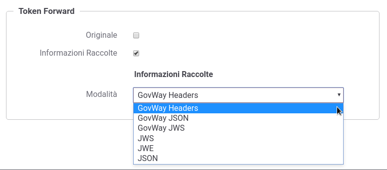

.. _tokenForward:

Token Forward
~~~~~~~~~~~~~

Tutte le configurazioni descritte nei precedente paragrafi indicavano di
abilitare la funzionalità *'Token Forward'* all'interno della sezione
*'Gestione Token'* (vedi ad es. :numref:`quick_oauthIntrospectionConfig_fig`). Tale configurazione fa sì che GovWay
inoltri all'applicativo interno al dominio (nel nostro esempio il
servizio *PetStore*) le informazioni inerenti il token ricevuto sotto
forma di header http.

Per vedere quali header vengono effettivamente prodotti possiamo
utilizzare la funzionalità *'Registrazione Messaggi'* .
.. descritta nel dettaglio nella sezione XXXX quick_registrazioneMessaggi. 
Accedere alla sezione *'Erogazioni'* e
selezionare l'API precedentemente registrata *'PetStore v2'*. Dopodichè
accedere, dal dettaglio dell'erogazione, alla sezione *'Configurazione'*
dove vengono visualizzate le funzionalità attive. Per abilitare la
registrazione degli header cliccare sulla voce presente nella colonna
'*Registrazione Messaggi*\ ' e procedere con la seguente configurazione.

-  *'Generale - Stato'*: ridefinito

-  *'Richiesta - Stato'*: abilitato

-  *'Richiesta - Ingresso'*: disabilitare tutte le voci

-  *'Richiesta - Uscita'*: abilitare solo la voce relativa agli header

-  *'Risposta - Stato'*: disabilitato

Effettuata la configurazione salvarla cliccando sul pulsante 'Salva'.

.. figure:: ../_figure_howto/oauthConfigurazioneDump.png
    :scale: 100%
    :align: center
    :name: quick_oauthDumpHeaderHTTP_fig

    Configurazione Registrazione Messaggi per visualizzare Header HTTP

Prima di procedere con una nuova richiesta effettuare il reset della
cache delle configurazioni accedendo alla sezione *'Strumenti' -
'Runtime'* e selezionare la voce *'ResetAllCaches'*.

Effettuare quindi una nuova invocazione contenente un *access token*
valido e successivamente consultare il dettaglio della transazione
tramite la *govWayMonitor*. Nel dettaglio sarà adesso disponibile la
voce *'Contenuti Uscita'* (:numref:`quick_oauthTokenForwardTransazione_fig`) che permette di vedere gli header http
prodotti da GovWay (:numref:`quick_oauthTokenHeaderHTTP_fig`).

.. figure:: ../_figure_howto/oauthConfigurazioneDumpVisualizzaHeader.png
    :scale: 100%
    :align: center
    :name: quick_oauthTokenForwardTransazione_fig

    Dettaglio della transazione con contenuti

.. figure:: ../_figure_howto/oauthConfigurazioneDumpHeaders.png
    :scale: 100%
    :align: center
    :name: quick_oauthTokenHeaderHTTP_fig

    Header HTTP prodotti da GovWay contenenti le informazioni sul Token

Le informazioni, inerenti il token ricevuto, trasmesse sotto forma di
header http all'applicativo dietro il Gateway, rappresenta la modalità
di default di GovWay per quanto concerne la Token Policy 'Google'.
GovWay supporta anche differenti modalità di consegna di tali
informazioni che possono essere attivate accendendo alla voce del menù
*'Configurazione - Token Policy'*, selezionando una policy (es. Google)
e accedendo alla sezione *'Token Forward'*. Le modalità si suddividono
tra inoltro del token originale (:numref:`quick_oauthTokenForwardTransazione2_fig`) e inoltre delle informazioni
raccolte durante la validazione del token (:numref:`quick_oauthForwardOriginale_fig`).

    Modalità  di Forward delle Informazioni Raccolte

.. figure:: ../_figure_howto/oauthConfigurazioneTokenPolicy2.png
    :scale: 100%
    :align: center
    :name: quick_oauthForwardOriginale_fig

    Modalità  di Forward del Token Originale

Di seguito vengono descritte le varie modalità di consegna supportate:

-  *Inoltro del token originale*: il token originale dopo essere stato
   validato dal gateway viene comunque inoltrato all'applicativo. E'
   possibile configurare la modalità di inoltro tra le seguenti opzioni:

   -  *Come è stato ricevuto*: Il token viene inoltrato al destinatario
      utilizzando lo stesso metodo con cui è stato ricevuto dal gateway.

   -  *RFC 6750 - Bearer Token Usage (Authorization Request Header
      Field)*: Il token viene inoltrato al destinatario utilizzando
      l'header Authorization presente nella richiesta HTTP.

   -  *RFC 6750 - Bearer Token Usage (URI Query Parameter)*: Il token
      viene inoltrato al destinatario tramite parametro access\_token
      della Query String.

   -  *Header HTTP*: Il token viene inoltrato al destinatario
      utilizzando un header HTTP il cui nome deve essere specificato.

   -  *Parametro URL*: Il token viene inoltrato al destinatario
      utilizzando un parametro della Query String il cui nome deve
      essere specificato.

-  *Inoltro delle Informazioni Raccolte*: consente di veicolare i dati
   inerenti il token ricevuto tramite una delle seguenti modalità:

   -  *GovWay Headers* (utilizzato nella token policy 'Google' delle
      sezioni precedenti): I dati raccolti dal token vengono inseriti
      nei seguenti header HTTP:

      ::

          GovWay-Token-Issuer
          GovWay-Token-Subject
          GovWay-Token-Username
          GovWay-Token-Audience
          GovWay-Token-ClientId
          GovWay-Token-IssuedAt
          GovWay-Token-Expire
          GovWay-Token-NotToBeUsedBefore
          GovWay-Token-Scopes
          GovWay-Token-FullName
          GovWay-Token-FirstName
          GovWay-Token-MiddleName
          GovWay-Token-FamilyName
          GovWay-Token-EMail

   -  *GovWay JSON*: I dati raccolti dal token vengono inseriti in un
      oggetto JSON, il cui JsonSchema è il seguente:

      ::

          {
              "required" : [ "id" ],
              "properties": {
                  "id": {"type": "string"},
                  "issuer": {"type": "string"},
              "subject": {"type": "string"},
              "username": {"type": "string"},
              "audience": {"type": "string"},
              "clientId": {"type": "string"},
              "iat": {
                      "type": "string",
                      "format": "date-time"
                  },
              "expire": {
                      "type": "string",
                      "format": "date-time"
                  },
              "expire": {
                      "type": "string",
                      "format": "date-time"
                  },
                  "roles": {
                      "type": "array",
                      "items": {"type": "string"}
                  },
                  "scope": {
                      "type": "array",
                      "items": {"type": "string"}
                  },
              "userInfo": {
                  "type": "object",
                  "properties": {
                      "fullName": {"type": "string"},
                      "firstName": {"type": "string"},
                      "middleName": {"type": "string"},
                      "familyName": {"type": "string"},
                      "email": {"type": "string"},
                  },
                  "additionalProperties": false
              }
              },
              "additionalProperties": false
          }

      Il JSON risultante viene inserito nell'Header HTTP *GovWay-Token*.

   -  *GovWay JWS*: I dati raccolti dal token vengono inseriti in un
      oggetto JSON, come descritto al punto precedente. In questo caso
      il token JSON viene inserito successivamente in un JWT e quindi
      firmato. Il JWS risultante viene inserito nell'Header HTTP
      *GovWay-JWT*.

   -  *JSON*: Le informazioni ottenute dai servizi di introspection,
      userinfo o il json estratto dal token jwt dopo la validazione,
      vengono inseriti negli header http o proprietà delle url indicati.

.. note::
   Le informazioni sono esattamente quelle recuperate dai servizi
   originali (o presenti nel token originale nel caso di
   validazione jwt).

   -  *JWS/JWE*: Uguale alla modalità JSON con la differenza che negli
      header http, o nelle proprietà delle url, vengono inseriti dei JWT
      firmati (caso JWS) o cifrati (caso JWE) contenenti al loro interno
      il JSON.
