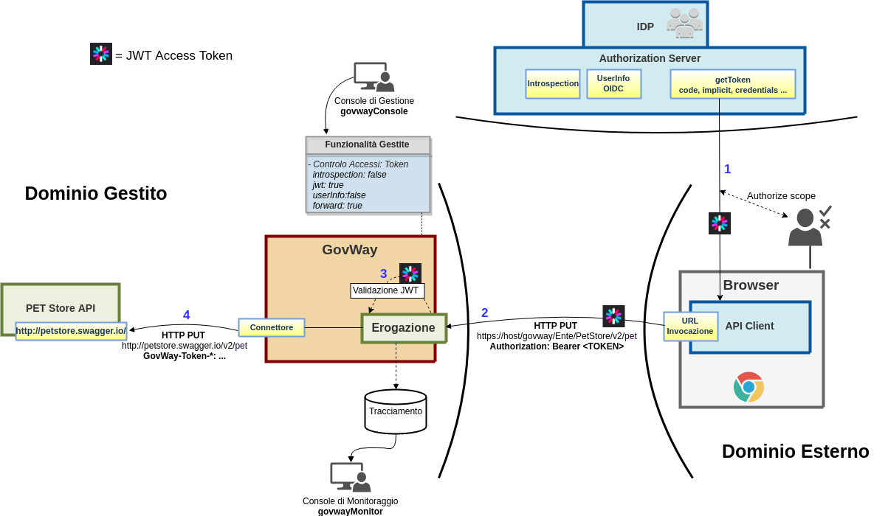
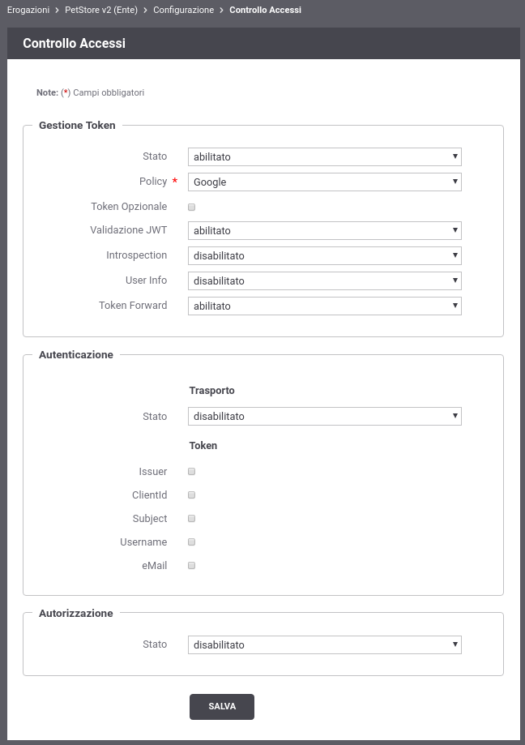
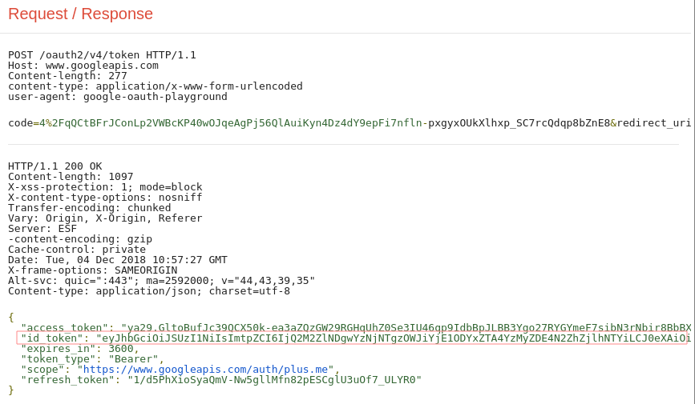

.. |br| raw:: html

     

.. _quickValidazioneJWT:

Validazione JWT
~~~~~~~~~~~~~~~

In questa sezione viene descritto uno scenario in cui GovWay non
interagisce con un servizio di Introspection per validare l'\ *access
token* ricevuto ma lo valida direttamente secondo la specifica JWS (`RFC
7515 <https://tools.ietf.org/html/rfc7515>`__).

    Scenario OAuth con validazione JWT

Per simulare lo scenario utilizzeremo sempre il servizio *Playground* e
l'\ *Authorization Server di Google* descritto nella precedente sezione
:ref:`validazioneIntrospection` utilizzando però impropriamente come *access token* l'\ *'id token'*
ottenuto insieme all'access token. L'id token contiene le informazioni
sull'utente strutturate all'interno di un *JWT* (per ulteriori dettagli
si rimanda `OIDC Connect -
IDToken <https://openid.net/specs/openid-connect-core-1_0.html#IDToken>`__).

.. note:: **Utilizzo improprio dell’id token**  
    |br|
    L'utilizzo dell'\ *'id token'* come *access token* è da considerarsi
    solo a titolo di esempio per mostrare la funzionalità di validazione
    di un token JWT disponibile su GovWay che potrebbe essere utilizzata
    negli scenari reali quando effettivamente l'\ *access token* non è
    opaco ma possieda una struttura JWT.

-  **Configurazione Controllo degli Accessi**

   Accedere alla sezione *'Erogazioni'* e selezionare l'API
   precedentemente registrata *'PetStore v2'*. Dopodichè accedere, dal
   dettaglio dell'erogazione, alla sezione *'Configurazione'* dove
   vengono visualizzate le funzionalità attive. Cliccare sulla voce
   presente nella colonna '*Controllo Accessi*\ ' e procedere con la
   seguente configurazione all'interno della sezione *'Gestione Token'*:

   -  *Stato*: abilitato

   -  *Policy*: Google

   -  *Validazione JWT*: abilitato

   -  *Introspection*: disabilitato

   -  *User Info*: disabilitato

   -  *Token Forward*: abilitato

   Effettuata la configurazione salvarla cliccando sul pulsante 'Salva'.

    Configurazione OAuth2 - Validazione JWT

-  **Acquisizione Access Token**

   Per simulare l'acquisizione di un token in formato JWT utilizzare
   l'applicazione *Playground* come descritto nella precedente sezione
   :ref:`validazioneIntrospection`. In fondo alla procedura, dopo aver cliccato sul pulsante
   *'Exchange authorization code for tokens'*, estrarre dalla risposta
   http visualizzata sulla destra dell'applicazione l'\ *id token*.

    Ottenimento Token: Playground Google, Step 3

-  **Invocazione API con un access token**

   Con il seguente comando è possibile effettuare una richiesta che
   possiede l'\ *id token* ottenuto nella precedente fase.

.. note:: **Bearer Token Usage** 
       |br|
       Un *access token* può essere incluso nella richiesta tramite una
       delle modalità definite dalla specifica `RFC
       6750 <https://tools.ietf.org/html/rfc6750>`__.

::

       curl -v -X PUT "http://127.0.0.1:8080/govway/Ente/PetStore/v2/pet?access_token=ID_TOKEN" \
       -H "accept: application/json" \
       -H "Content-Type: application/json" \
       -d '{
               "id": 3,
               "category": { "id": 22, "name": "dog" },
               "name": "doggie",
               "photoUrls": [ "http://image/dog.jpg" ],
               "tags": [ { "id": 23, "name": "white" } ],
               "status": "available"
       }'

   L'esito dell'aggiornamento viene confermato con un codice http 200 e
   una risposta json equivalente alla richiesta:

   ::

       HTTP/1.1 200 OK
       Access-Control-Allow-Origin: *
       Access-Control-Allow-Methods: GET, POST, DELETE, PUT
       Access-Control-Allow-Headers: Content-Type, api_key, Authorization
       Content-Type: application/json
       Transfer-Encoding: chunked
       Server: GovWay
       GovWay-Message-ID: 84e1d9a4-c181-436f-b7f0-4cabf55c370d
       GovWay-Transaction-ID: 6c13b9ac-3d60-45a6-9130-297a4d832824

       {
           "id":3,
           "category":{"id":22,"name":"dog"},
           "name":"doggie",
           "photoUrls":["http://image/dog.jpg"],
           "tags":[{"id":23,"name":"white"}],
           "status":"available"
       }

-  **Consultazione Tracce**

   Attraverso la console *govwayMonitor* è possibile adesso vedere che
   le richieste transitano con successo sul gateway. Accedendo al
   dettaglio di una transazione, tra le varie informazioni presenti
   nella sezione *'Informazioni Mittente'*, sono presenti le
   informazioni principali estratte dal token (es. Subject presente nel
   claim 'sub').

.. figure:: ../_figure_howto/oauthConsultazioneStoricoTransazioniOk_validazioneJWT.png
    :scale: 100%
    :align: center
    :name: quick_oauthStoricoTransazioniOKJWT_fig

    Traccia di una invocazione terminata con successo

- Cliccando sul link *'Visualizza'* della voce *'Token Info'* è
   possibile vedere tutti i claims presenti nel token, tra cui è
   possibile constatare la presenza del claim *scope* valorizzato con
   quanto richiesto tramite l'applicazione Playground.

.. figure:: ../_figure_howto/oauthConsultazioneStoricoTransazioniOkTokenInfo_validazioneJWT.png
    :scale: 100%
    :align: center
    :name: quick_oauthStoricoTransazioniOKTokenInfoJWT_fig

    Informazioni presenti in un Token JWT
