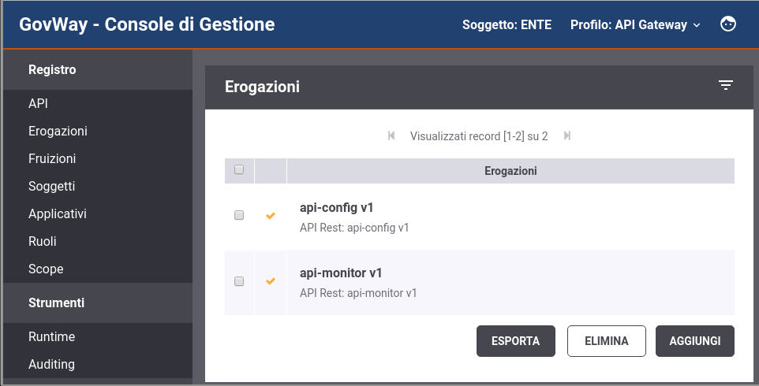

.. _apiRest:

API di Configurazione e Monitoraggio
------------------------------------

Se nell'installer sono stati selezionati i servizi che espongono API REST per la configurazione e il monitoraggio di GovWay (:numref:`apiREST_fig`) gli indirizzi base per utilizzarli sono:

- *http://<hostname-pdd>/govway/ENTE/api-config/v1/*
- *http://<hostname-pdd>/govway/ENTE/api-monitor/v1/*

Per poterli invocare deve prima essere completata la configurazione del Controllo degli Accessi accedendo alla console di gestione tramite browser all'indirizzo *http://<hostname-pdd>/govwayConsole* utilizzando le credenziali fornite durante l'esecuzione dell'installer.

Accendendo alla lista delle Erogazioni si può notare come le API relative alla configurazione ed al monitoraggio riportano uno 'stato rosso' che evidenzia una configurazione incompleta.

Procedere con la configurazione del :ref:`apiGwControlloAccessi` di ogni API al fine di renderla invocabile dall'esterno secondo le modalità di autenticazione ed autorizzazione desiderate. Per maggiori informazioni sul *Controllo degli Accessi* si rimanda alla Guida della Console di Gestione.

