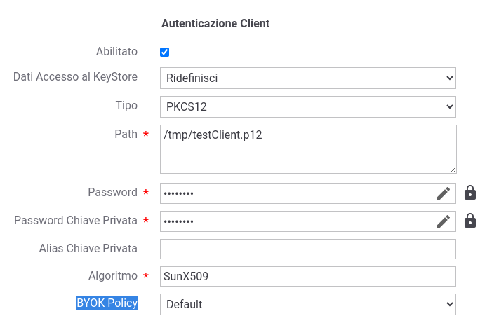

.. _byokInstall:

Cifratura delle informazioni confidenziali (HYOK/BYOK)
-------------------------------------------------------

GovWay supporta la gestione delle informazioni confidenziali salvate su database e delle chiavi/keystore presenti su filesystem attraverso la cifratura/decifratura mediante una master key, utilizzando un approccio HYOK (Hold Your Own Key) o BYOK (Bring Your Own Key).

Con l'approccio HYOK, le operazioni di cifratura e decifratura avvengono utilizzando una master key presente in un keystore locale (risiedente su filesystem) o all'interno di un HSM come descritto nella sezione :ref:`pkcs11Install`.

In alternativa, è possibile adottare una gestione BYOK, dove la master key è depositata su un servizio remoto (es. in cloud). In questo caso, le operazioni di wrap-key e unwrap-key delle informazioni confidenziali vengono gestite tramite chiamate API esposte dal servizio remoto.

La gestione delle informazioni confidenziali è attivabile all'interno del file *<directory-lavoro>/byok.properties*, nel quale sono presenti le due seguenti sezioni principali:

- 'Key Management Service' (KMS): ogni KMS definisce i criteri di cifratura (wrap) o di decifratura (unwrap) di un'informazione sensibile o di una chiave/keystore; la sintassi viene descritta nella sezione :ref:`byokInstallKsm`. Un KMS può riferirsi a una chiave gestita localmente tramite un approccio HYOK (:ref:`byokInstallKsmLocale`) o gestita da remoto su un servizio cloud come previsto dall'approccio BYOK (:ref:`byokInstallKsmRemoto`).

- 'Security Engine': l'associazione di un KMS che consente la cifratura di un'informazione confidenziale (wrap) e un altro che ne consente la decifratura (unwrap) viene registrata sotto la definizione di un security engine, come descritto nella sezione :ref:`byokInstallSecurityEngine`.

I KMS e i security engine vengono utilizzati da GovWay per gestire diversi aspetti:

- 'Security Engine di default': l'attivazione di uno specifico security engine comporta il suo utilizzo da parte di GovWay per la cifratura e la decifratura delle informazioni confidenziali salvate su database (:ref:`byokInstallSecurityGovWay`);

- 'Secrets Map': nel file *<directory-lavoro>/govway.secrets.properties* è possibile definire delle variabili Java o delle variabili di sistema con valori cifrati tramite uno dei security engine o dei KMS definiti; tali variabili potranno essere riferite nelle varie configurazioni di GovWay e saranno decifrate al momento del loro utilizzo (per maggiori dettagli si rimanda alla sezione :ref:`govwaySecretsMap`);

- 'Unwrap delle chiavi/keystore': le chiavi e i keystore indicati nei connettori HTTPS e nelle funzionalità di message security possono riferirsi a path su filesystem relativi a file cifrati, la cui decodifica avviene utilizzando un KMS di 'unwrap' tra quelli disponibili. La figura :numref:`byokPolicyConnettoreEsempio` mostra un esempio di utilizzo di una policy BYOK necessaria per decodificare il keystore cifrato riferito contenente la chiave e il certificato client da utilizzare in un connettore HTTPS.

  
    Esempio di configurazione di una policy BYOK su GovWay

- 'Unwrap delle chiavi/keystore per la funzionalità di FileTrace': nella sezione :ref:`avanzate_fileTrace_proprietaCifrate` vengono fornite le indicazioni per cifrare eventuali parti di log; i keystore o le chiavi utilizzate per la cifratura possono a loro volta essere cifrate e dovranno essere decifrate prima del loro utilizzo attraverso un KSM riferito tramite la direttiva *encrypt.encMode1.ksm*.

- 'Tool govway-vault-cli': al termine dell'esecuzione dell'installer (:ref:`inst_installer`), nella directory *dist/tools/govway-vault-cli* è presente un tool da linea di comando che consente:

   - la cifratura o decifratura di chiavi, riferendosi a un security engine o un KSM definito nel file *<directory-lavoro>/byok.properties*;
   
   - l'aggiornamento di una base dati esistente, consentendo di cifrare le informazioni confidenziali precedentemente salvate in chiaro o di aggiornarle attraverso l'utilizzo di una differente master key.
   
   Maggiori dettagli vengono forniti nella sezione :ref:`byokInstallToolVaultCli`.

.. toctree::
        :maxdepth: 2

	ksm/index
	security
	infoConfidenziali
	vaultCli/index
