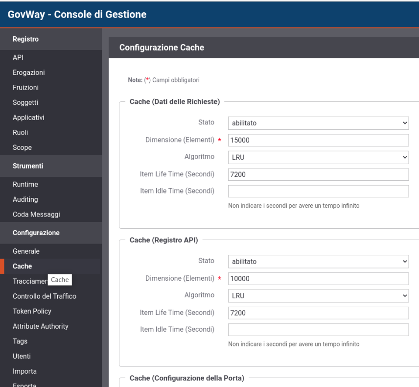

.. _govWayCaches:

Cache
---------

GovWay utilizza cache che mantengono i dati di configurazioni acceduti, i keystore e i certificati, il risultato dei processi di validazione, autenticazione, autorizzazione e altri aspetti minori.

Ogni funzionalità è associata ad una cache dedicata per la quale i parametri configurabili sono:

- Stato (abilitato/disabilitato): consente di disabilitare l'utilizzo della cache;
- Dimensione (Elementi): numero massimo di elementi che possono risiedere in cache;
- Algoritmo (LRU/MRU): politica di eliminazione degli elementi quando si raggiunge la massima dimensione consentita;
- Item Life Time (Secondi): indica l'intervallo temporale massimo in cui un elemento può risiedere in cache;
- Item Idle Time (Secondi): indica l'intervallo temporale massimo in cui un elemento può risiedere in cache senza mai essere acceduto;

I parametri di ogni cache sono configurabili accedendo alla console di gestione (govwayConsole) in modalità avanzata (:ref:`modalitaAvanzata`) nella sezione 'Configurazione -> Cache' (:numref:`cacheConfigEsempio`).

  
    GovWay Cache

Le cache utilizzate da govway e i valori di default associati sono i seguenti:

- *Registro API*: mantiene le configurazioni delle API accedute.

	- Stato: abilitato
	- Dimensione: 10000
	- Algoritmo: LRU
	- Item Life Time (Secondi): 7200
	- Item Idle Time (Secondi): infinito

- *Configurazione del Gateway*: mantiene le configurazioni generali di GovWay.

	- Stato: abilitato
	- Dimensione: 10000
	- Algoritmo: LRU
	- Item Life Time (Secondi): 7200
	- Item Idle Time (Secondi): infinito

- *Dati di Autorizzazione*: contiene i risultati dei processi di autorizzazione.

	- Stato: abilitato
	- Dimensione: 5000
	- Algoritmo: LRU
	- Item Life Time (Secondi): 7200
	- Item Idle Time (Secondi): infinito

- *Dati di Autenticazione*: contiene i risultati dei processi di autenticazione.

	- Stato: abilitato
	- Dimensione: 5000
	- Algoritmo: LRU
	- Item Life Time (Secondi): 7200
	- Item Idle Time (Secondi): infinito

- *Gestione dei Token*: mantiene i risultati dei processi di validazione dei token e i token negoziati.

	- Stato: abilitato
	- Dimensione: 5000
	- Algoritmo: LRU
	- Item Life Time (Secondi): 600
	- Item Idle Time (Secondi): infinito

- *Keystore*: contiene i keystore e i certificati acceduti, le CRL e i risultati delle validazioni tramite OCSP. A differenza delle altre cache, il parametro che indica l'intervallo temporale di validità dell'elemento differisce per le CRL e per il risultato della validazione tramite OCSP per poter consentire un intervallo minore.

	- Stato: abilitato
	- Dimensione: 10000
	- Algoritmo: LRU
	- Item Life Time (Secondi): 7200
	- Item Idle Time (Secondi): infinito
	- CRL/OCSP Life Time (Secondi): 1800

- *Controllo Traffico - Dati Statistici*: mantiene i dati statistici utilizzati dalle politiche di Rate Limiting.

	- Stato: abilitato
	- Dimensione: 10000
	- Algoritmo: LRU
	- Item Life Time (Secondi): 300
	- Item Idle Time (Secondi): infinito

- *Cache Risposte*: cache dedicata alla funzionalità descritta nella sezione :ref:`cachingRisposta`. Non è possibile disabilitarla e nemmeno definire un intervallo di validità degli elementi in cache.

	- Stato: N.D.
	- Dimensione: 10000
	- Algoritmo: LRU
	- Item Life Time (Secondi): N.D.
	- Item Idle Time (Secondi): infinito

- *Cache (Load Balancer)*: cache dedicata alla funzionalità descritta nella sezione :ref:`loadBalancerConnettore`. Non è possibile disabilitarla e nemmeno definire un intervallo di validità degli elementi in cache.

	- Stato: N.D.
	- Dimensione: 10000
	- Algoritmo: LRU
	- Item Life Time (Secondi): N.D.
	- Item Idle Time (Secondi): N.D.

**Cache di secondo livello**

Esiste un'ulteriore cache denominata 'Dati delle Richieste' che funge da cache di secondo livello che consente di raccogliere tutti i dati di una richiesta (API, configurazioni, keystore, politiche di rate limiting ...) normalmente presenti in altre cache di primo livello con lo scopo di minimizzare l'accesso concorrente alle cache di primo livello per motivi di performance.

	- Stato: abilitato
	- Dimensione: 10000
	- Algoritmo: LRU
	- Item Life Time (Secondi): 1800
	- Item Idle Time (Secondi): infinito

.. note::

   Poichè la cache 'Dati delle Richieste' consente di recuperare i dati normalmente presenti in altre cache di primo livello, si consiglia di impostare un intervallo temporale di validità della cache non superiore all'intervallo minimo configurato sulle seguenti cache di primo livello: Registro API, Configurazione del Gateway e Keystore.
