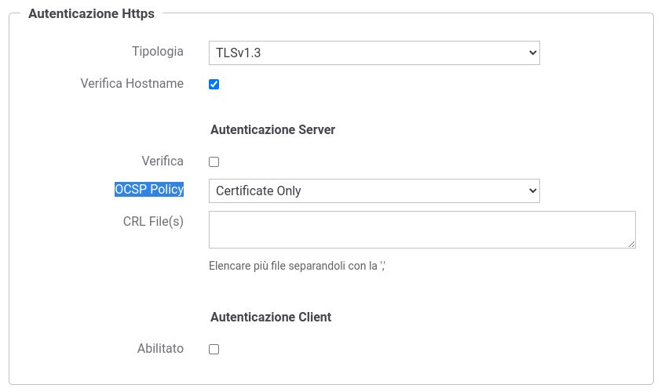

.. _ocspInstall:

Online Certificate Status Protocol (OCSP)
-----------------------------------------

Il protocollo Online Certificate Status Protocol (OCSP), descritto nel RFC 2560, consente di verificare la validità di un certificato senza ricorrere alle liste di revoca dei certificati (CRL).
Le modalità di verifica possono differire per svariati motivi: dove reperire la url del servizio OCSP a cui richiedere la validità del certificato e il certificato dell'Issuer che lo ha emesso, come comportarsi se un servizio non è disponibile, eventuale validazione CRL alternativa etc.

GovWay consente di definire differenti policy OCSP sul file *<directory-lavoro>/ocsp.properties* e una volta configurate saranno disponibili per la scelta in fase di configurazione di una funzionalità che richiede la validazione di un certificato. La sintassi delle opzioni che consentono di definire una policy OCSP viene descritta nella sezione :ref:`ocspConfig`. La figura :numref:`ocspEsempio` mostra un esempio di utilizzo di una policy OCSP nella validazione del certificato server in un connettore https.

  
    Esempio di configurazione di una policy OCSP su GovWay

Con l'installazione di GovWay vengono fornite due policy di default che presentano la medesima configurazione e differiscono solamente per il fatto che una policy consente di verificare l'intera catena di certificati. Le caratteristiche di entrambe le policy sono:

- viene verificata la validità temporale del certificato prima di intraprenderne la validazione tramite servizio OCSP;

- il certificato dell'Issuer viene cercato prima nel trustStore configurato insieme alla policy e successivamente nell'extension 'Authority Information Access'; se un certificato Issuer non viene trovato la verifica fallisce;

- l'endpoint del OCSP Responder viene cercato nell'extension 'Authority Information Access' e se non presente la verifica fallisce;

- oltre alla validazione della risposta ottenuta dal servizio OCSP, vengono attuati ulteriori controlli che differiscono a seconda del certificato di firma utilizzato dal OCSP Responder:

	- se combacia con il certificato Issuer che ha emesso anche il certificato in fase di verifica non vengono attuati altri controlli;

	- se il certificato di firma differisce ma è stato comunque emesso dall'Issuer del certificato in fase di verifica, vengono effettuate i seguenti ulteriori controlli:
	
		- deve possedere l'extended key usage 'id_kp_OCSPSigning';
		- viene verificata la validità temporale e la verifica rispetto al certificato Issuer;
		- se nel certificato di firma è presente l'extension 'CRL Distribution Points' viene attuata una verifica del certificato tramite la CRL indicata;
	
	- se il certificato di firma differisce e non è stato emesso dallo stesso Issuer del certificato in fase di verifica il processo di validazione fallisce. 

	  .. note::

	     	È possibile realizzare una configurazione che consente di attuare una validazione del certificato di firma anche per questo caso definendo una nuova policy OCSP che definisce, tramite le proprietà 'ocsp.<policyId>.signer.trustStore' descritta nella sezione :ref:`ocspConfig`, il trustStore da cui reperire il certificato Issuer che ha emesso il certificato di firma della risposta OCSP.

Il risultato di una validazione OCSP di un certificato viene mantenuto in cache, in modo che successive validazioni non debbano attuare nuovamente il processo di verifica. Per ulteriori dettagli sul tempo di validità di un risultato inserito in cache si rimanda alla sezione :ref:`govWayCaches`.

.. toctree::
        :maxdepth: 2

	config
