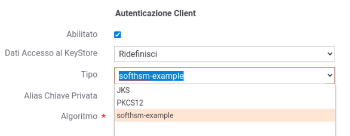

.. _pkcs11Install:

Registrazione Token PKCS11
-----------------------------------

Il Cryptographic Token Interface Standard, PKCS#11, definisce interfacce di programmazione native per token crittografici, come acceleratori crittografici hardware e smartcard.

Come prerequisito per consentire a GovWay di accedere ai token PKCS#11
nativi è necessario innanzitutto configurare correttamente il provider
PKCS#11 predispondendo le corrette librerie di sistema (.so o .dll)
necessarie.

Si può verificare la configurazione accedendo al token utilizzando il
'keytool' di java. Di seguito viene fornito un esempio di accesso ad
un token creato con softhsm, il simulatore pkcs11 di dnssec.

::

    cat /etc/softhsm_java.conf
    > name = softhsm-example
    > library = /usr/lib64/libsofthsm2.so
    > slotListIndex = 0

    keytool -list -keystore NONE -storetype PKCS11 -providerClass sun.security.pkcs11.SunPKCS11 -providerArg /etc/softhsm_java.conf
    > Keystore type: PKCS11
    > Keystore provider: softhsm-example
    >
    > Your keystore contains X entries

Un provider accessibile correttamente tramite keytool può essere censito tra i provider conosciuti da GovWay agendo sul file *<directory-lavoro>/hsm.properties*
Di seguito un esempio di registrazione del provider softhsm di esempio mostrato in precedenza:

::

    hsm.keystore.provider=SunPKCS11
    hsm.keystore.provider.add=true
    hsm.keystore.provider.configFile=/etc/softhsm_java.conf
    hsm.keystore.pin=123456
    hsm.keystore.keystoreType.label=softhsm-example
    hsm.keystore.keystoreType=pkcs11

Sarà possibile censire più token utilizzabili da GovWay. Ogni token registrato è identificato dal valore fornito nella proprietà *hsm.keystore.keystoreType.label* e sarà utilizzabile all'interno delle configurazioni di GovWay. La figura :numref:`pkcs11Esempio` mostra un esempio di utilizzo del token registrato nell'esempio sopra riportato.

  
    Esempio di configurazione di un token PKCS11 su GovWay

Di seguito vengono descritte tutte le opzioni di configurazione utilizzabili nella registrazione di un token all'interno del file *<directory-lavoro>/hsm.properties*:

- hsm.<idKeystore>.provider: (obbligatorio su nodo run) indica la classe del provider che deve essere stata registrata in JVM/conf/security/java.security o che dovrà essere aggiunta dinamicamente tramite l'opzione successiva;
- hsm.<idKeystore>.provider.add: (opzionale, default false) indica se il provider fornito deve essere registrato dinamicamente, se non già presente;
- hsm.<idKeystore>.provider.configFile: (opzionale) se fornito verrà utilizzato per configurare il provider tramite l'istruzione 'configure(configFile)';
- hsm.<idKeystore>.provider.config: (opzionale) se fornito verrà utilizzato per configurare il provider tramite l'istruzione 'configure(config)';
- hsm.<idKeystore>.pin: (obbligatorio su nodo run) pin per accedere al token;
- hsm.<idKeystore>.keystoreType.label: (obbligatorio) label associata al token e visualizzata nelle console;
- hsm.<idKeystore>.keystoreType: (obbligatorio su nodo run) tipo associato al token ed utilizzato per istanziarlo tramite l'istruzione 'KeyStore.getInstance(keystoreType, provider)';
- hsm.<idKeystore>.usableAsTrustStore: (opzionale, default false) indica se il token è utilizzabile anche come truststore di certificati;
- hsm.<idKeystore>.usableAsSecretKeyStore: (opzionale, default false) indica se il token è utilizzabile anche come repository di chiavi segrete.

