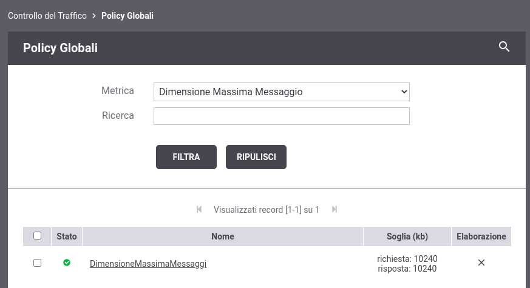
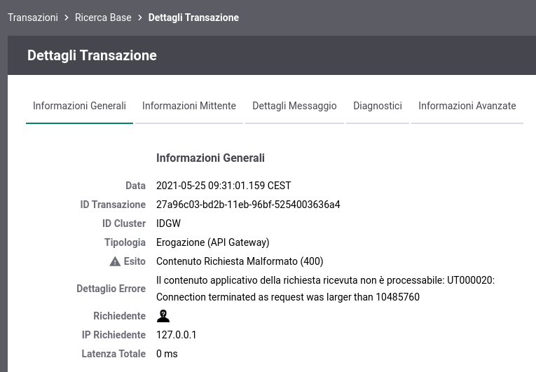

.. _dimensioneMassimaMessaggi:

Dimensione Massima dei Messaggi
--------------------------------------------------------

L'installazione di default di GovWay possiede una policy globale di :ref:`rateLimiting` (:numref:`inst_policyDimensioneMaxFig`), definita tramite la metrica 'Dimensione Massima Messaggio', che limita la dimensione massima accettata di una richiesta e di una risposta. Il valore di default impostato per entrambe le soglie è 10240k (10MB). Per una descrizione dettagliata sulle policy di Rate Limiting supportate da GovWay si rimanda alla sezione :ref:`rateLimiting` della guida 'Console di Gestione'.

    Policy globale 'Dimensione Massima Messaggio'

.. note::

	La policy 'Dimensione Massima Messaggio' non è eliminabile ma è consentito modificarne i valori di soglia o disabilitarla.

Anche in presenza della policy, precedentemente descritta, si potrebbe rilevare un limite inferiore se a livello di application server esistono ulteriori limitazioni sulla dimensione dei messaggi. Di seguito vengono fornite alcune indicazioni a riguardo.

**WildFly**

L'application server, per default, limita la dimensione del payload delle richieste a 10MB.
Per poter modificare il livello di soglia bisogna agire sull'attributo 'max-post-size' nell'elemento 'http-listener' della configurazione di WildFly (es. in standalone/configuration/standalone.xml): indica il numero di bytes massimo che un payload può contenere per essere processato. Se non presente l'attributo assume il valore di default 10485760 (10MB). È anche possibile disabilitare il limite impostando l'attributo al valore '0'.

   ::

       <server name="default-server">
                <http-listener name="default" socket-binding="http" max-post-size="10485760" .../>
		...
       </server>

L'esempio seguente riporta l'errore che si ottiene inviando una richiesta con payload superiore al limite configurato su WildFLy:

    Violata dimensione massima su WildFLy 'UT000020: Connection terminated as request was larger than 10485760'
